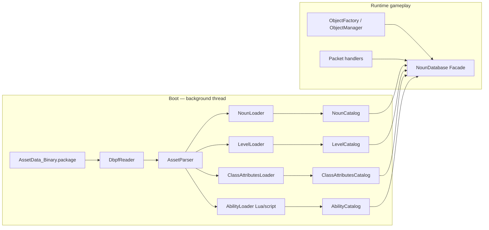

# Asset System — Current State & Robust Redesign

The Darkspore client expects the server to know the same noun/level/markerset metadata it does. C++ ships `NounDatabase` (8 typed catalogues) plus `Level::Load` (markerset XML parser). C# currently exposes a thin `AssetDatabase` wrapper around `lib/AssetData.Parser` and reads only the bare minimum (level markers + chain-vote enemy nouns).

This document inventories the current C# usage, lists every gap that affects gameplay, and proposes a robust replacement that keeps the generic `AssetData.Parser` core but adds typed indexes + eager warm-up + level / noun caches.

---

## Current C# usage

`lib/AssetData.Parser` is consumed in only **3** server files (10 lines of real logic):

### 1. `ReCap.Server/Services/AssetDatabase.cs` (`AssetDatabase`)

Thin wrapper exposing:

```csharp
sealed class AssetDatabase : IDisposable
{
    DbpfReader _reader;
    AssetParser _parser = new();
    Dictionary<string, AssetNode> _cache;

    AssetNode? GetAsset(string virtualName);                 // by name+ext
    AssetNode? GetAssetById(ulong assetId, string extension);// by id+ext (LINEAR SCAN!)
    IEnumerable<AssetNode> GetLevelMarkers(string levelName);// one-shot flatten
    IEnumerable<string> ListAssets();
    void Dispose();
}
```

Constructed once at `Program.cs:111` when `--game-path` is supplied. Shared via `GameService.Assets`. **Single instance per process.** No global singleton, no eager warm-up.

### 2. `ReCap.Server/Domain/Gameplay/ChainData.cs` — `PopulateFromLevel(db)`

Reads the level asset, dereferences `planetConfig`, walks `minion[]/special[]/boss[]/agent[]`, FNVs the `mpNoun` string field, stuffs into `EnemyNouns[6]` / `LevelNouns[2]`. **Filters out any noun name containing `_`** (heuristic for "is this a base noun?").

Called from `Game.HandleChainPlayerMsgs` Phase 07/08 (`Game.cs:297, 311`).

### 3. `ReCap.Server/Domain/Gameplay/Game.cs` — `OnPlayerStart(client)`

Iterates `Assets.GetLevelMarkers($"{Chain.LevelName}.level")`, reads `marker["nounDef"]`, `marker["pos"]`, `marker["scale"]`, builds `ObjectCreatePacket` per marker (`Game.cs:358-400`).

Used during Phase 09 (Dungeon entry).

That is **all** the server does with assets today.

---

## Problems with the current design

### 1. No eager warm-up

`AssetDatabase` lazily parses on first call. First gameplay tick that touches a new asset blocks the 50 ms event loop on disk I/O + structure parsing (the package is ~150 MB). C++ pre-loads everything in a detached background thread at boot (`Main.cpp:193`).

### 2. No noun catalog

C++ `NounDatabase` (`Game/Noun.h:695-731`) holds 8 typed dictionaries (`Noun`, `NonPlayerClass`, `PlayerClass`, `NpcAffix`, `ClassAttributes`, `AIDefinition`, `CharacterAnimation`, `Phase`) all keyed by `uint32_t` (FNV of asset name).

C# has nothing. Every gameplay handler that needs noun metadata (HP, abilities, animations, AI behaviour, attack speed, gear score, …) has no place to ask.

### 3. No level cache

`Chain.PopulateFromLevel` re-walks the `planetConfig` tree every time `ChainPlayerMsgs(1, value=0)` fires. The level asset is cached at the `AssetNode` level by `_cache`, but the **derived** enemy/level noun arrays are rebuilt each call. `Game.OnPlayerStart` similarly re-reads markers on every Dungeon entry.

### 4. No markerset indexing

C++ `Level::GetMarkerset(name, out markerset)` returns a fully-indexed `Markerset` object with:

- `mMarkersByNoun: unordered_map<uint32_t, vector<MarkerPtr>>`
- `mMarkers: vector<MarkerPtr>`
- helpers `GetMarkersByType(noun)` for spawn-point filtering

C# `GetLevelMarkers` flattens every marker into a single `IEnumerable` and drops the markerset context. There's no way to ask "give me the obelisk markers only" without scanning all of them.

### 5. No marker-set hash exposure

C# computes the wire `MarkerSetHash` via `FnvHash($"{LevelName}_ai_1.Markerset")` (`ChainData.cs:101`). C++ obtains it from the loaded `Level` via `chainData.GetMarkerSet()` — which is the actual hash recorded in the level XML, not a name-derived FNV. If the canonical hash differs (e.g. capitalization, suffix variant), the wire byte sent in `GamePrepareForStart` would not match. **Top suspect for the current PreDungeon stall.**

### 6. `GetAssetById` is O(n)

`AssetDatabase.cs:38-68` does `foreach (var entry in _reader.Entries)`. Each call linearly scans the entire DBPF entry table. For every level transition this happens at least twice (once for the level, once for each markerset). At ~tens of thousands of entries, this becomes measurable.

### 7. `DisplayValue` used as primary key

`ChainData.cs:42` reads `levelAsset["planetConfig"]?.DisplayValue` to find the planet config key. `DisplayValue` is the MVVM-friendly string for the editor UI — it's a coincidence that it round-trips. For a `StringNode` it returns the raw string, for an `AssetNode` reference it returns the path. Should use the typed accessor (`AsString()` or a new `AsAssetReference()`).

### 8. Generic `_cache` not invalidated on reload

If the user swaps `--game-path` mid-process (currently impossible, but a future admin endpoint might do so), the cache is stale. No invalidation hook.

### 9. `AssetNode` is observable for MVVM

Server-side code never observes property changes. The `INotifyPropertyChanged` overhead, `ObservableCollection<AssetNode>` child storage, and `BinaryOffset` debugging field all carry memory + allocation cost that's pointless in the server. For a 150 MB package, the parsed graph likely runs to hundreds of MB of unnecessary observable bookkeeping.

### 10. No noun → noun cross-reference

C++ `Noun` carries pointers to its `NonPlayerClass`, `PlayerClass`, `Attributes`, `Animation`, `AIDefinition`, `Phase`, `NpcAffix` (`Noun.cpp:232, 266, 293, 442, …`). When the object manager creates an instance, all that data is one pointer deref away.

C# would need to walk back to `AssetDatabase` and re-parse every related asset per object creation.

### 11. No ability/Lua loader

C++ `GlobalLua::Initialize()` (`Main.cpp:196`) loads gameplay scripts referenced from nouns. The C# port has no ability-loading path at all. Once gameplay starts, every `UseCharacterAbility` action no-ops (`Phase 10` finding).

### 12. No type schema enforcement at lookup time

`node["minion"]` returns `AssetNode?`. The caller has to assume it's an `ArrayNode`. If the schema changes (or the field is renamed), it silently returns null. Compile-time checked accessors would catch this earlier.

---

## Comparison against C++ ground truth

| Subsystem | C++ | C# (today) | Gap |
|---|---|---|---|
| Eager package warm-up | `Main.cpp:155-198` background thread parses `NounDatabase`, `Lua` scripts, installer | Lazy on first call | ⚠️ Tick stall risk |
| Generic asset reader | `Game/AssetData/DBPFManager` (currently dormant) | `AssetData.Parser.DbpfReader` ✅ | OK |
| Typed noun catalog | `NounDatabase` with 8 typed dicts | none | ❌ |
| Level loader | `Level::Load` parses markersets, configs, first-time data | none — relies on raw `AssetNode` lookups | ❌ |
| Markerset | `Markerset` with marker-by-noun index | flat enumerable | ⚠️ |
| Object factory | `ObjectManager::Create(nounId)` builds typed Object with attributes / animations | inline `ObjectCreatePacket` construction in `Game.OnPlayerStart` | ⚠️ |
| Ability registry | `GlobalLua::GetAbility(id)` | none | ❌ |
| Chain enemy/level nouns | static defaults seeded in `RakNet/Types.cpp:1067-1075`, then mutated by `ResetDedicatedServer` calling `chainData.SetLevelByIndex` + `LoadLevel` | computed each call inside `ChainData.PopulateFromLevel` from raw `AssetNode` walks | ⚠️ |
| Marker-set hash for `GamePrepareForStart` | from real asset (`chainData.GetMarkerSet()` after `Level::Load`) | `FnvHash($"{LevelName}_ai_1.Markerset")` | ⚠️ Top suspect |
| NPC affix resolution | `NounDatabase::GetNpcAffix(hash)` | none | ❌ |
| Class attributes resolution | `NounDatabase::GetClassAttributes` | none | ❌ |

---

## Redesign goals

1. **Eager warm-up on boot** (background thread) once `--game-path` is supplied.
2. **Indexed typed catalogues** for the same 8 categories C++ exposes plus `Level` and `Markerset`.
3. **O(1) lookups** by FNV hash key (no linear scans).
4. **One source of truth** for marker-set hashes — read from the asset, not computed from the filename.
5. **Server-friendly node materialisation** (drop observable bookkeeping for catalog DTOs).
6. **Pluggable backend** so XML or future cloud storage can be substituted.
7. **Cross-references resolved at warm-up time** so gameplay handlers walk in-memory pointers, not the parser.
8. **Drop-in compatibility** with the current `AssetDatabase` API so the migration can land in phases.

---

## Target architecture



### Public facade

```csharp
public sealed class NounDatabase   // singleton or DI scope
{
    NounDef?              GetNoun(uint nounId);
    NounDef?              GetNounByName(string name);   // applies FnvHash internally
    NonPlayerClassDef?    GetNonPlayerClass(uint id);
    PlayerClassDef?       GetPlayerClass(uint id);
    NpcAffixDef?          GetNpcAffix(uint id);
    ClassAttributesDef?   GetClassAttributes(uint id);
    AIDefinitionDef?      GetAIDefinition(uint id);
    CharacterAnimationDef? GetCharacterAnimation(uint id);
    PhaseDef?             GetPhase(uint id);
    LevelDef?             GetLevel(string levelName);
    AbilityDef?           GetAbility(uint id);

    Task WarmUpAsync(CancellationToken ct);          // called from Program.Main
    bool IsReady { get; }
}
```

### Typed DTOs (immutable records)

```csharp
public sealed record NounDef(
    uint   Id,
    string Name,
    uint   AssetId,
    NounType Type,
    uint?  NonPlayerClassId,
    uint?  PlayerClassId,
    uint?  ClassAttributesId,
    uint?  AIDefinitionId,
    uint?  PhaseId,
    float? MaxHealth,
    float? MaxMana,
    float? GearScore,
    float? GearScoreFlattened,
    uint[] AbilityIds);

public sealed record LevelDef(
    string  Name,
    uint    NameHash,                          // FnvHash($"{Name}.Level")
    uint    PlanetConfigHash,
    ImmutableArray<MarkerSetRef> MarkerSets,   // pre-indexed
    PlanetConfigDef PlanetConfig);

public sealed record MarkerSetRef(
    string Name,                                // e.g. "zelems_1_ai_1"
    uint   NameHash,                            // FnvHash($"{Name}.Markerset")
    ulong  AssetId,
    MarkerSetDef Loaded);                       // resolved at warm-up

public sealed record MarkerSetDef(
    string Name,
    ImmutableArray<MarkerDef> Markers,
    ImmutableDictionary<uint, ImmutableArray<MarkerDef>> MarkersByNoun);

public sealed record MarkerDef(
    uint    Id,
    string  Name,
    uint    Noun,
    Vector3 Position,
    Vector3 Rotation,
    float   Scale,
    TeleporterData? Teleporter,
    InteractableData? Interactable);

public sealed record PlanetConfigDef(
    ImmutableArray<NounRef> Minions,
    ImmutableArray<NounRef> Specials,
    ImmutableArray<NounRef> Bosses,
    ImmutableArray<NounRef> Agents,
    ImmutableArray<NounRef> Captains);

public sealed record NounRef(uint NounId, string Name);
```

> Immutable records cut allocation pressure during gameplay and document the schema. Where C++ uses `friend class NounDatabase` to gate construction, C# uses internal constructors plus an `internal` loader.

### Warm-up flow

```csharp
public async Task WarmUpAsync(CancellationToken ct)
{
    using var reader = new DbpfReader(_packagePath);
    var parser = new AssetParser();

    // Build the entry index up front (DbpfEntry → typed key)
    var entryIndex = BuildEntryIndex(reader);   // Dict<(TypeId, InstanceId), DbpfEntry>

    await Task.Run(() =>
    {
        LoadNouns(reader, parser, entryIndex);
        LoadNonPlayerClasses(reader, parser, entryIndex);
        LoadPlayerClasses(reader, parser, entryIndex);
        LoadNpcAffixes(reader, parser, entryIndex);
        LoadClassAttributes(reader, parser, entryIndex);
        LoadAIDefinitions(reader, parser, entryIndex);
        LoadCharacterAnimations(reader, parser, entryIndex);
        LoadPhases(reader, parser, entryIndex);
        LoadLevels(reader, parser, entryIndex);     // each level pulls its markersets + planetConfig
        LoadAbilities(reader, parser, entryIndex);  // optional, requires Lua bridge
        ResolveCrossReferences();                   // fix up `Loaded` references etc.
        IsReady = true;
    }, ct);
}
```

Each `Load*` walks the appropriate sub-tree of `entryIndex`, parses with the typed `FileTypeInfo`, materialises the DTO, and indexes by FNV hash.

### `GetAssetById` performance fix

Replace `foreach (var entry in _reader.Entries)` with `entryIndex.TryGetValue((typeHash, instanceId), out entry)`. Build the index once at boot.

### Hash sources

Stop computing `FnvHash($"{levelName}_ai_1.Markerset")` ad-hoc. Each `LevelDef.MarkerSets` carries the **real** hash recorded in the level XML, which becomes:

- `Chain.MarkerSet` in `GamePrepareForStart` — pull from `LevelDef.MarkerSets.First(m => m.Name.EndsWith("_ai_1")).NameHash`.
- ChainVote enemy/level nouns — pull from `LevelDef.PlanetConfig.Minions/...` already resolved.

The `MarkerSetHash` mismatch (Phase 08 top suspect) disappears because the value comes straight from the asset.

### Migration path (phased)

| Phase | Goal | Touchpoints |
|---|---|---|
| 1 | Add `NounDatabase` skeleton + warm-up scaffolding alongside existing `AssetDatabase` | new file `Services/NounDatabase.cs`, called from `Program.cs:118` |
| 2 | Build `LevelDef` + `MarkerSetDef` + `PlanetConfigDef`. Wire `Chain.PopulateFromLevel` to use them instead of raw `AssetNode` walks | `ChainData.cs`, `Game.cs` `HandleChainPlayerMsgs` |
| 3 | Use real `MarkerSetHash` from `LevelDef` in `GamePrepareForStart` | `Game.cs:313` |
| 4 | Build `NounDef` catalog + use in `Game.OnPlayerStart` to spawn typed enemies / obelisks | `Game.cs:358-400` |
| 5 | Build `ClassAttributesDef`, `NonPlayerClassDef` so `LabsCharacterData` no longer ships hardcoded defaults (HP=200, GearScore=300) | `LabsPlayerUpdatePacket.cs`, `Game.cs:178-201` |
| 6 | Build `AIDefinitionDef` + simple AI loop in `ObjectManager.Update(delta)` | new `ObjectManager.cs` |
| 7 | Ability loader (Lua bridge or stub) | new `Services/AbilityRegistry.cs` |
| 8 | Drop the old `AssetDatabase` once everything has migrated; delete generic `_cache` | `Services/AssetDatabase.cs` removed |

Migration is **incremental**. Phases 1–3 are enough to unblock the PreDungeon stall.

### File layout proposal

```
ReCap.Server/
  Services/
    NounDatabase.cs                — facade + warm-up
    Assets/
      Loaders/
        NounLoader.cs
        LevelLoader.cs
        ClassAttributesLoader.cs
        ...
      Defs/
        NounDef.cs
        LevelDef.cs
        MarkerSetDef.cs
        MarkerDef.cs
        PlanetConfigDef.cs
        AIDefinitionDef.cs
        ClassAttributesDef.cs
        AbilityDef.cs
      EntryIndex.cs                 — typed (TypeId,InstanceId) → DbpfEntry lookup
      AssetReferenceResolver.cs     — handles "Foo.Bar" path strings → AssetId/Name
    AssetDatabase.cs                — kept during migration; delegates to NounDatabase
```

`Domain/Gameplay/ChainData.cs` shrinks dramatically — no more raw `AssetNode` walks; pulls from `LevelDef`.
`Domain/Gameplay/Game.cs` `OnPlayerStart` reads from `LevelDef.MarkerSets.First(...).Loaded` and `NounDatabase.GetNoun(...)`.

---

## Quick wins (without full redesign)

If the full redesign is too big to take in one go, these standalone fixes already remove most of the current pain:

1. **Index DBPF entries by `(TypeId, InstanceId)`** — replace the O(n) loop in `AssetDatabase.GetAssetById` with a `Dictionary` built once in the constructor. ~10 minutes of work, immediate measurable speedup.
2. **Pull `MarkerSetHash` from the actual level asset** instead of `FnvHash($"{level}_ai_1.Markerset")`. New helper on `AssetDatabase` that returns the real hash. Untangles the PreDungeon top suspect.
3. **Pre-walk and cache `LevelDef` at boot** — populate enemy / level noun arrays once at startup so `ChainData.PopulateFromLevel` is a no-op after the first call.
4. **Stop using `DisplayValue` as a key.** Replace `levelAsset["planetConfig"]?.DisplayValue` with `levelAsset["planetConfig"]?.AsAssetReference()` (new typed accessor returning the asset reference path).
5. **Drop `INotifyPropertyChanged` from server-side materialised nodes.** Either skip the parser entirely for catalogue rows (write a minimal binary reader for `NounDef`) or freeze the node graph after warm-up.

---

## Open questions

1. Does the binary `noun` asset embed pointers to `NonPlayerClass` / `PlayerClass` / `AIDefinition` / `Phase` via raw asset IDs, or via name strings? If IDs, the cross-reference resolution is trivial. If names, the resolver has to FNV-hash each one.
2. How does the C++ build handle "no `Game.Config.STORAGE_PATH` set + no `--game-path` provided"? Does it fall back to embedded test data, or refuse to start? Mirror the same behaviour in C#.
3. Is the `_ai_1.Markerset` suffix a stable convention or does it vary per level? If it varies, the redesign needs to learn which markerset is the "AI markers" one from the level asset itself rather than from the name suffix.
4. Lua ability loading — port the C++ Lua VM, or stub abilities entirely until a different mechanism (e.g. C# ability scripts) replaces it?
5. Should `NounDatabase` be a singleton (`Instance` accessor) like C++ does, or be DI-scoped? C++ uses singleton; C# convention favours DI. Singleton is fine for now since there's never more than one package loaded at a time.

---

## Acceptance criteria for "robust"

- [ ] `dotnet run --project ReCap.Server -- --game-path=/path/to/AssetData_Binary.package` reports "NounDatabase ready, 12 345 nouns, 25 levels indexed in 1 234 ms" within 2 s of boot on a warm filesystem.
- [ ] `NounDatabase.GetNoun(id)` returns in O(1) (`Dictionary.TryGetValue`).
- [ ] No 50 ms tick exceeds 5 ms because of an unexpected asset parse.
- [ ] `Chain.MarkerSet` matches the value the C++ build emits for the same `--game-path`.
- [ ] `OnPlayerStart` creates the same set of marker objects (count + nouns) as the C++ build for the same level.
- [ ] Removing `--game-path` falls back to in-memory defaults without crashing (`NounDatabase.IsReady == false`, handlers degrade gracefully — e.g. `Chain.EnemyNouns` keeps the hardcoded values).
- [ ] `dotnet build` warning count does not increase.
- [ ] No `INotifyPropertyChanged` machinery sits in a server-side hot path.

---

## Files referenced

C++ (mirror for the redesign):

- `recap_server_develop/darkspore_server/source/Game/Noun.h` (`NounDatabase` interface, lines 695-731)
- `recap_server_develop/darkspore_server/source/Game/Noun.cpp` (`LoadNouns`, `LoadNonPlayerClasses`, etc., lines 993+)
- `recap_server_develop/darkspore_server/source/Game/Level.h` (`Level`, `Markerset`, `LevelConfig`)
- `recap_server_develop/darkspore_server/source/Game/Level.cpp` (`Level::Load`, `Markerset::Load`)
- `recap_server_develop/darkspore_server/source/Game/AssetData/DBPFManager.h` (planned generic adapter, currently dormant)
- `recap_server_develop/darkspore_server/source/Main.cpp:155-198` (background warm-up)

C# (today):

- `ReCap.Server/Services/AssetDatabase.cs`
- `ReCap.Server/Domain/Gameplay/ChainData.cs`
- `ReCap.Server/Domain/Gameplay/Game.cs` (`OnPlayerStart`, `HandleChainPlayerMsgs`)
- `lib/AssetData.Parser/src/Core/AssetParser.cs`
- `lib/AssetData.Parser/src/Core/DbpfReader.cs`
- `lib/AssetData.Parser/src/Core/AssetNode.cs`
- `lib/AssetData.Parser/src/Core/AssetNodeExtensions.cs`
- `lib/AssetData.Parser/src/Core/TypeSystem.cs`
