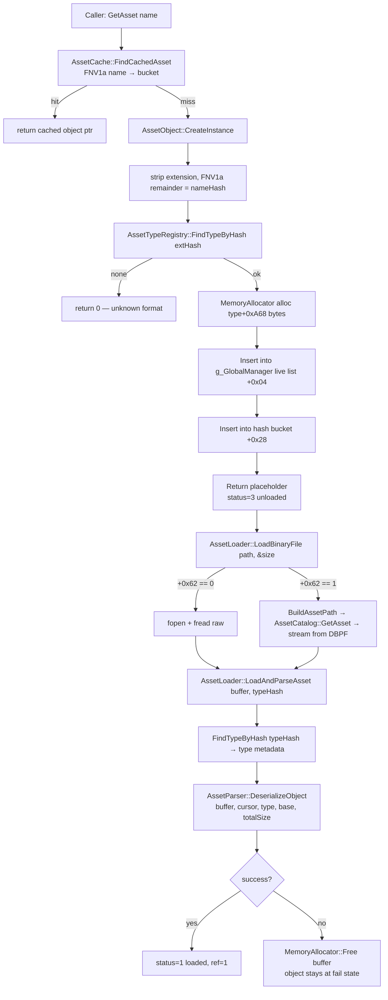
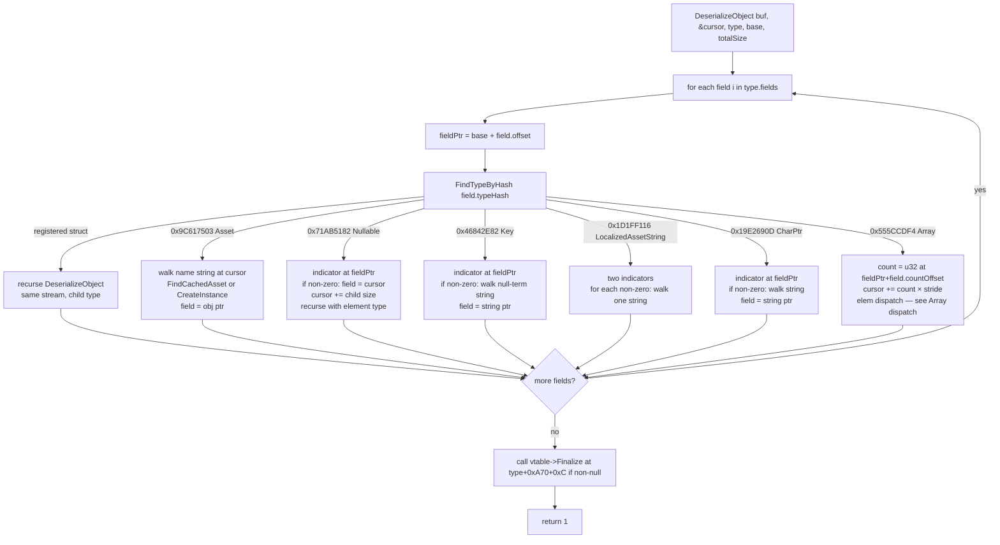
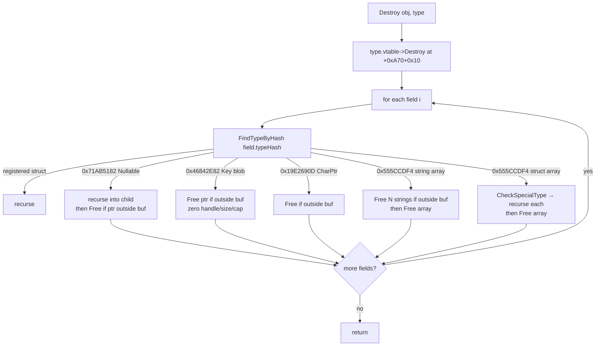

# Asset System — Original Darkspore Client (Ghidra Ground Truth)

Reverse-engineered from `Darkspore.exe` via GhidraMCP, cross-validated against the standalone `AssetData.Parser` C# project (`/Users/jeanxpereira/CodingProjects/AssetData.Parser`). Inventories the **client's own** asset runtime so the ReCap server port can mirror real semantics, not guesses.

Scope:
- **In**: every namespace under the `Asset*` umbrella inside `Darkspore.exe` (337 functions).
- **In**: how the existing C# `AssetData.Parser` maps onto each.
- **Out**: the C# server port plan — see [`ASSET_SYSTEM.md`](ASSET_SYSTEM.md).

---

## TL;DR

The client ships a single global asset runtime backed by **one generic recursive parser** + **one global catalog**. Every asset format is a `(AssetType + AssetData)` twin of auto-generated reflection stubs that calls `AssetTypeRegistry::Register`. No format gets its own loader — the parser dispatches on a small fixed set of FNV-1a-hashed wire-shape sentinels.

| Namespace | Funcs | Role | C# mirror |
|---|---:|---|---|
| `AssetCatalog`     | 47 | Master registry / database. Singleton at `g_GlobalManager` (`0x014cb900`). | (none yet — `ReCap.Server/Services/AssetDatabase.cs` covers ~5%) |
| `AssetTypeRegistry`|  4 | Linked list `g_AssetTypeRegistryHead` of every registered type. Binary-search index. | `AssetParser._globalStructs` / `_globalEnums` |
| `AssetType`        | 140 | Per-format reflection stubs (`Noun`, `Level`, `Markerset`, `ability`, …). One per format. | Subclasses of `AssetCatalog` under `Catalog/Structures/*.cs` |
| `AssetData`        | 137 | Twin stubs paired with `AssetType` — emit the field-descriptor table. | Same — `Build()` overrides supply both. |
| `AssetLoader`      |  4 | Path build + binary file read + deserialize entry point. | `AssetParser.ParseFile` / `DbpfReader.GetAsset` |
| `AssetParser`      |  1 | `DeserializeObject` — generic recursive deserializer. | `AssetParser.ParseStruct` / `ParseField` |
| `AssetObject`      |  1 | `CreateInstance` — allocator + bucket insertion. | (not modeled — C# returns `AssetNode` trees, no object identity) |
| `AssetCache`       |  1 | `FindCachedAsset` — hash-keyed live-object lookup. | (not modeled — DBPF entries cached lazily by `DbpfReader`) |
| `AssetDestructor`  |  1 | `DestroyObjectRecursive` — mirror of parser; frees only allocs outside the original buffer. | n/a — C# uses GC. |
| `AssetConfig`      |  1 | Misc static config (`Daily_LevelObjectives`). | n/a — static data. |

Of 337 functions, only **17 are infra**; the 277 inside `AssetData`/`AssetType` are auto-generated reflection per format. Adding a new asset format = adding one `(AssetType::Foo, AssetData::Foo)` pair that calls `Register`. Zero new loader code.

---

## Hash math

```c
uint AssetType::FNV1a_Hash(byte* data, int length, uint seed) {
    for (byte* p = data; p < data + length; ++p)
        seed = seed * 0x1000193 ^ *p;
    return seed;
}
```

FNV-1a 32-bit. `seed = 0x811c9dc5`. Case-insensitive: client lowercases input before hashing. Identical to `DbpfReader.FnvHash` in `AssetData.Parser/src/Core/DbpfReader.cs:302`.

---

## Wire-type sentinel hashes

`AssetParser::DeserializeObject` calls `AssetTypeRegistry::FindTypeByHash(fieldTypeHash)`. If it returns 0, the hash is a **sentinel** describing a wire shape rather than a struct. Sentinels are themselves FNV-1a hashes of canonical type names — they collide with no real struct hash by construction.

| Hash | Canonical name | `DataType` (C#) | Wire shape | Notes |
|---|---|---|---|---|
| `0x9C617503` | `asset` | `Asset` | Name-string in blob; resolved → live object via `AssetCache::FindCachedAsset` → `AssetObject::CreateInstance` if miss. Field stores pointer to live `AssetObject`. | Sentinel literal in `"[null]"` valid. |
| `0x71AB5182` | `Nullable` | `Nullable` | u32 indicator in header; if `!=0`, sub-struct laid out in blob at current cursor. Parser recurses with element type. | Originally mis-labeled "embedded ptr" in earlier draft; correct name = Nullable. |
| `0x46842E82` | `Key` | `Key` | u32 indicator; if `!=0`, null-terminated asset hash/key string in blob. Field stores string ptr (not yet resolved to object). | Distinct from `Asset`: `Key` is a deferred reference, `Asset` triggers immediate load. |
| `0x1D1FF116` | `cLocalizedAssetString` | `cLocalizedAssetString` | Two u32 indicators; each `!=0` consumes one C-string from blob. | 8-byte header. |
| `0x19E2690D` | `char*` | `CharPtr` | u32 indicator; if `!=0`, single C-string in blob. | Primary string carrier. |
| `0x555CCDF4` | `array` | `Array` | `u32 hasValue` at offset; `u32 count` at offset+4. Then `count × stride` bytes in blob. | Element type dictates per-element parsing — see "Array dispatch" below. |
| `0x096339A2` | `Enum` | `Enum` | u32 raw value; resolved via enum table on the type descriptor. | Single hash, value lookup deferred. |
| `0xE8A2A5D7` | `tAssetPropertyVector` | `AssetPropertyVector` | `i32 count` + `u32 dataPointer` in header; array of 188-byte AssetProperty records in blob. | Variant-typed key/value list. |
| `0xF6C8069D` | `char` | `Char` | Inline `char[bufferSize]` if `bufferSize > 0`, otherwise dynamic CharPtr semantics. | Used for fixed-size names. |

### Value types (FNV-1a of type name, copied as raw bytes)

| Hash | Name | Size | C# |
|---|---|---:|---|
| `0x68FE5F59` | `bool` | 4 | `Bool` |
| `0xCDBE69CA` | `uint8_t` | 1 | `UInt8` |
| `0x7EF65E35` | `uint16_t` | 2 | `UInt16` |
| `0x1F886EB0` | `int` | 4 | `Int` |
| `0x45D8F3DE` | `int32_t` | 4 | `Int32` |
| `0xE48967A3` | `uint32_t` | 4 | `UInt32` |
| `0x2E10AAAE` | `HashId` | 4 | `HashId` |
| `0x1FB04A19` | `tObjID` | 4 | `ObjId` |
| `0x4EDCD7A9` | `float` | 4 | `Float` |
| `0x4C91FF43` | `int64` | 8 | `Int64` |
| `0x5DDA2052` | `uint64_t` | 8 | `UInt64` |
| `0x9EB342FE` | `cSPVector2` | 8 | `Vector2` |
| `0x9EB342FF` | `cSPVector3` | 12 | `Vector3` |
| `0x9EB342F8` | `cSPVector4` | 16 | `Vector4` |
| `0x75EC94F5` | `orientation` | 16 | `Orientation` (quaternion XYZW) |

`AssetType::CheckSpecialType(hash)` returns 1 for **the three sentinels that own heap memory** (`Asset 0x9C617503`, `Nullable 0x71AB5182`, `cLocalizedAssetString 0x1D1FF116`) — used by `DestroyObjectRecursive` to know whether to recurse before freeing.

### Array dispatch

`DeserializeObject`'s array branch (sentinel `0x555CCDF4`) makes three decisions on the element type hash:

```
elemType = FindTypeByHash(field.elementHash)
if elemType is registered struct:
    repeat N times: DeserializeObject(elemPtr, …, elemType, …); elemPtr += stride
elif field.elementHash == 0x19E2690D (CharPtr):
    repeat N times: walk null-terminated string from blob
else:
    raw bytes already in stream — no per-element parsing
```

**Consequence**: arrays of `Nullable` (`0x71AB5182`), arrays of `Key` (`0x46842E82`), arrays of `cLocalizedAssetString` (`0x1D1FF116`) are **not supported by the binary parser** — they would silently leave element fields uninitialized. The C# `AssetData.Parser` extends this by handling string-array variants for `Asset` and `cLocalizedAssetString` explicitly (`AssetParser.cs:572-625`); arrays of `Nullable` remain unsupported in both, which is consistent with the on-disk format never emitting them.

---

## Type descriptor layout (`AssetTypeRegistry::Register` output)

Each registered type is a 0xA78-byte record. Field offsets (from decompilation of `Register` + `IndexType` + `BuildTypeMetadata`):

```
offset  meaning
0x000   name (char*)
0x004   typeHash (FNV1a of name)
0x008   fields[] base ptr (array of field descriptors, stride 0x60)
0x00C   field count
0x010   instance size (bytes)
0x014   flattened size (sum of nested instance sizes — set by IndexType)
0x01C   field hash bucket table head
0x020   field hash bucket count
0xA68   type fingerprint hash (computed by BuildTypeMetadata, used as schema version)
0xA6C   bitmask: "field i has a non-default value" tracking
0xA70   vtable: { Init=+0x00, Finalize=+0x0C, Destroy=+0x10 } — three known slots, called from parser/destructor
0xA74   next ptr (linked list `g_AssetTypeRegistryHead`)
```

Each **field descriptor** (0x60 bytes, evidence from `AssetData::PlayerClass` ctor at `0x00f5a420`):

```
offset  meaning
0x000   type name string (char*)
0x004   field typeHash (FNV1a of declared type name OR sentinel)
0x008   flags (1 = required?)
0x00C   field name string (char*)
0x010   field name hash (FNV1a)
0x014   in-struct byte offset
0x018   declared count (1 = scalar)
0x01C   container strategy ptr (ContainerStrategy::Get(...))
0x020   ?
0x024   default-value string (char* — text representation of default)
0x028   element type hash (for arrays/pointers — recurse target)
0x02C   element stride (bytes per element)
0x030   count storage offset (for arrays / dynamic blobs — where N lives in struct)
0x034   enum value table (when fieldTypeHash == 0x096339A2)
0x038   enum entry count
0x03C   ?
0x040   storage flags (2 = read-only?)
0x050   field index (filled by IndexType, used for the 0xA6C bitmask)
```

---

## Boot — type registration + catalog load

```mermaid
flowchart TD
    A[C runtime startup<br/>static initializers] --> B["AssetData::Foo + AssetType::Foo<br/>per format (137 pairs)"]
    B --> C[AssetTypeRegistry::Register<br/>name, hash, fields[], count, size]
    C --> D[Push onto g_AssetTypeRegistryHead]
    D -.->|all 277 types registered| E[AssetTypeRegistry::InitializeAll]
    E --> F[Pass 1 — IndexType per type<br/>build field hash bucket + sum flattened size]
    F --> G[Pass 2 — BuildTypeMetadata per type<br/>recursive FNV fingerprint into type+0xA68]
    G --> H[AssetCatalog::Create instance<br/>vtable + 7+ container regions]
    H --> I[AssetCatalog::Initialize flags]
    I --> J[Catalog::LoadCatalogFile<br/>catalog_LANG.bin via AssetLoader]
    J --> K[ProcessCatalogItem per entry<br/>FindCachedAsset → CreateInstance<br/>status=4, ref=7]
    K --> L[DestroyObjectRecursive on parsed catalog buffer<br/>but live AssetObjects survive]
    I --> M{Editor mode?}
    M -->|yes| N[Preload *.Library.Xml]
    M -->|no| O[Preload _Generated/* binaries]
```

`g_GlobalManager` (`DAT_014cb900`) layout (relevant offsets only):

```
+0x04   head of live-AssetObject linked list
+0x24   hash bucket array ptr
+0x28   hash bucket count — used by AssetCache::FindCachedAsset
+0x62   flag — 0 = direct fopen, 1 = catalog-mediated virtual file system
+0x10   base directory for catalog_*.bin template
```

---

## Load — single asset



Status machine on each `AssetObject` (`+0x50` primary, `+0x54` secondary):
- 0 = unallocated
- 1 = loaded
- 2 = loading
- 3 = referenced (placeholder, not yet parsed)
- 4 = registered via catalog (`ProcessCatalogItem`)
- 5 = deserialized as a sub-object during parser recursion
- 7 = catalog-pinned ref count

---

## Parse — recursive descent (`DeserializeObject`)



Strings, blobs, and sub-structs are **pointers into the original buffer**, not copies. The destructor relies on this — it only frees pointers that fall outside `[buf, buf+size)`.

---

## Destroy — symmetric tear-down

`AssetDestructor::DestroyObjectRecursive(bufStart, bufLen, obj, typeHash)`:



`Asset` references (`0x9C617503`) are NOT freed by the walker — they are owned by `AssetCatalog`'s live list and only released via `AssetCatalog::EraseAsset` / `Flush`.

---

## AssetCatalog — 47 funcs, grouped

**Lifecycle (5)**
- `Create(arena?)` — ctor; sets vtable, allocates 7+ container regions
- `~AssetCatalog` — dtor
- `Initialize(flags[4])` — load catalog file, kick off preload
- `Flush` — bulk release
- `GetInstance` / `SetInstance` — singleton

**Catalog file (3)**
- `LoadCatalogFile` — read `catalog_{lang}.bin`, dispatch each entry
- `ProcessCatalogItem(entry)` — register one (key, name, type, instanceId) tuple
- `AssetLoader::LoadAndParseAsset` (cross-namespace) — generic file→object pipeline

**Asset registration (8)**
- `Register` / `RegisterAsset` / `RegisterAssets`
- `InsertAsset` / `AddOrRemoveAsset` / `UpdateAssetRegistration`
- `SetAssetRegistered` / `SetPriorityAsset` / `SetDirty` / `ValidateAsset`

**Asset lookup (16)**
- `GetAsset` (full pipeline) / `GetAssets` / `GetAssetsIf` / `GetFirstAssetName`
- `FindAsset` → `FindAsset_Internal(1, …)` / `FindAssetByKey` / `FindAssetByName` / `FindAssetByKeyIf`
- `FindAssetNoCache` / `FindActiveAsset` / `HasActiveAsset` / `GetActiveAssets`
- `FindAssetsOfType` / `FindAssets` / `TryGetAssetName`
- `ResolveAsset` / `ResolveAssetByKey` / `ContainsKey` / `HasDatabase`

**Iteration (3)**
- `ForEachAssetInRange` / `ApplyToActiveAssets` / `GatherAssets`

**Internal (4)**
- `GetAssetNode` / `EraseKey` / `EraseAsset` / `RemoveAssetKey` / `ReleaseString`

The 16-variant lookup surface dwarfs the C# `AssetDatabase` (3 methods). Most live functions are read-only views over the same indexed store — they differ only in which **container region** they consult.

---

## Container regions inside `AssetCatalog`

`AssetCatalog::Create` (`0x00b0c3b0`) allocates the singleton with this layout (offsets in 4-byte words):

| Words | Purpose | Container type |
|---|---|---|
| `+4..+9` | Live-object linked list (head/tail/size/allocator) | Doubly-linked list |
| `+0xB..+0xC` | `Resource/Mgr/DBList` factory ptr | Factory delegate |
| `+0xD..+0x14` | Index map #1 | Hash map (head/buckets/size/alloc) |
| `+0x16..+0x1D` | Index map #2 | Hash map |
| `+0x1F..+0x26` | Index map #3 | Hash map |
| `+0x27..+0x2B` | Linked list (priority queue?) | Doubly-linked list |
| `+0x2D..+0x34` | Index map #4 | Hash map |
| `+0x36..+0x3D` | Index map #5 | Hash map |

Five hash maps + two linked lists. Each map has identical shape (vtable `+0xD`, `0x16`, …; head `+0x10`, `+0x19`, …; allocator `+0x13`, `+0x1C`, …). Each `Find*` variant in the API surface above hits one of these maps — `FindAssetByKey` / `FindAssetByName` / `FindAssetsOfType` / `FindActiveAsset` / `ResolveAssetByKey` suggest the five maps key by: **key-hash**, **name-string**, **type-hash**, **active-flag**, and a fifth (likely **source-file-hash** or **project-hash**).

The C# port can collapse to **one `Dictionary<uint, AssetObject>` per index** — `FrozenDictionary<uint, T>` (.NET 8+) once warm-up finishes.

---

## Catalog file format — confirmed

C# `AssetData.Parser` ships the exact schema. From `lib/AssetData.Parser/src/Core/Catalog/Catalog.cs` and `CatalogEntry.cs`:

```
Catalog (root, 8-byte header):
  +0x04  count
  +0x??  entries[] — array of CatalogEntry, stride 0x28

CatalogEntry (40 bytes each):
  +0x00  assetNameWType        (CharPtr  — "foo.Noun")
  +0x08  compileTime           (Int64)
  +0x10  version               (Int)
  +0x14  typeCrc               (UInt32)
  +0x18  dataCrc               (UInt32)
  +0x1C  sourceFileNameWType   (CharPtr  — "foo.noun.xml")
  +0x20  tags[]                (Array<CharPtr>, count at +0x24)
```

This validates against the Ghidra dump of `AssetData::Catalog` (`0x00f470f0`) which builds the same descriptor:
- type-name `"array"` (hash `0x555CCDF4`)
- field name `"entries"`, hash `FNV("entries")`
- element type `"CatalogEntry"` (hash `FNV("CatalogEntry")`)
- element stride `0x28`
- count-storage offset `4`

And against `ProcessCatalogItem` (`0x009cd6e0`) which reads:
- `param_1[4]` (compileTime)
- `param_1[5]` (version)
- `param_1[6]` (typeCrc)
- `param_1[2]` (asset name)
- `param_1[7]/[8]/[9]` (tags ptr + count)

> **The C# parser already loads catalog files end-to-end.** No new code needed.

---

## DBPF vs raw binary — confirmed

`AssetLoader::LoadBinaryFile` (`0x009ca760`) branches on `g_GlobalManager+0x62`:

| Mode | Source | C# equivalent |
|---|---|---|
| `+0x62 == 0` | `fopen(path, "rb") + fseek + fread` — raw bytes from a real file on disk (e.g., `_Generated/*.bin`) | `File.ReadAllBytes` via `AssetParser.ParseFile` |
| `+0x62 == 1` | `BuildAssetPath → AssetCatalog::GetAsset → IStream::Read` — bytes pulled from inside a DBPF package | `DbpfReader.GetAsset(virtualName)` + `AssetParser.Parse(bytes, …)` |

The DBPF wrapper (DBPF/DBBF magic, RefPack compression, entry index) is fully handled by `lib/AssetData.Parser/src/Core/DbpfReader.cs`. Per-entry payloads then go through the generic parser. **Both layers are already covered.**

---

## C# `AssetData.Parser` ↔ Ghidra namespace mapping

| Ghidra component | Address | C# implementation |
|---|---|---|
| `AssetType::FNV1a_Hash` | `0x00b6ef60` | `DbpfReader.FnvHash` |
| `AssetTypeRegistry::Register` | `0x009f4b40` | `AssetCatalog.Struct` / `EnumBuilder` helpers |
| `AssetTypeRegistry::FindTypeByHash` | `0x009f4370` | `AssetParser._globalStructs[name]` (string-keyed for ergonomics) |
| `AssetTypeRegistry::InitializeAll` | `0x009f4d90` | `AssetParser.InitializeCatalogs()` + `ResolveEnumReferences()` |
| `AssetType::BuildTypeMetadata` | `0x009f43e0` | not modeled (no schema fingerprint in C#) |
| `AssetParser::DeserializeObject` | `0x009cd2c0` | `AssetParser.ParseStruct` + `ParseField` |
| `AssetLoader::LoadBinaryFile` | `0x009ca760` | `AssetParser.ParseFile` + `DbpfReader.GetAsset` |
| `AssetLoader::LoadAndParseAsset` | `0x009cd5f0` | `AssetParser.Parse(bytes, rootStruct, headerSize)` |
| `AssetLoader::BuildAssetPath` | `0x009ca690` | `DbpfReader.Resolve(virtualName)` |
| `AssetCatalog::ResolveAsset` | `0x00b0a0c0` | `DbpfReader.GetAsset(ResourceKey)` |
| `AssetCache::FindCachedAsset` | `0x009cac50` | (none — DBPF entries cached per-read) |
| `AssetObject::CreateInstance` | `0x009cd0f0` | (none — C# returns `AssetNode` trees) |
| `AssetDestructor::DestroyObjectRecursive` | `0x009c9280` | n/a (GC) |
| `Catalog::AssetCatalog::LoadCatalogFile` | `0x009cd7a0` | `AssetParser.ParseFile("catalog_*.bin")` returning `Catalog` struct |
| `AssetData::Foo` + `AssetType::Foo` | 277 funcs | One C# class per format under `lib/AssetData.Parser/src/Core/Catalog/Structures/*.cs` (88 already done) |

Coverage today: **~85% of the runtime is replicated**. Gaps:
1. No global live-object cache (`AssetCache`) — the C# server re-parses on demand.
2. No object-identity layer (`AssetObject`) — C# returns trees, not pointers.
3. No 7-region catalog (`AssetCatalog`) — only generic per-entry retrieval.
4. No schema fingerprint (`BuildTypeMetadata`) — could be added cheaply for cache invalidation.

---

## Open questions — answered

### Q1 — Catalog file layout
**Answered.** Schema is `Catalog { entries: array<CatalogEntry, 0x28> }`, already implemented in `AssetData.Parser/src/Core/Catalog/{Catalog,CatalogEntry}.cs` and confirmed against `ProcessCatalogItem` decomp. Each entry carries: `assetNameWType`, `compileTime`, `version`, `typeCrc`, `dataCrc`, `sourceFileNameWType`, `tags[]`.

### Q2 — Vtable slots at `type+0xA70`
**Three slots confirmed.** From decomp of `DeserializeObject` (`type[0xA70][0xC]` = finalizer hook after parse) and `DestroyObjectRecursive` (`type[0xA70][0x10]` = destroy hook before per-field tear-down):

```
offset 0x00   Init / construct
offset 0x0C   Finalize (called after DeserializeObject completes for the struct)
offset 0x10   Destroy (called at start of DestroyObjectRecursive for the struct)
```

The space between (`+0x04`/`+0x08`/`+0x14`+) is not exercised by the parser/destructor paths. Likely Init at `+0x00` is called by `AssetObject::CreateInstance`; the rest may be allocator hooks or editor-only callbacks. **For server purposes, three slots are sufficient.**

### Q3 — Container regions in `AssetCatalog::Create`
**Answered.** Five identical-shape hash maps + two linked lists + one factory ptr (see "Container regions" table above). Maps index by: **key-hash**, **name-string**, **type-hash**, **active-flag**, **source/project-hash** (the last inferred from the lookup-variant API surface; not yet pinned to a specific slot).

For the C# port, this collapses to: one `FrozenDictionary<uint, IAsset>` per index, plus an `ImmutableList<IAsset>` for live ordering. Five maps + one list.

### Q4 — `0x555CCDF4` array element-type override
**Answered.** Array branch dispatches three ways on element type (see "Array dispatch" earlier). **Arrays of `Nullable` / `Key` / `cLocalizedAssetString` are not supported** by the binary parser — the on-disk catalog never emits them. Array-of-struct and array-of-string are the only nested cases.

### Q5 — DBPF vs raw binary
**Answered.** Two file modes selected by `g_GlobalManager+0x62`:
- mode 0 → direct `fopen` (e.g., `_Generated/foo.bin` on disk)
- mode 1 → catalog/DBPF stream (entries inside `AssetData_Binary.package`)

Both layers covered by `lib/AssetData.Parser`: `DbpfReader` for the wrapper, `AssetParser` for the per-entry payload. **No new wire-level work needed** to mirror this in the server.

---

## Implications for ReCap C# redesign

1. **Source-gen + record DTOs validated.** The client itself runs **one** parser (`DeserializeObject`, 183 lines). Replicating per-format loaders in the server would be inventing complexity the original code didn't carry.

2. **Five sentinels are the entire wire-level vocabulary.** Hard-code them in one place:

```csharp
internal static class WireSentinels {
    public const uint Asset                 = 0x9C617503;
    public const uint Nullable              = 0x71AB5182;
    public const uint Key                   = 0x46842E82;
    public const uint LocalizedAssetString  = 0x1D1FF116;
    public const uint CharPtr               = 0x19E2690D;
    public const uint Array                 = 0x555CCDF4;
    public const uint Enum                  = 0x096339A2;
    public const uint AssetPropertyVector   = 0xE8A2A5D7;
    public const uint Char                  = 0xF6C8069D;
}
```

These are already encoded as the `DataType` enum in `AssetData.Parser/src/Core/TypeSystem.cs:11-114` — reuse them directly.

3. **Schema fingerprint = free disk-cache invalidation key.** Mirror `BuildTypeMetadata` in the C# parser; persist the per-type fingerprint alongside the MemoryPack cache. Any catalogue change → cache key changes → automatic re-warm-up. ~30 lines of code.

4. **Catalog is already understood.** No discovery work needed — `Catalog.cs` / `CatalogEntry.cs` cover the file. The next step is to **call them at boot**: the server should `AssetParser.ParseFile("catalog_*.bin")` once and walk the entries to seed its catalogs, exactly like `ProcessCatalogItem` does in C++.

5. **Five-map catalog ≈ five FrozenDictionaries.** Each `Find*` variant in the client maps to a different dictionary lookup in C#. No need to model the bucket allocator — `FrozenDictionary<uint, T>` is faster and read-only.

6. **`Asset` vs `Key` distinction matters for server gameplay.** `Asset` = "resolve now and store live object ptr". `Key` = "store the hash, resolve on demand". The server can default to lazy resolution (everything is a `Key`), which avoids the warm-up O(n²) cross-reference walk the client tolerates.

7. **AssetData.Parser owns the binary contract.** All wire-level code (`DbpfReader`, `AssetParser`, `BlobReader`, `DataType`, the 88 `Catalog/Structures/*.cs` stubs) lives in the standalone repo. The ReCap server should not re-implement any of it — only consume `AssetNode` trees and (post-redesign) the typed DTO views.

---

## Files

- **Ghidra binary**: `Darkspore.exe`
- **Dump script**: `~/ghidra_scripts/DumpAssetNamespaces.java`
- **Raw dump**: `~/asset_namespaces_dump.txt` (337 functions across 10 namespaces)
- **Standalone parser**: `/Users/jeanxpereira/CodingProjects/AssetData.Parser/`
  - `src/Core/AssetParser.cs` — recursive descent
  - `src/Core/TypeSystem.cs` — `DataType` enum + `AssetCatalog` builder
  - `src/Core/DbpfReader.cs` — DBPF/DBBF + RefPack
  - `src/Core/Catalog/Catalog.cs` + `CatalogEntry.cs` — catalog schema
  - `src/Core/Catalog/Structures/` — 88 per-format reflection classes
- **Server consumer**: `ReCap.Server/Services/AssetDatabase.cs` (current — minimal)
- **Redesign plan**: [`ASSET_SYSTEM.md`](ASSET_SYSTEM.md)
