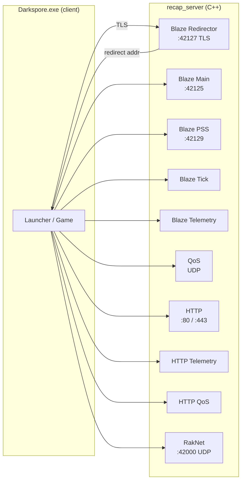

# FLOW_CPP — Ground-Truth Server Flow (C++)

Source: `C:/CodingProjects/Personal/ReCap.Cpp/darkspore_server/source/`. All `file:line` citations resolve into that tree.

> **Status:** skeleton. Each phase will be expanded into `phases/NN-*.md` with full byte-level layout and mermaid diagrams. This page = global view + pointers.

---

## Global topology



All servers share a single `boost::asio::io_context` (`Main.cpp:46`). A single `io_service.run()` call on the main thread (`Main.cpp:221`) multiplexes every connection.

---

## Servers and ports (default config)

| Server | Port | Proto | File | Constructed at |
|---|---|---|---|---|
| Redirector | 42127 | TCP+TLS | `Blaze/Server.cpp` | `Main.cpp:132` |
| Blaze main (lobby) | 42125 | TCP | `Blaze/Server.cpp` | `Main.cpp:133` |
| PSS | 42129 | TCP | `Blaze/Server.cpp` | `Main.cpp:135` |
| Tick | (config) | TCP | `Blaze/Server.cpp` | `Main.cpp:136` |
| Telemetry | (config) | TCP | `Blaze/Server.cpp` | `Main.cpp:137` |
| QoS | (config) | UDP | `QoS/Server.cpp` | `Main.cpp:140` |
| HTTP main | (config) | TCP | `HTTP/Server.cpp` | `Main.cpp:143` |
| HTTP Telemetry | (config) | TCP | `HTTP/Server.cpp` | `Main.cpp:144` |
| HTTP QoS | (config) | TCP | `HTTP/Server.cpp` | `Main.cpp:145` |
| RakNet | 42000 | UDP | `RakNet/Server.cpp` | via Game (Instance) |

Config keys: `Game/Config.h:13-32` (`enum ConfigKey`).

---

## Registered Blaze components

`Blaze/Component/`:

| ID | Component | Responsibility |
|---|---|---|
| 0x0001 | Authentication (`AuthComponent.cpp`) | Login, logout, session token |
| 0x0004 | GameManager (`GameManagerComponent.cpp`) | CreateGame, JoinGame, FinalizeGameCreation |
| 0x0007 | Redirector (`RedirectorComponent.cpp`) | ServerInstanceRequest |
| 0x0009 | Stats / Census (`CensusDataComponent.cpp`) | UserCount, subscribe |
| 0x000F | AssociationList (`AssociationComponent.cpp`) | Friends list |
| 0x0015 | UserSessions (`UserSessionComponent.cpp`) | Session lifecycle |
| 0x0019 | Util (`UtilComponent.cpp`) | Ping, tick, fetchClientConfig, preauth |
| 0x001D | Messaging (`MessagingComponent.cpp`) | Lobby chat |
| 0x0066 | Rooms (`RoomsComponent.cpp`) | Lobby rooms |
| 0x0067 | Playgroups (`PlaygroupsComponent.cpp`) | Party / playgroup |

Dispatch: `Blaze/Client.cpp` → `Component::ParseRequest()` → component-specific handler.

---

## RakNet PacketID enum

Defined in `RakNet/Types.h:24-102`. Range `0x7F`–`0xCC`. Bit-for-bit identical to the C# `PacketType.cs`. Trimmed view:

```
0x7F HelloPlayerRequest    0x80 HelloPlayer           0x81 ReconnectPlayer
0x82 Connected             0x84 PlayerJoined          0x85 PartyMergeComplete
0x88 PlayerStatusUpdate    0x8A GameState             0x8B DirectorState
0x8C ObjectCreate          0x8D ObjectUpdate          0x8E ObjectDelete
0x91 ObjectPlayerMove      0x94 LocomotionDataUpdate  0x96 AttributeDataUpdate
0x97 CombatantDataUpdate   0x9B ServerEvent           0x9C ActionCommandMsgs
0xA1 LabsPlayerUpdate      0xA7 PlayerCharacterDeploy 0xA8 ActionCommandResponse
0xA9 ChainVoteMsgs         0xAC ChainPlayerMsgs       0xAF QuickGameMsgs
0xB0 GamePrepareForStart   0xB1 GameStart             0xB7 ObjectivesInitForLevel
0xB8 ObjectiveUpdated      0xB9 ObjectivesComplete    0xCC DebugPing
```

---

## Phases

### Phase 00 — Boot

Entry point `main()` at `Main.cpp:303`:

1. `Application::InitApp(argc, argv)` (`Main.cpp:50`) — parse CLI args.
2. `Application::OnInit()` (`Main.cpp:91`):
   - `Game::Config::Load("config.xml")`
   - Construct `Scheduler`
   - Construct `SporeNet::Instance`
   - Construct `Game::API` (HTTP route registrar)
   - Spin up 9 TCP/UDP servers (see table above)
   - Share the same `Router` between `mHttpServer`, `mHttpTelemetryServer`, `mHttpQosServer`
   - Background thread: `Installer::LoadDarksporeData` + `NounDatabase::Instance()` + `GlobalLua::Initialize()`
3. `app.Run()` calls `mIoService.run()` (single thread, multiplexed).

> **Deep-dive:** [`phases/00-boot.md`](phases/00-boot.md) (TODO)

---

### Phase 01 — Redirector

Client opens TLS on :42127. C++ accepts in `Blaze::Server` → creates a `Blaze::Client`. Client sends `RedirectorComponent::ServerInstanceRequest`. Server replies with `ServerInstanceInfo` pointing at :42125.

Handler: `RedirectorComponent.cpp` (lines to be pinned in deep-dive).

> **Deep-dive:** [`phases/01-redirector.md`](phases/01-redirector.md) (TODO)

---

### Phase 02 — Blaze Auth

Client opens TCP on :42125. Typical sequence:

1. `Util::preAuth` — `fetchClientConfig`, ping
2. `Auth::login` (or `loginPersona`) — credentials
3. `UserSessions::updateNetworkInfo`, `updateHardwareFlags`
4. Periodic ticker keeps the connection alive

Handlers: `Blaze/Component/AuthComponent.cpp`, `UserSessionComponent.cpp`, `UtilComponent.cpp`.

> **Deep-dive:** [`phases/02-blaze-auth.md`](phases/02-blaze-auth.md) (TODO)

---

### Phase 03 — REST Bootstrap

The HTTP launcher calls:

- `GET /bootstrap/api?method=api.status.getStatus` → server status
- `GET /bootstrap/api?method=api.config.getConfigs` → URLs, flags
- `GET /bootstrap/api?method=api.account.getAccount` → account, decks, creatures
- `POST /survey/api?method=*` → telemetry
- Static asset paths under `/web/sporelabsgame/*`

Routing: `HTTP/Router.cpp` + `Game/API.cpp`.

> **Deep-dive:** [`phases/03-rest-bootstrap.md`](phases/03-rest-bootstrap.md) (TODO)

---

### Phase 04 — Blaze GameManager

Client creates / joins a "game" through `GameManager::CreateGame` or `JoinGame`. Server generates attributes (`NETWORK_QOS_DATA`, etc.), broadcasts `NotifyGamePlayerStateChange`, and hands the RakNet endpoint back. Attribute payloads use TDF Map.

Handler: `GameManagerComponent.cpp`.

> **Deep-dive:** [`phases/04-blaze-gamemanager.md`](phases/04-blaze-gamemanager.md) (TODO)

---

### Phase 05 — RakNet Connect

Client opens UDP :42000. RakNet handshakes internally (CONNECTION_REQUEST → INCOMING). Server detects `ID_NEW_INCOMING_CONNECTION` in `Server::ParseRakNetPackets` (`RakNet/Server.cpp:401`):

```
ID_NEW_INCOMING_CONNECTION → Server::OnNewIncomingConnection (Server.cpp:565)
  AddClient(packet)
  client->SetGameState(Spaceship)
  SendConnected(client)   // 0x82, empty body
```

> **Deep-dive:** [`phases/05-raknet-connect.md`](phases/05-raknet-connect.md) (TODO)

---

### Phase 06 — Spaceship (`state = 0x02`)

Client sends `HelloPlayerRequest` (0x7F). Server:

1. `OnHelloPlayerRequest` (`Server.cpp:596`):
   - `client->SetUser(GetUserById(blazeId))`
   - `gameStateData.state = Spaceship (0x02)`, `type = Chain`
   - `SetCatalyst×8` for slots 0–7 (random AoE rarity, slot 7 = Health / Rare). Each call sets `updateBits |= CrystalBits<<i`, then `UpdateCatalystBonuses()` → `dataBit 14` + `PlayerBits`
2. `SendHelloPlayer` (0x80, ~12 B): type=0, mId, IP, port (`Server.cpp:1235`)
3. `SendPartyMergeComplete` (0x85, body ≤1 B)
4. First `Instance::Update()` tick → `SendLabsPlayerUpdate` (0xA1):
   - **Initial dataBits** = `{0,3,4,5,6,7,8,12,13,14,15,16,17,18,21,22}` (16 bits) — set by `Player()` ctor + `Setup()` + `SetStatus(0,0)` + `UpdateCatalystBonuses()`
   - **updateBits** = `PlayerBits | (CrystalBits<<0..7)` = `0x17F8`
   - Payload: `Player::WriteReflection` (16 fields, byte-ID + `0xFF` terminator) + 8× `Catalyst::WriteReflection` top-level
   - Post-send: `Player::ResetUpdateBits()` zeroes `mUpdateBits`, `mDataBits`, and each `Character.dataBits`

> **Deep-dive:** [`phases/06-spaceship.md`](phases/06-spaceship.md) (TODO)

---

### Phase 07 — ChainVoting (`state = 0x0B`)

1. Client sends `DebugPing` (0xCC). C++ Spaceship branch in `Server::OnDebugPing` (`Server.cpp:~1145`) sets `state = ChainVoting (0x0B)`. No immediate packet — the next `SendGameState` broadcast carries the change.
2. Client sends `ChainPlayerMsgs` (0xAC) **byteCount=2**, value=0. `OnChainPlayerMsgs` (`Server.cpp:986`):
   - `SendChainVoteMessages(client, 0)` → `ChainVoteMsgs` (0xA9), value=0, then `ChainData::WriteTo(stream)` emits a **0x151-byte (337 B) LE blob** with offsets:
     - `0x00`: u32 mLevel | u32 mLevelIndex | u32 mStarLevel | f32 timeRemaining (= 30·60·1000)
     - `0x10`: u8 progression
     - `0x11`: u32 enemyNouns[6]
     - `0x29`: u32 levelNouns[2]
     - `0x39`: u32 partyValue, u32 cinematic1, u32 cinematic2
     - `0x45`: u32 voiceover, u32 completionFlag
   - `SendChainVoteMessages(client, 1)` → value=1, `f32 secondsUntilDeployment = 30.0`. **8 B total.**

> **Note:** the buffer is encoded **LE**. The wire is LE throughout (Write&lt;T&gt; produces LE). Do not flip (confirmed LE in `VERIFIED_FACTS.md`).

> ⚠️ SUPERSEDED 2026-05-31 — see VERIFIED_FACTS.md (old "rest of wire is BE" claim was wrong; all wire is LE)
>
> **Deep-dive:** [`phases/07-chainvote.md`](phases/07-chainvote.md) (TODO)

---

### Phase 08 — PreDungeon (`state = 0x05`)

Client sends `ChainPlayerMsgs` (0xAC) **byteCount=6** → reads `value (u8), unknown (u8), squadId (u32 BE)`, calls `PrepareGameStart(client, unknown, squadId)` (`Server.cpp:1208`):

1. `squad = user->GetSquadById(squadId)`
2. `gameStateData.state = PreDungeon (0x05)`
3. **`player->SetSquad(squad)`** (`Player.cpp:267`):
   - `mCurrentDeckIndex = 0; mQueuedDeckIndex = 0`
   - For each of 3 creatures: `Character()` ctor sets **all 13 `mDataBits`** (`Character.cpp:11`). Setters fire `SetMaxHealth(200)`, `SetHealth(...)`, `SetMaxMana(200)`, `SetMana(...)`, `SetNoun`, `SetVersion`, `SetCreatureType`, `SetGearScore`, `SetGearScoreFlattened` (each also sets the matching Character dataBit). Then `SetCharacter(std::move(char), i)` → `mDataBits.set(3)`, `SetUpdateBits(CharacterBits<<i)`
   - After loop: dataBits |= `{1 = CurrentDeckIndex, 2 = QueuedDeckIndex, 23 = DeckScore}`
   - `SetUpdateBits(PlayerBits)` — final `updateBits = PlayerBits | CharacterMask = 0x1007`
4. `SendGamePrepareForStart(client)` (`Server.cpp:1996`) — packet 0xB0, **17 B**: u32 level, u32 markerSet, u32 (= 1, "all players ready" bitfield), u32 levelIndex
5. Next 50 ms tick: `SendLabsPlayerUpdate` (updateBits = `0x1007` ≠ 0):
   - PlayerReflection with accumulated dataBits = `{1,2,3,23}`
   - 3× Character.WriteReflection (each carries all 13 dataBits from the ctor)

Client then drives its loading sequence, sending `PlayerStatusUpdate` (0x88, 9 B: u32 status, f32 progress). `OnPlayerStatusUpdate` (`Server.cpp:643`):

- `player->SetStatus(status, progress)` → dataBits `{7, 8}`, `SetUpdateBits(PlayerBits)`
- status=2 (joining): no extra action
- status=4 (loading): no extra action
- status=8 (loaded): `state = Dungeon (0x06)`, `SendGameStart(client)` (0xB1, 5 B: type + u32 levelIndex), `SendDebugPing(client)`
- status=20: `mGame.BeamOut(player)`
- **Always:** `SendLabsPlayerUpdate(client, player); player->ResetUpdateBits();`

**The server does not drive 4 → 8.** The client transitions on its own once assets / Lua finish loading. If it stalls at 4 the bug is upstream (malformed LPU, ChainVote, or `GamePrepareForStart`).

> **Deep-dive:** [`phases/08-predungeon.md`](phases/08-predungeon.md) (TODO)

---

### Phase 09 — Dungeon (`state = 0x06`)

Once in Dungeon, client sends `DebugPing`. `OnDebugPing` Dungeon branch (`Server.cpp:1186`):

1. `SendDirectorState` (0x8B) with an empty `cAIDirector` (boss=0, bbBossSpawned=false, raw `WriteTo`)
2. `SendQuickGame` (0xAF, QuickGameMsgs)
3. `mGame.OnPlayerStart(player)` (`Instance.cpp:308`):
   - `ObjectivesInitForLevel`
   - `ObjectCreate` for every level marker (NPCs)
   - Hero `ObjectCreate` + `PlayerCharacterDeploy`
4. `mGame.SwapCharacter(player, 1)` (`Instance.cpp:533`) — set current creature, send LPU

> **Deep-dive:** [`phases/09-dungeon.md`](phases/09-dungeon.md) (TODO)

---

### Phase 10 — Gameplay loop

`Server::run_one()` (`RakNet/Server.cpp:234`) runs once per `io_service` iteration. Every 50 ms:

- Outer `mGame.Update()` returns `true` if any work happened → broadcast `SendGameState(client, gameStateData)` to all clients (in every state, PreDungeon/Dungeon included).
- `Instance::Update()` (`Instance.cpp:452`) runs every 50 ms:
  - `mObjectManager->Update(delta/1000)`
  - Per player: `SendLabsPlayerUpdate(player)`. Early-returns if `updateBits == 0`.

In-game actions (movement, abilities, loot drops):

- `OnActionCommandMsgs` (`Server.cpp:688`)
- `OnCrystalDragMessage` (`Server.cpp:1024`)
- `OnLootDropMessage` (`Server.cpp:1091`)
- `Instance::MoveObject` (`Instance.cpp:483`)
- `Instance::UseAbility` (`Instance.cpp:507`)
- `Instance::DropLoot` (overloads at `Instance.cpp:616+`)

> **Deep-dive:** [`phases/10-gameloop.md`](phases/10-gameloop.md) (TODO)

---

### Phase 11 — ChainCashOut (`state = 0x0C`)

Terminal happy-path of a Chain run. Triggered by `PlayerStatusUpdate(status=0x20)` (player presses **Beam Out**) which routes to `Instance::BeamOut` (`Instance.cpp:856-880`):

1. `mChainData.SetCompleted(true)` + `SetProgression(1)`
2. `mCashOutData` filled with placeholder rewards (DNA=50, planets=2, medals + drop chances)
3. `SendReconnectPlayer(client, GameState::ChainVoting)` (0x81, 5 B: u32 BE newState)
4. `SendDebugPing(client)` (0xCC echo)

Client then raises its own transition into `ChainCashOut` (because `chainData.completed == true`) and pings the server:

5. `OnDebugPing` ChainCashOut branch (`Server.cpp:1173-1176`) → `SendChainCashOutMessages(client, 1)` (`Server.cpp:2184-2196`).

> ⚠️ **C++ wire-ID quirk:** `SendChainCashOutMessages` writes `PacketID::ChainVoteMsgs (0xA9)` instead of `ChainCashOutMsgs (0xAB)`. Either a copy-paste bug or the client demultiplexes both opcodes through the same parser. Verify against a real capture before mirroring in C#.

Body of the cashout message (value=1): `u8 value + CashOutData::WriteTo` — a 0x2C8 (712 B) buffer with absolute-offset fields:

| Offset | Field | Type |
|---|---|---|
| `0x000` | `mPlanetsCompleted` | u32 |
| `0x004` | `mDna` | f32 |
| `0x034..0x043` | `mGoldMedals[4]` | u32[4] |
| `0x044..0x053` | `mSilverMedals[4]` | u32[4] |
| `0x054..0x063` | `mBronzeMedals[4]` | u32[4] |
| `0x064..0x073` | `mUniqueChances[4]` | u32[4] |
| `0x074..0x083` | `mRareChances[4]` | u32[4] |
| `0x084..0x2C7` | (zero) | — |

Companion packet `SendObjectivesComplete` (0xB9, `Server.cpp:2233-2253`) is **distinct from** the cashout blob: `u8 count + per-objective WriteTo + u32 medals`.

**Failure lane (GameOver, `state = 0x0D`).** Not actually invoked anywhere in the C++ source, but the wiring exists:

- `SendChainGame(client, state)` (`Server.cpp:2334-2348`) — `state=1` = mission failed → drives client into `GameOver`.
- `ChainGameOverMsgs (0xAE)` — declared, never invoked.
- `IsValidStateChange` allows only `GameOver → Spaceship`.

> **Deep-dive:** [`phases/11-chaincashout.md`](phases/11-chaincashout.md)

---

### Phase 12 — GameOver (`state = 0x0D`)

Failure lane parallel to Phase 11. Reached on party wipe; signalled via `ChainGameMsgs(state=1)` (`Server.cpp:2334-2348`). Body: 2 bytes (`u8 packetId(0xAD) + u8 state`).

C++ status: declared (helper + enum value), **never invoked** — all four `SendChainGame` call sites in `Server.cpp` are commented out (lines 1164, 1188, 1199, 2105). No wipe-detection trigger exists. `ChainGameOverMsgs (0xAE)` is also declared but unimplemented.

`IsValidStateChange` (`Client.cpp:24-26`) only allows `GameOver → Spaceship`.

> **Deep-dive:** [`phases/12-gameover.md`](phases/12-gameover.md)

---

### Phase 13 — Disconnect / Shutdown

Three paths into cleanup:

1. **Graceful** — client sends `Goodbye (0x83)`. **No parser case** in `ParseSporeNetPackets` — the packet is silently consumed.
2. **RakNet timeout / FIN** — `ID_DISCONNECTION_NOTIFICATION` or `ID_CONNECTION_LOST` in `ParseRakNetPackets` (`Server.cpp:403,424`) → `RemoveClient(packet)` (`Server.cpp:516-520`).
3. **Server-initiated** — none. No `SendGoodbye`, no `SendPlayerKick`.

`RemoveClient` only erases from `mClients`. It does **not** call `Instance::RemovePlayer`, leaving a stale entry in `mPlayers` (small leak per session).

`SendPlayerDeparted (0x86, 1 B mId)` is defined (`Server.cpp:1297-1304`) but has **zero call sites**. `VoteKickStarted (0x87)` and `GameAborted (0x89)` are declared but unimplemented.

> **Deep-dive:** [`phases/13-disconnect.md`](phases/13-disconnect.md)

---

## Wire-state codes (recap)

| State | Code |
|---|---|
| Spaceship | `0x02` |
| PreDungeon | `0x05` |
| Dungeon | `0x06` |
| ChainVoting | `0x0B` |
| ChainCashOut | `0x0C` |
| GameOver | `0x0D` |
| Quit | `0x0E` |

## Reflection encoding (recap)

- `Player::WriteReflection` → `reflection_serializer<24>` (>16 fields) → byte field-ID per field + `0xFF` terminator.
- `Character::WriteReflection` → `reflection_serializer<124>` (>16 fields) → byte ID + `0xFF`.
- Inside `Player`:
  - Field 3 → 3× `Character::WriteTo`, raw fixed 0x620 B each
  - Field 13 → 9× `Catalyst::WriteTo`, raw 16 B each (yes — 9 on the wire even though only 8 logical slots, last one masks the active slot)
  - Field 14 → `bool[8]`

## Per-call mutation cheat sheet

| Call | dataBits set | updateBits set |
|---|---|---|
| `Player::SetStatus(s, p)` | `{7, 8}` | `\|= PlayerBits` |
| `Player::SetSquad(squad)` | `{1, 2, 23}` + each Character `{3}` | `\|= PlayerBits \| (CharacterBits<<i)` |
| `Player::SetCharacter(char, i)` | `{3}` | `\|= CharacterBits<<i` |
| `Player::SetCatalyst(cat, i)` | `{14}` via `UpdateCatalystBonuses` | `\|= CrystalBits<<i \| PlayerBits` |
| `Instance::SwapCharacter` | `{1}` | `\|= PlayerBits` |
