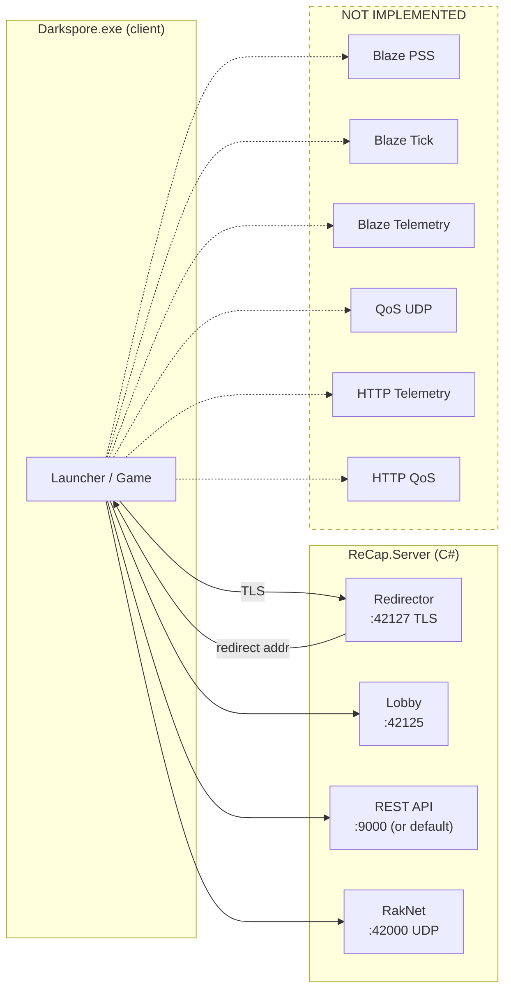

# FLOW_CSHARP — Current Server Flow (C#)

Source: `/Users/jeanxpereira/CodingProjects/ReCap/ReCap.Server/`. All `file:line` citations resolve into that tree.

> **Status:** skeleton. Mirrors `FLOW_CPP.md` phase-by-phase, flagging what is implemented, what is missing, and what diverges. Byte-level audits land in `phases/NN-*.md`.

---

## Global topology

Each server runs on its own `Task.Run` from `Program.Main` (`Program.cs:127-135`). No single shared event loop — every adapter owns its own socket / `TcpListener` / `HttpListener` lifecycle.

---

## Servers and ports

| Server | Port | Proto | Class | Constructed at |
|---|---|---|---|---|
| Redirector | 42127 | TCP+TLS | `BlazeServer` (secure=true) | `Program.cs:126` |
| Lobby | 42125 | TCP | `BlazeServer` (secure=false) | `Program.cs:130` |
| RakNet | 42000 | UDP | `RakNetServer` | `Program.cs:134` |
| REST | 9000 (or `--port=`) | TCP HTTP | `Adapters.Rest.Api.Api` | `Program.cs:140` |
| **PSS** | — | — | ❌ missing | — |
| **Tick** | — | — | ❌ missing | — |
| **Telemetry** | — | — | ❌ missing | — |
| **QoS** | — | — | ❌ missing | — |
| **HTTP Telemetry / QoS** | — | — | ❌ missing | — |

> The missing TCP/UDP services are not strictly required for offline play, but some Blaze flows expect at least an open socket (e.g. `PSS`). To confirm later: does the client survive when those ports refuse?

---

## Blaze components present

`ReCap.Server/Adapters/Blaze/Component/`:

| C# class | Maps to C++ | Notes |
|---|---|---|
| `AuthenticationComponent.cs` | `AuthComponent.cpp` | ID 0x0001 |
| `GameManager/` directory | `GameManagerComponent.cpp` | ID 0x0004 |
| `RedirectorComponent.cs` | `RedirectorComponent.cpp` | ID 0x0007 |
| (no equivalent) | `CensusDataComponent.cpp` | ID 0x0009 — **missing**, currently stubbed |
| `AssociationListsComponent.cs` | `AssociationComponent.cpp` | ID 0x000F |
| `UserSessionsComponent.cs` | `UserSessionComponent.cpp` | ID 0x0015 |
| `UtilComponent.cs` | `UtilComponent.cpp` | ID 0x0019 |
| `MessagingComponent.cs` | `MessagingComponent.cpp` | ID 0x001D |
| `RoomsComponent.cs` | `RoomsComponent.cpp` | ID 0x0066 |
| `PlaygroupsComponent.cs` | `PlaygroupsComponent.cpp` | ID 0x0067 |
| `UnknownComponent1.cs` | — | unknown ID; to be identified |
| `Shared.cs` / `IComponent.cs` | base + helpers | — |

Dispatch path: `BlazeServer` → `Client` accepts → `Packet` parsed → component lookup by ID → method index → handler.

---

## RakNet adapter layout

`ReCap.Server/Adapters/RakNet/`:

| File | Role |
|---|---|
| `RakNetServer.cs` | UDP socket via `RakNexus` submodule (`lib/RakNexus`), session lifecycle, dispatcher loop |
| `RakNetClient.cs` | Per-session wrapper, `SendPacket(IRakNetPacket)` |
| `PacketType.cs` | `enum PacketType : byte`, mirrors C++ `PacketID` |
| `Packets/PacketActivator.cs` | Switch on `PacketType` → instantiate `IRakNetPacket` for incoming traffic |
| `Packets/*.cs` | One file per packet implementing `IRakNetPacket` (`ReadFrom` / `WriteTo`) |
| `ReflectionSerializer.cs` | Replicates the C++ `reflection_serializer<N>` bitmap rules |

> **Submodule note:** `lib/RakNexus` is a custom C# RakNet 3.92 port authored by `JeanxPereira`. It is **not** byte-for-byte identical to the upstream RakNet — UDP framing, MTU handling, and reliability layers were re-implemented. Treat divergent UDP behaviour as a possible source of bugs.

### Packets implemented (with `IRakNetPacket`)

`ActionCommandMsgs`, `ActionCommandResponse`, `ChainPlayerMsgs`, `ChainVoteMsgs`, `Connected`, `DebugPing`, `DirectorState`, `GamePrepareForStart`, `GameStart`, `GameState`, `HelloPlayer`, `HelloPlayerRequest`, `LabsPlayerUpdate`, `LocomotionDataUpdate`, `ObjectCreate`, `ObjectivesComplete`, `ObjectivesInitForLevel`, `ObjectiveUpdated`, `ObjectPlayerMove`, `ObjectUpdate`, `PartyMergeComplete`, `PlayerCharacterDeploy`, `PlayerJoined`, `PlayerStatusUpdate`, `QuickGameMsgs`.

### Packets *not yet* implemented but on the wire

Among the C++ enum members not covered: `ReconnectPlayer`, `Goodbye`, `PlayerDeparted`, `VoteKickStarted`, `GameAborted`, `ObjectDelete`, `ObjectJump`, `ObjectTeleport`, `ForcePhysicsUpdate`, `PhysicsChanged`, `LocomotionDataUnreliableUpdate`, `AttributeDataUpdate`, `CombatantDataUpdate`, `InteractableDataUpdate`, `AgentBlackboardUpdate`, `LootDataUpdate`, `ServerEvent`, `PlayerDamage`, `LootSpawned`, `LootAcquired`, `ModifierCreated/Updated/Deleted`, `SetAnimationState`, `SetObjectGfxState`, `ChainLevelResultsMsgs`, `ChainCashOutMsgs`, `ChainGameMsgs`, `ChainGameOverMsgs`, `Arena*`, `CombatEvent`, `Juggernaut*`, `ReloadLevel`, `GravityForceUpdate`, `CooldownUpdate`, `CrystalDragMessage`, `CrystalMessage`, `KillRace*`, `TutorialGameMsgs`, `CinematicMsgs`, `ObjectiveAdd`, `LootDropMessage`.

Some of these are spec'd in the enum but never appear in normal flow; others (`ObjectDelete`, `LootDropMessage`, `CrystalDragMessage`) are absolutely required by the gameplay loop.

---

## Domain model

`ReCap.Server/Domain/`:

| File | Role | C++ peer |
|---|---|---|
| `Gameplay/Game.cs` | State machine driver, packet dispatch into gameplay | `Game/Instance.cpp` |
| `Gameplay/GameplayState.cs` | enum of wire states (Spaceship, ChainVoting, PreDungeon, Dungeon, ChainCashOut) | hard-coded codes in C++ |
| `Gameplay/Player.cs` | LabsPlayer state, dataBits/updateBits | `Game/Player.cpp` |
| `Gameplay/BasePlayer.cs` | Shared base | — |
| `Gameplay/Bot.cs` | AI placeholder | partial of `Object.cpp` |
| `Gameplay/ChainData.cs` | 0x151 buffer fields | `Game/Level.cpp` (ChainData struct) |
| `Gameplay/Objects/*` | Object hierarchy (creatures, items, markers) | `Game/Object.cpp`, `Noun.cpp` |
| `Adapters/Persistence/SQLite/` | Account / Creature / Deck repositories | `SporeNet/Instance.cpp` |

Asset access goes through `Services/AssetDatabase.cs` (uses `lib/AssetData.Parser`). The generic `AssetNode` API replaces every place the C++ side calls `NounDatabase::Get(nounId)`. Field access is by name (`node["mGearScore"].AsUInt32()`).

---

## Phases

### Phase 00 — Boot

Entry point `Program.Main` (`Program.cs:27`):

1. Parse CLI args (`--port=`, `--database-path=`, `--assetdata-path=`)
2. Optional elevation (`ProcessPermissions.RerunElevatedAsync`)
3. `ServerConfig.Configure(serverOpts)` (`Program.cs:107`)
4. Construct `AssetDatabase` from `GamePath` (if provided)
5. `SqliteConfig.Start()` (`Program.cs:119`) — EF Core DbContext warm-up + seed
6. Launch four servers via `Task.Run`:
   - Redirector (`Program.cs:126`)
   - Lobby (`Program.cs:130`)
   - RakNet (`Program.cs:134`)
   - REST (`Program.cs:140`)

> Asymmetric to C++: no `Scheduler`, no shared `io_context`. Each adapter is independent — pros (clean ownership), cons (no shared back-pressure / no central tick).
>
> **Deep-dive:** [`phases/00-boot.md`](phases/00-boot.md) (TODO)

---

### Phase 01 — Redirector

Implemented via `BlazeServer` with `isSecure=true`. TLS material under `Adapters/Blaze/Ssl/`. `RedirectorComponent.cs` handles `ServerInstanceRequest`.

> **Deep-dive:** [`phases/01-redirector.md`](phases/01-redirector.md) (TODO)

---

### Phase 02 — Blaze Auth

Implemented by `AuthenticationComponent.cs`, `UserSessionsComponent.cs`, `UtilComponent.cs`. Backed by `AccountService.cs` (SQLite) + `BlazeCredentials.cs`.

Known divergence: `CensusDataComponent` is absent. If the client subscribes to user-count it currently receives no response (silent fail).

> **Deep-dive:** [`phases/02-blaze-auth.md`](phases/02-blaze-auth.md) (TODO)

---

### Phase 03 — REST Bootstrap

REST adapter under `Adapters/Rest/`:

- `Api.cs` — `HttpListener` loop
- `Contracts/Bootstrap/` — `/bootstrap/api?method=*`
- `Contracts/Game/` — `/game/api?method=*`
- `Contracts/Survey/` — `/survey/api?method=*`
- Static files served from `resources/static/`

Services: `AccountService`, `CreatureService`, `DeckService`, `StatusService`, `SurveyService`, `ConfigService`, `BroadcastService`.

> **Deep-dive:** [`phases/03-rest-bootstrap.md`](phases/03-rest-bootstrap.md) (TODO)

---

### Phase 04 — Blaze GameManager

`Adapters/Blaze/Component/GameManager/` — split into multiple files. Handles `CreateGame`, `JoinGame`, `NotifyGameSetup`, `NotifyGamePlayerStateChange`. The `GameService` (`Services/GameService.cs`) holds the in-memory game registry and is shared with both `BlazeServer (Lobby)` and `RakNetServer` via constructor injection.

> **Deep-dive:** [`phases/04-blaze-gamemanager.md`](phases/04-blaze-gamemanager.md) (TODO)

---

### Phase 05 — RakNet Connect

`RakNetServer.ExecuteAsync` (in `RakNetServer.cs`) listens via `RakNexus`. On `ID_NEW_INCOMING_CONNECTION`:

1. Allocate `RakNetClient` session
2. Set state to `Spaceship` (via `GameService`)
3. Send `ConnectedPacket` (0x82)

Audit candidates here: RakNexus framing parity vs upstream RakNet 3.92, reliability layer behaviour, MTU.

> **Deep-dive:** [`phases/05-raknet-connect.md`](phases/05-raknet-connect.md) (TODO)

---

### Phase 06 — Spaceship (`state = 0x02`)

`Game.HandlePacket` dispatches `HelloPlayerRequest` (0x7F):

1. `Player` constructed → `SetInitialDataBits` → **`{0, 4, 5, 6, 7, 8, 12, 15, 16, 18, 21, 22}` (12 bits)**.
2. Catalysts 0–7 populated.
3. `HelloPlayer` (0x80), `PartyMergeComplete` (0x85) sent.
4. Game loop's next tick → `LabsPlayerUpdate` (0xA1) with the 12 initial bits + catalysts.

> **Updated 2026-05-31:** C# now emits 13 bits (added bit 3). Bit 3 is safe — chain vote still fires. Adding `{13, 14, 17}` not yet tested. See `VERIFIED_FACTS.md`.

> ⚠️ SUPERSEDED 2026-05-31 — see VERIFIED_FACTS.md (bit-3 FROZEN rule disproved)
>
> **Deep-dive:** [`phases/06-spaceship.md`](phases/06-spaceship.md) (TODO)

---

### Phase 07 — ChainVoting (`state = 0x0B`)

Implemented. `Game.HandleDebugPing` flips Spaceship → ChainVoting on `0xCC`. `Game.HandleChainPlayerMsgs` byteCount=2 path emits two `ChainVoteMsgs` packets:

- One with `ChainData` 0x151-byte LE blob
- One with `value=1, secondsUntilDeployment=30.0`

> **Confirmed:** the buffer is LE. Verified 2026-05-31 — wire is LE throughout. Do not flip. See `VERIFIED_FACTS.md`.
>
> **Deep-dive:** [`phases/07-chainvote.md`](phases/07-chainvote.md) (TODO)

---

### Phase 08 — PreDungeon (`state = 0x05`)

**Current bug surface.** Sequence intended:

- `ChainPlayerMsgs` byteCount=6 (vote): parse `value, unknown, squadId(BE u32)`, run `PrepareGameStart`.
- `Player.SetSquad(squad)` populates 3 characters → dataBits `{1, 2, 3, 23}` + Character bits.
- Send `GamePrepareForStart` (0xB0, 17 B).
- LPU broadcast on next tick.
- Receive `PlayerStatusUpdate` (0x88) at status=2, 4, 8.
- On status=8: switch state to Dungeon, send `GameStart` + `DebugPing`.

What we observe today: client reaches status=4 and stops. Bug must be in one of: ChainVote blob payload, GamePrepareForStart layout, the LPU emitted just before status=4, or RakNet reliability under load.

> **Deep-dive:** [`phases/08-predungeon.md`](phases/08-predungeon.md) (TODO — top priority)

---

### Phase 09 — Dungeon (`state = 0x06`)

Stubbed. `Game.HandleDebugPing` Dungeon branch should send `DirectorState`, `QuickGameMsgs`, then run `OnPlayerStart` (objectives + object create + character deploy). Currently dependent on objects we have not yet ported (`Instance::OnPlayerStart` logic, level marker iteration, etc.).

> **Deep-dive:** [`phases/09-dungeon.md`](phases/09-dungeon.md) (TODO)

---

### Phase 10 — Gameplay loop

`RakNetServer.ExecuteAsync` runs the 50 ms tick. Calls `Game.Update()`. Inside the loop:

- Broadcasts `GameStatePacket` (`GameType=0`) to all connected players.
- Per player: builds and sends `LabsPlayerUpdatePacket` if `updateBits != 0`, then `ResetUpdateBits`.

Action handlers missing or partial — see "Packets not yet implemented" above. Object manager / octree are minimal stubs in `Domain/Gameplay/Objects/`.

> **Deep-dive:** [`phases/10-gameloop.md`](phases/10-gameloop.md) (TODO)

---

### Phase 11 — ChainCashOut (`state = 0x0C`)

**Not implemented.** Inventory of gaps:

- `Game.HandleDebugPing` (`Game.cs:264-287`) has no `ChainCashOut` arm.
- `Game.HandlePlayerStatusUpdate` (`Game.cs:334-356`) handles only `Status == 0x08`; client-initiated beam-out (`status = 0x20`) is silently dropped.
- No `BeamOut`, `SendReconnectPlayer`, `SendChainCashOutMessages`, `SendChainGame` helpers anywhere in `Game.cs`.
- `Domain/Gameplay/` has no `CashOutData` class. The 712-byte reward blob has no model.
- `GameplayState.cs` is missing `GameOver = 0x0D` (failure lane).
- `Adapters/RakNet/PacketType.cs` has `ReconnectPlayer (0x81)`, `ChainLevelResultsMsgs (0xAA)`, `ChainCashOutMsgs (0xAB)`, `ChainGameMsgs (0xAD)`, `ChainGameOverMsgs (0xAE)` declared.
- `Adapters/RakNet/Packets/PacketActivator.cs:23,156,159,166,169` — those five PacketTypes are **empty case stubs**. No packet classes exist for any of them.
- `Adapters/RakNet/Packets/ObjectivesCompletePacket.cs` exists but is **mis-encoded**: writes a raw 712-byte buffer labelled "CashOutData" under opcode `0xB9`. The real `ObjectivesComplete` body is `u8 count + per-objective WriteTo + u32 medals`. The 712-byte payload belongs to `ChainCashOutMsgs` (or `ChainVoteMsgs` per the C++ wire-ID quirk).

To implement: see the "Packets to implement" + "Game.cs work" sections in [`phases/11-chaincashout.md`](phases/11-chaincashout.md).

> **Deep-dive:** [`phases/11-chaincashout.md`](phases/11-chaincashout.md)

---

### Phase 12 — GameOver (`state = 0x0D`)

**Not implemented.** Inventory:

- `Domain/Gameplay/GameplayState.cs` — `GameOver` enum value missing (Quit `0x0E` also absent).
- `Adapters/RakNet/PacketType.cs` declares `ChainGameMsgs (0xAD)` and `ChainGameOverMsgs (0xAE)`.
- `Adapters/RakNet/Packets/PacketActivator.cs:166,169` — both are empty `break` stubs. No `IRakNetPacket` classes.
- `Domain/Gameplay/Game.cs` — no wipe detection, no `ChainGameMsgs` send.

Same caveat as C++: nothing actually exercises this lane today. Spec lives in [`phases/12-gameover.md`](phases/12-gameover.md).

---

### Phase 13 — Disconnect / Shutdown

Partial. C# does the same minimum as C++ — symmetric leak shape.

- `Adapters/RakNet/RakNetServer.cs:49,54-60` — `session.Disconnected += reason => OnSessionDisconnected(session)` and `OnSessionDisconnected` only calls `Clients.Remove(session.Guid.G)`. `reason` is discarded.
- **Player is not detached from the `Game`** on disconnect (`game.DetachPlayer` doesn't exist). Stale `Players` entry persists.
- **No `PlayerDeparted (0x86)` broadcast** to surviving clients.
- **No empty-game cleanup** — `GameService` keeps the entry indefinitely.
- `Adapters/RakNet/PacketType.cs:9,12,13,15` declares `Goodbye (0x83)`, `PlayerDeparted (0x86)`, `VoteKickStarted (0x87)`, `GameAborted (0x89)`.
- `Adapters/RakNet/Packets/PacketActivator.cs:30,41,44,51` — all four are empty stubs. No packet classes.
- No graceful shutdown signal handling (SIGINT/SIGTERM) — relies on process kill. See Phase 00 deep-dive.

> **Deep-dive:** [`phases/13-disconnect.md`](phases/13-disconnect.md)

---

## Wire-state codes used by C#

Defined in `Gameplay/GameplayState.cs`. Matches C++ codes:

| State | Code |
|---|---|
| Spaceship | `0x02` |
| PreDungeon | `0x05` |
| Dungeon | `0x06` |
| ChainVoting | `0x0B` |
| ChainCashOut | `0x0C` |
| **GameOver** | **`0x0D`** — ❌ missing from C# enum |

## Known C# ↔ C++ structural differences (snapshot)

1. **No shared `io_context`** — each adapter has its own loop. Affects shutdown ordering and back-pressure.
2. **`AssetDatabase` (generic)** replaces typed `NounDatabase`. Use `node["field"].AsUInt32()` instead of compile-time structs.
3. **RakNexus** is a re-implemented RakNet 3.92. Treat any UDP-level bug as potentially specific to this port.
4. **Initial LPU dataBits diverge (12 vs 16)** — frozen by design.
5. **PSS / Tick / Telemetry / QoS / HTTP-secondary** servers absent.
6. **`CensusDataComponent` absent** under Blaze.
7. **No `Scheduler`** — no centralised delayed-task queue.
