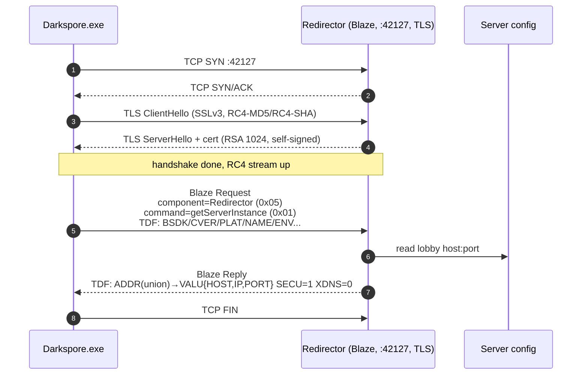

# Phase 01 — Redirector

Client opens its first TLS connection to discover where the real Blaze lobby lives. The redirector is a tiny Blaze instance whose only job is to answer `getServerInstance` with a `ServerInstanceInfo` payload (host, port, secure flag).



Blaze framing (every packet, both directions, both sides):

```
u16 BE  length          payload length in bytes
u16 BE  component       e.g. 0x05 Redirector
u16 BE  command         e.g. 0x01 getServerInstance
u16 BE  error_code      0 on success
u32 BE  message         (type:4 | id:20) ; type 0=request 1=reply 2=notification 3=error
... TDF body ...
```

TDF body uses Blaze's tag/type encoding (4-char tag → 3 bytes, type nibble, then value).

---

## C++

### Listener

`Blaze::Server` is the only Blaze server class. It is **always** TLS — there is no plaintext path:

| Item | Location | Notes |
|---|---|---|
| Ctor | `Blaze/Server.cpp:48-74` | Builds `mAcceptor` and an `ssl::context` (`sslv3`). |
| Cipher list | `Server.cpp:56` | `RC4-MD5:RC4-SHA` only. |
| Cert | `Server.cpp:11-27` | Hardcoded PEM. RSA 1024, self-signed, CN=`AU`, expired 2016-10-16. |
| Private key | `Server.cpp:29-45` | Hardcoded PEM. |
| `verify_callback` | `Server.cpp:100-110` | RFC 2818 against `"gosredirector.ea.com"`. Logs but the client connects with `verify_none`. |
| Accept loop | `Server.cpp:80-90` | One `Client*` allocated per accept; on success `client->start()` is fired, next `Client*` queued. |

The same class instance is used for the redirector at :42127 (`Main.cpp:132`) **and** for the lobby / PSS / tick / telemetry. Everything in the Blaze layer rides RC4 TLS.

### Client lifecycle

`Blaze::Client`:

| Item | Location | Notes |
|---|---|---|
| Ctor | `Client.cpp:16-31` | 10 KB read buffer, RCV/SND timeout disabled, `verify_mode = verify_none`. |
| `start()` | `Client.cpp:33-36` | Triggers `async_handshake` as server. |
| `send(...)` | `Client.cpp:38-72` | Writes the 12 B header (length, component, command, error, message) BE then optional TDF body. |

### Component registration

`RedirectorComponent` is the only component attached to the redirector listener.

- ID: `RedirectorComponent::Id` (header constant). C# mirrors with `Id = 5`.
- `ParsePacket` dispatch: `RedirectorComponent.cpp:123-134`.
- Reply names: `RedirectorComponent.cpp:115-121`.

### `getServerInstance` (0x01)

`RedirectorComponent::GetServerInstance` (`RedirectorComponent.cpp:194-201`):

```cpp
auto blazeServer = GetApp().get_blaze_server();        // the lobby on :10041 (default)
TDF::Packet packet;
WriteServerInstanceInfo(packet, blazeServer->get_address().to_string(),
                                blazeServer->get_port());
request.reply(packet);
```

`WriteServerInstanceInfo` (`RedirectorComponent.cpp:136-177`) builds:

| Tag | Type | Value | Source |
|---|---|---|---|
| `ADDR` | Union, member = `XboxClientAddress` | nested `VALU` struct | `RedirectorComponent.cpp:137` |
| `ADDR.VALU.HOST` | String | lobby DNS / IP | `RedirectorComponent.cpp:141` |
| `ADDR.VALU.IP` | Integer | 0 | `RedirectorComponent.cpp:142` |
| `ADDR.VALU.PORT` | Integer | lobby port (10041 by default) | `RedirectorComponent.cpp:143` |
| `SECU` | Integer | **1** | `RedirectorComponent.cpp:175` |
| `XDNS` | Integer | 0 | `RedirectorComponent.cpp:176` |

`AMAP` / `NMAP` / `MSGS` / `CERT` are present in the C# Tdf class but the C++ code does not emit them in this build (block is commented out, `RedirectorComponent.cpp:147-174`).

`Request` defined in `Blaze/Component.h` (see `Request::get_command()`, `request.reply(...)`); the reply path uses `Client::send(MessageType::Reply, ...)`.

### Inputs read from the client (`ServerInstanceRequest`)

The client sends a TDF struct including `BSDK`, `BTIM`, `CLNT`, `CLTP`, `CPLT`, `CSKU`, `CVER`, `DSDK`, `ENV`, `FPID` (union), `LOC`, `NAME`, `PLAT`, `PROF`. The C++ side does not deserialize them explicitly here — the response is computed unconditionally from the running server's address.

---

## C#

### Listener

`Adapters/Blaze/BlazeServer.cs`:

| Item | Location | Notes |
|---|---|---|
| Ctor | `BlazeServer.cs:32-77` | One `TcpListener`. Builds `Rc4TlsCrypto` + cert only if `isSecure=true`. |
| `Start()` | `BlazeServer.cs:79-84` | `Task.Run(Run)`. |
| Accept loop | `BlazeServer.cs:151-160` | `AcceptTcpClientAsync` then per-connection `Client`. |

Component attachment for the secure (redirector) instance:

```csharp
// BlazeServer.cs:49-55
if (isSecure) {
    AttachComponent(new RedirectorComponent{
        HostName = HostName,
        Ip = 0,
        Port = 42125
    });
}
```

> **Hardcoded port 42125** for the lobby is baked into the redirector at C# build time (`BlazeServer.cs:53`). C++ pulls the lobby port from `Game::Config` (`Blaze/Component/RedirectorComponent.cpp:195-198`).

TLS material: `Adapters/Blaze/Ssl/` (`CertGenerator.cs`, `Rc4TlsCrypto.cs`, `TlsServer.cs`, `TlsClient.cs`, `TlsRC4Cipher.cs`). The cert is generated programmatically (`PrepareCertificate(HostName)` on `BlazeServer.cs:46`); not pinned to the C++ hardcoded PEM.

### Component handler

`RedirectorComponent.cs:5-83`. Public fields:

| Field | Default | Set at |
|---|---|---|
| `Id` | `5` | `RedirectorComponent.cs:7` |
| `HostName` | `""` then overridden | `RedirectorComponent.cs:10`, set at `BlazeServer.cs:51` |
| `Ip` | `0` | `RedirectorComponent.cs:11`, set at `BlazeServer.cs:52` |
| `Port` | `0` then `42125` | `RedirectorComponent.cs:12`, set at `BlazeServer.cs:53` |
| `IsSecure` | `false` (never assigned) | `RedirectorComponent.cs:13` |

### `HandleGetServerInstance` (command 1)

`RedirectorComponent.cs:30-62`:

```csharp
var serverInfo = new ServerInstanceInfo
{
    Secure = IsSecure                    // false  <-- diverges from C++
};

serverInfo.Address.ActiveMember = ServerAddressMember.IpAddress;
serverInfo.Address.IpAddress.Hostname = HostName;
serverInfo.Address.IpAddress.Ip = Ip;
serverInfo.Address.IpAddress.Port = Port;

client.RespondTo(packet, serverInfo);
```

Reply TDF schema (`RedirectorComponent.cs:202-224`):

| Tag | C# property | Default | Notes |
|---|---|---|---|
| `ADDR` | `ServerAddress` (union) | `IpAddress` | `RedirectorComponent.cs:204` |
| `ADDR.VALU.HOST` | `Hostname` | from config | `RedirectorComponent.cs:124` |
| `ADDR.VALU.IP` | `Ip` | 0 | `RedirectorComponent.cs:127` |
| `ADDR.VALU.PORT` | `Port` | 42125 hardcoded | `RedirectorComponent.cs:130` |
| `AMAP` | `AddressRemaps` | empty | `RedirectorComponent.cs:208` |
| `CERT` | `CertificateList` | empty | `RedirectorComponent.cs:211` |
| `MSGS` | `Messages` | empty | `RedirectorComponent.cs:214` |
| `NMAP` | `NameRemaps` | empty | `RedirectorComponent.cs:217` |
| `SECU` | `Secure` | **false** | `RedirectorComponent.cs:220` |
| `XDNS` | `DefaultDNSAddress` | 0 | `RedirectorComponent.cs:223` |

If `HostName` and `Ip` are both empty, the handler short-circuits with `ServerInstanceError` (`RedirectorComponent.cs:41-47`) using error code `0x10005`. Mirrors the C++ "no target server" fallback.

### Lobby TLS in C#

`BlazeServer` for the lobby (`Program.cs:130`) is built with `isSecure=false`, so the lobby socket is plaintext. The client is told `SECU = 0` via the redirector reply, which is consistent on the C# side but **inconsistent with the C++ reference** (which is fully TLS on every Blaze port).

---

## Parity table

| Item | C++ | C# | Status | Notes |
|---|---|---|---|---|
| Listener :42127 (TCP+TLS) | `Main.cpp:132` | `Program.cs:126` | ✅ | |
| Component ID | 5 (`RedirectorComponent::Id`) | 5 (`RedirectorComponent.cs:7`) | ✅ | |
| Command dispatch | `RedirectorComponent.cpp:123-134` | `RedirectorComponent.cs:15-28` | ✅ | Both single command 1. |
| TLS version | SSLv3 (`Server.cpp:51`) | TLS via BouncyCastle (`Adapters/Blaze/Ssl`) | ⚠️ | Confirm the BouncyCastle path actually negotiates SSLv3 for client compatibility. |
| Cipher | `RC4-MD5:RC4-SHA` | RC4 via `TlsRC4Cipher` / `Rc4TlsCrypto` | ⚠️ | Cipher family matches but verify the exact suite name on the wire. |
| Cert | hardcoded PEM (CN=AU, expired 2016) | generated per-launch by `CertGenerator` | ⚠️ | The client doesn't verify, but cert chain differences can still surface in some TLS stacks. |
| Lobby host | `GetApp().get_blaze_server()->get_address()` | `HostName` from `ServerConfig` | ⚠️ | C++ resolves dynamically; C# uses configured hostname. |
| Lobby port | `get_port()` (10041 default) | **42125 hardcoded** | ⚠️ | Different number; functional because the redirector tells the client. |
| `SECU` flag | **1** (`RedirectorComponent.cpp:175`) | **false** (default `IsSecure`) | ⚠️ | **Divergent.** Client is told the lobby is plaintext in C# but TLS in C++. |
| `XDNS` | 0 | 0 | ✅ | |
| `AMAP` / `NMAP` / `CERT` / `MSGS` | absent on wire (commented out) | empty vectors emitted | ⚠️ | Empty TDF vectors still consume tag bytes; verify the client doesn't choke. |
| `ServerInstanceError` (error path) | C++ has no explicit fallback in this snippet | `0x10005` returned when host/ip both unset | ⚠️ | Confirm C++ does the same somewhere (probably a `Component::ParseRequest` fallback). |

---

## Open audit items

1. **`SECU` flag.** The C++ build hardcodes 1, the C# build emits the default `false`. Either:
   - C++ comment in `RedirectorComponent.cpp:175` is the bug (we made the lobby plaintext on purpose later), **or**
   - C# is leaking the wrong flag and the client sends Blaze packets to :42125 plaintext while expecting TLS, which would corrupt the very first lobby read.
2. **TLS negotiation.** SSLv3 + RC4 is brittle. Capture a `tcpdump` of the redirector handshake and confirm the BouncyCastle server actually accepts SSLv3 (most modern stacks disable it).
3. **`AMAP` / `NMAP` emitted empty in C#.** C++ doesn't emit those tags at all in current builds. An empty TDF list is still extra bytes on the wire — confirm the client tolerates either.
4. **Cert pinning.** C++ keeps an expired cert; C# regenerates. Confirm neither hits a CRL/OCSP path on Windows.
5. **No error path on the C++ side.** If `getServerInstance` is asked before the Blaze main server is up, C++ would dereference a null pointer. Document this as an actual race for completeness; it doesn't affect normal play.

---

## Files referenced

C++:

- `recap_server_develop/darkspore_server/source/Blaze/Server.cpp`
- `recap_server_develop/darkspore_server/source/Blaze/Server.h`
- `recap_server_develop/darkspore_server/source/Blaze/Client.cpp`
- `recap_server_develop/darkspore_server/source/Blaze/Component/RedirectorComponent.cpp`
- `recap_server_develop/darkspore_server/source/Blaze/Component/RedirectorComponent.h`

C#:

- `ReCap.Server/Adapters/Blaze/BlazeServer.cs`
- `ReCap.Server/Adapters/Blaze/Client.cs`
- `ReCap.Server/Adapters/Blaze/Component/RedirectorComponent.cs`
- `ReCap.Server/Adapters/Blaze/Ssl/CertGenerator.cs`
- `ReCap.Server/Adapters/Blaze/Ssl/Rc4TlsCrypto.cs`
- `ReCap.Server/Adapters/Blaze/Ssl/TlsServer.cs`
- `ReCap.Server/Adapters/Blaze/Ssl/TlsRC4Cipher.cs`
