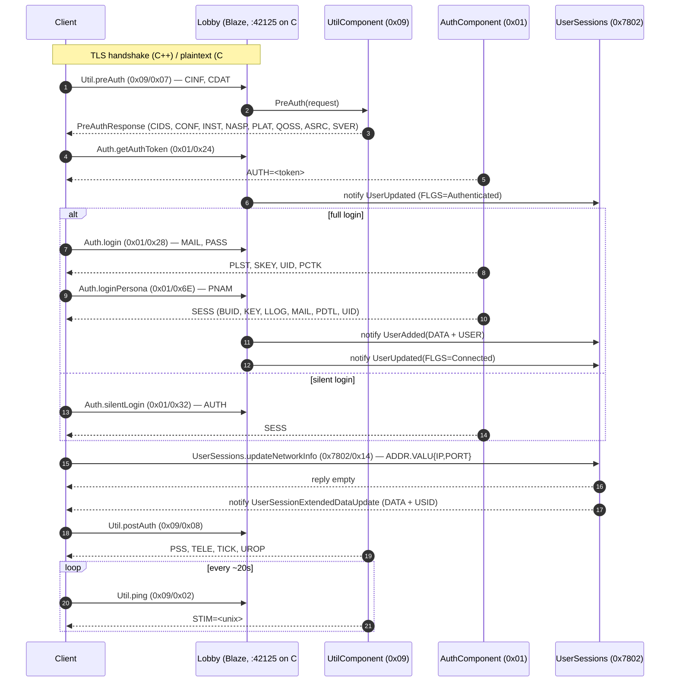

# Phase 02 — Blaze Auth (Lobby)

Once the redirector hands back the lobby address, the client opens a second connection to the Blaze main socket. On that socket every login/session ritual happens: `preAuth`, persona resolution, `login`/`silentLogin`/`expressLogin`, `loginPersona`, network info, `postAuth`, periodic `ping`.



---

## Blaze framing recap

```
u16 BE  length         body length in bytes
u16 BE  component      e.g. 0x01, 0x09, 0x7802
u16 BE  command        component-specific
u16 BE  error_code     0 on success
u32 BE  message        (type:4 | id:20) ; types: 0 request, 1 reply, 2 notification, 3 error
... TDF body ...
```

Source: `Blaze/Client.cpp:38-72` (C++ write), `ReCap.Server/Adapters/Blaze/Packet.cs` (C# read/write).

---

## Component ID matrix (auth phase)

| Component | C++ Id | Header | C# Id | File | Match |
|---|---|---|---|---|---|
| Authentication | `0x01` | `AuthComponent.h:14` | `0x01` | `AuthenticationComponent.cs:20` | ✅ |
| GameManager | `0x04` | `GameManagerComponent.h:14` | `0x04` | `GameManager/GameManagerComponent.cs:11` | ✅ |
| Redirector | `0x05` | `RedirectorComponent.h:13` | `0x05` | `RedirectorComponent.cs:7` | ✅ |
| Playgroups | `0x06` | `PlaygroupsComponent.h:13` | `0x06` | `PlaygroupsComponent.cs:8` | ✅ |
| Util | `0x09` | `UtilComponent.h:13` | `0x09` | `UtilComponent.cs:10` | ✅ |
| CensusData | `0x0A` | `CensusDataComponent.h:15` | — | absent | ❌ |
| Messaging | `0x0F` | `MessagingComponent.h:14` | `0x0F` | `MessagingComponent.cs:7` | ✅ |
| Rooms | `0x15` | `RoomsComponent.h:14` | `0x15` | `RoomsComponent.cs:7` | ✅ |
| Association | `0x19` | `AssociationComponent.h:20` | `0x19` | `AssociationListsComponent.cs:7` | ✅ |
| GameReporting | — | not present in this build | `0x1C` | `GameManager/GameReportingComponent.cs:7` | ⚠️ extra in C# |
| (unknown) | — | — | `0x2678` | `UnknownComponent1.cs:7` | ⚠️ extra in C# |
| UserSessions | `0x7802` | `UserSessionComponent.h:16` | `0x7802` | `UserSessionsComponent.cs:13` | ✅ |

> The earlier `FLOW_CPP.md` / `FLOW_CSHARP.md` summary tables had wrong IDs (e.g. Util as `0x0019`, UserSessions as `0x0015`). Those will be corrected on the next pass. Use **this** table as the source of truth for the auth phase.

---

## Util — `preAuth` (0x07)

### C++

`UtilComponent::PreAuth` (`UtilComponent.cpp:184-248`):

1. Reads `CINF` (client info struct) and `CDAT` (client data struct).
2. Reply assembled with:
   - `ASRC` = `"321915"` (string)
   - `CIDS` = **integer list** of 9 component IDs (`AssociationComponent::Id`, `AuthComponent::Id`, `GameManagerComponent::Id`, `MessagingComponent::Id`, `PlaygroupsComponent::Id`, `RedirectorComponent::Id`, `RoomsComponent::Id`, `UserSessionComponent::Id`, `UtilComponent::Id`) — `UtilComponent.cpp:185-195`.
   - `CONF` struct → nested `CONF` map: `{"pingPeriod": "20000"}` — `UtilComponent.cpp:214-220`.
   - `INST` = `data.serviceName` (read from CDAT) — `UtilComponent.cpp:222`.
   - `NASP` = `"cem_ea_id"` — `UtilComponent.cpp:223`.
   - `PILD` = `""` — `UtilComponent.cpp:224`.
   - `PLAT` = `clientInfo["PLAT"]` (echoed from request) — `UtilComponent.cpp:225`.
   - `QOSS` struct → `latencyProbes=1`, `serviceId=1161889797`, ping site `"ams"` pointing at the HTTP QoS server's actual `host:port`.
   - `RSRC` = `"321915"` — `UtilComponent.cpp:244`.
   - `SVER` = `"Blaze 3.9.3.1"` — `UtilComponent.cpp:245`.

### C#

`UtilComponent.HandlePreAuth` (`UtilComponent.cs:33-90`):

- `AuthenticationSource = "321915"`, `RegistrationSource = "321915"`, `ServerVersion = "Blaze 3.9.3.1"` — matches.
- `InstanceName` from request — matches.
- `PersonaNamespace = "cem_ea_id"` — matches.
- `Platform = "pc"` — **hardcoded**, C++ echoes back whatever the client sent.
- `ComponentIds` list contains **18 entries** (`UtilComponent.cs:54-71`):

  | C# emits | hex | C++ also sends? |
  |---|---|---|
  | 1 | 0x01 | ✅ Auth |
  | 25 | 0x19 | ✅ Association |
  | 4 | 0x04 | ✅ GameManager |
  | 27 | 0x1B | ❌ no such component |
  | 28 | 0x1C | ⚠️ matches C# GameReporting only |
  | 6 | 0x06 | ✅ Playgroups |
  | 7 | 0x07 | ❌ no such component (C++ Redirector is 0x05) |
  | 9 | 0x09 | ✅ Util |
  | 10 | 0x0A | ⚠️ CensusData id, but C# has no handler |
  | 11 | 0x0B | ❌ no such component |
  | 30720 | 0x7800 | ❌ |
  | 30721 | 0x7801 | ❌ |
  | 30722 | 0x7802 | ✅ UserSessions |
  | 30723 | 0x7803 | ❌ |
  | 20 | 0x14 | ❌ |
  | 30725 | 0x7805 | ❌ |
  | 30726 | 0x7806 | ❌ |
  | 2000 | 0x7D0 | ❌ |

  C# advertises 12 component IDs that have no handler attached. If the client takes the list at face value and issues a request against any ghost ID, the dispatch silently no-ops (or replies with the `<unknown>` fallback) and the affected workflow stalls.

- `Config.Config` map has 5 entries: `connIdleTimeout`, `defaultRequestTimeout`, `pingPeriod`, `voipHeadsetUpdateRate`, `xlspConnectionIdleTimeout`. C++ only emits `pingPeriod`. Extra keys are usually harmless on Blaze but increase the chance of a TDF parser mismatch.

- `QosSettings.BandwithPingSiteInfo` hardcoded to `127.0.0.1:17502` with site `"ams"`. C++ pulls the address from the actual `HTTP QoS` server it owns; on C# there is no QoS server so the hardcoded value is the closest fallback.

---

## Auth — login family

### `login` (0x28)

| Request | C++ | C# |
|---|---|---|
| `MAIL` | accepted | `LoginRequest.Email` |
| `PASS` | accepted | `LoginRequest.Password` |
| `PNAM` | accepted | unused in C# `Login` (used in `LoginPersona`) |

Reply assembly:

| Tag | C++ value (`AuthComponent.cpp:430-472`) | C# value (`AuthenticationComponent.cs:89-137`) |
|---|---|---|
| `NTOS` | 0 | `IsOfLegalContactAge = false` |
| `PCTK` | `"unknown_data"` | `"unknown_data"` |
| `PLST` | list of 1 `PersonaDetails` (name, last, id, status) | matches |
| `PRIV` | `""` | `""` (default) |
| `SKEY` | `"telemetry_key"` | `"telemetry_key"` |
| `SPAM` | 0 | 0 (default) |
| `THST` | `""` | `""` |
| `TURI` | `""` | `""` |
| `UID` | `personaDetails.id` | `account.Id` |

C# also sends an error path: empty content → `0x5E0001`, account not found → `0xB0001`. C++ has no explicit error reply on the snippet, relies on caller short-circuiting.

### `getAuthToken` (0x24)

C++ (`AuthComponent.cpp:533-548`): sets `user->set_auth_token(std::to_string(user->get_id()))`, replies `AUTH=<token>`, fires `NotifyUserUpdated(FLGS=Authenticated)` on the UserSessions component.

C# (`AuthenticationComponent.cs:72-87`): same. `StatusFlags = SessionState.Authenticated`.

### `silentLogin` (0x32), `expressLogin` (0x3C), `loginPersona` (0x6E)

All present on both sides; commands match. C# adds a few legacy / FIFA-era handlers (`0xF1 acceptTos2`, `0xF2 getEmailOptInSettings`, `0xF6 getLegalDocContent`) that C++ does not handle — these are no-ops in C++.

---

## UserSessions

### `updateNetworkInfo` (0x14)

C++ (`UserSessionComponent.cpp:170-186`): reads `ADDR.VALU`, stores the IP in `user.extended_data.ip`, replies empty, broadcasts `NotifyUserSessionExtendedDataUpdate`.

C# (`UserSessionsComponent.cs:65-92`):

- Reads `NetworkInfo` payload but ignores its contents — the IP/port comes from `client.EndPoint` (the live TCP socket), not from the TDF.
- Notification fills `update.ExtendedData.Address.IpPairAddress.ExternalAddress` (member = `IpPairAddress`).
- Sets `UserInfoAttribute = 0x4000000000000000` to suppress the "multiple location" popup on the client.

> Minor: the C++ side uses the `ip` field from the client-supplied `ADDR.VALU`, which lets you put the client behind a NAT manually if needed; the C# side overrides with the socket's `RemoteEndPoint`. Usually identical, but if the client lies (some EA clients still do), the two paths diverge.

### `updateUserSessionClientData` (0x19)

Both reply `CVAR` integer-list with a single `1`.

### `lookupUser` (0x0C)

C++ (`UserSessionComponent.cpp:145-168`): reads the requested user, sets statusFlags `|= 1` (Online), returns `UserData` with extendedData when name == `"test"`.

C# (`UserSessionsComponent.cs:117+`): present but not shown above; uses `AccountService`.

---

## Util — `postAuth` (0x08)

C++ (`UtilComponent.cpp:250-289`) assembles four nested structs:

| Tag | Source | Notes |
|---|---|---|
| `PSS` | `pssServer->get_address()`, `pssServer->get_port()`, `pjid="123071"`, `rprt=9`, `tiid=0` | Lives on its own port (8443 default). |
| `TELE` | `telemetryServer->get_address()`, real `port`, full country blocklist, `noToggleOk="US,CA,MX"`, `sendDelay=15000`, `sendPercentage=75`, `session="telemetry_session"`, `key="telemetry_key"`, `anonymous=false` | |
| `TICK` | `tickServer->get_address()`, real `port`, `key=std::format("0,{}:{}...darkspore-pc,10,50,50,50,50,0,0", address, port)` | |
| `UROP` | `value = TelemetryOpt::OptIn` | |

C# (`UtilComponent.cs:92-122`):

- `PssConfig.Address = "127.0.0.1"`, **Port = 42125** (the lobby!). C++ uses the **PSS** port (8443).
- `Telemetry.Address = "127.0.0.1"`, **Port = 42125**. C++ uses the telemetry port.
- `Ticker.Address = "127.0.0.1"`, **Port = 42125**, Key references `127.0.0.1:8999` literal (the C++ default ticker port) — inconsistent with the Port field on the same struct.
- `Options.TelemetryOpt = TelemetryOpt.OptOut`. **C++ defaults to `OptIn`.**

**This is a major source of likely client confusion.** The client receives addresses pointing back at the Blaze lobby for services that should be on dedicated ports. When the client opens follow-up connections to PSS / Telemetry / Tick, it lands on the same TCP socket as the lobby. Some Blaze clients tolerate this; others time out or send malformed framing into the lobby socket.

---

## Parity table (Phase 02)

| Item | C++ | C# | Status | Notes |
|---|---|---|---|---|
| Lobby socket TLS | yes (`Server.cpp:48-74`) | no (`Program.cs:130`, `BlazeServer` `isSecure=false`) | ⚠️ | Confirm whether `SECU=1` from Redirector causes the client to wrap the C# lobby socket in TLS expectation. |
| Component IDs registered | 9 + CensusData (0x0A) | 10 + GameReporting + UnknownComponent1, missing CensusData | ⚠️ | Functional set is mostly aligned. CensusData missing might break some launcher pages. |
| `preAuth` `CIDS` list | 9 entries (real components) | 18 entries (12 of which are unbound) | ⚠️ | Probable cause of client issuing requests to no-op components. |
| `preAuth` `CONF` map | 1 entry (`pingPeriod`) | 5 entries | ⚠️ | |
| `preAuth` `PLAT` | echoed from request | hardcoded `"pc"` | ⚠️ | |
| `preAuth` `QOSS` | real HTTP QoS host/port | hardcoded 127.0.0.1:17502 | ⚠️ | C# has no QoS server. |
| `getAuthToken` | `AUTH=<userid str>` + notify Authenticated | identical | ✅ | |
| `login` | reply layout matches | matches; adds error path 0x5E0001 / 0xB0001 | ✅ | |
| `loginPersona` | builds `SessionInfo` | builds `SessionInfo` + notifies UserAdded + UserUpdated(Connected) | ⚠️ | C++ snippet only writes the reply; verify C++ also sends UserAdded somewhere. |
| `silentLogin` / `expressLogin` | present | present | ✅ | |
| `updateNetworkInfo` | IP read from TDF | IP read from socket | ⚠️ | Edge case mostly benign. |
| `updateNetworkInfo` notify | `NotifyUserSessionExtendedDataUpdate` | same | ✅ | |
| `updateNetworkInfo` UserInfoAttribute | not explicitly set in snippet | `0x4000000000000000` | ⚠️ | C# adds popup-suppression flag. |
| `lookupUser` | online flag = 1, extendedData when name=="test" | uses AccountService | ⚠️ | Verify reply schema. |
| `postAuth` `PSS` host:port | real PSS server | `127.0.0.1:42125` | ⚠️ | Wrong port. |
| `postAuth` `TELE` host:port | real Telemetry server | `127.0.0.1:42125` | ⚠️ | Wrong port. |
| `postAuth` `TICK` host:port | real Tick server | port=42125, key="…:8999…" | ⚠️ | Inconsistent. |
| `postAuth` `UROP` | `OptIn` | `OptOut` | ⚠️ | |
| `ping` cadence | `pingPeriod=20000` in `preAuth` | `pingPeriod=20s` | ⚠️ | Same number; different string format — verify the client parser tolerates both. |
| `CensusDataComponent` (0x0A) | present (subscribe, user counts) | absent | ❌ | Not in dispatch table at all. |
| Notification `UserAdded` (0x7802/0x02) | sends DATA + USER | sends DATA + USER | ✅ | |
| Notification `UserUpdated` (0x7802/0x05) | FLGS + ID | BlazeId + StatusFlags | ✅ | Field names match wire tags. |

---

## Open audit items

1. **TLS expectation on lobby.** The C++ redirector tells the client `SECU=1`; if the client then expects TLS on the C# lobby (which is plaintext), the initial `preAuth` write would land on a plaintext socket while the client streams TLS bytes. This alone could break the entire auth pipeline silently. Capture the first 80 bytes the client sends to the lobby on a fresh login and confirm they look like a Blaze frame and not a TLS ClientHello.
2. **CIDS bloat.** Trim the C# `ComponentIds` list to the 9 components C++ advertises. Verify the launcher proceeds with the smaller list.
3. **postAuth wrong ports.** Fix `PSS`/`TELE`/`TICK` to advertise the right host/port. If those servers don't exist in C# at all, pointing them at the lobby is a sticky workaround at best.
4. **CensusData missing.** Add a stub responder for component `0x0A` even if it returns empty data; otherwise client calls into it stall.
5. **`UnknownComponent1 (0x2678)`** in C# is a stub. Identify what command 0x200 on it actually is in the Blaze SDK and either fold it into an existing component or document it.

---

## Files referenced

C++:

- `recap_server_develop/darkspore_server/source/Blaze/Component/AuthComponent.cpp`
- `recap_server_develop/darkspore_server/source/Blaze/Component/AuthComponent.h`
- `recap_server_develop/darkspore_server/source/Blaze/Component/UserSessionComponent.cpp`
- `recap_server_develop/darkspore_server/source/Blaze/Component/UserSessionComponent.h`
- `recap_server_develop/darkspore_server/source/Blaze/Component/UtilComponent.cpp`
- `recap_server_develop/darkspore_server/source/Blaze/Component/UtilComponent.h`
- `recap_server_develop/darkspore_server/source/Blaze/Component/CensusDataComponent.cpp`
- `recap_server_develop/darkspore_server/source/Blaze/Component/CensusDataComponent.h`

C#:

- `ReCap.Server/Adapters/Blaze/Component/AuthenticationComponent.cs`
- `ReCap.Server/Adapters/Blaze/Component/UserSessionsComponent.cs`
- `ReCap.Server/Adapters/Blaze/Component/UtilComponent.cs`
- `ReCap.Server/Adapters/Blaze/Component/UnknownComponent1.cs`
- `ReCap.Server/Adapters/Blaze/Component/GameManager/GameReportingComponent.cs`
