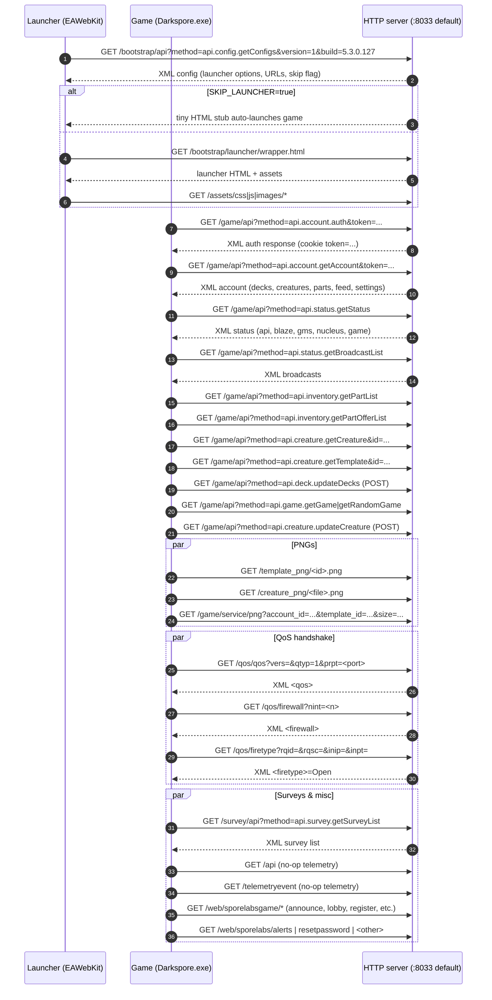

# Phase 03 — REST Bootstrap (HTTP)

Once Blaze is up, the Darkspore client makes a series of HTTP calls to fetch launcher configuration, account / squad data, broadcasts, surveys, PNG portraits, and QoS handshake data. The launcher (EAWebKit-backed) also pulls static assets from the same HTTP server.

---

## Route inventory

### C++ (`Game/API.cpp:316-740`)

Single shared `Router` attached to all 3 HTTP servers (`Main.cpp:147-149`).

| Path | Verbs | Methods (when `?method=`) | Implementation file:line |
|---|---|---|---|
| `/api` | GET/POST | (no-op telemetry sink) | `API.cpp:319-322` |
| `/telemetryevent` | GET/POST | (no-op telemetry sink) | `API.cpp:325-328` |
| `/recap/api` | GET/POST | `api.game.registration`, `api.game.status`, `api.game.log`, `api.panel.listUsers`, `api.panel.getUserInfo`, `api.panel.setUserInfo` | `API.cpp:331-351` |
| `/bootstrap/api` | GET/POST | `api.config.getConfigs` (default if missing) | `API.cpp:354-372` |
| `/bootstrap/launcher/` | GET/POST | static + skip-launcher stub | `API.cpp:374-391` |
| `/bootstrap/launcher/{path}` | GET/POST | regex static fallback | `API.cpp:393-395` |
| `/game/api` | GET/POST | `api.account.auth`, `getAccount`, `logout`, `unlock`, `setSettings`, `searchAccounts`, `setNewPlayerStats`; `api.status.getStatus`, `getBroadcastList`; `api.inventory.getPartList`, `getPartOfferList`, `vendorParts`, `updatePartStatus`; `api.creature.getCreature`, `getTemplate`, `resetCreature`, `unlockCreature`, `updateCreature`; `api.deck.updateDecks`; `api.game.getGame`, `getRandomGame`, `exitGame`; `api.leaderboard.getLeaderboard` | `API.cpp:398-511` |
| `/template_png/{id}.png` | GET/POST | static PNG from `WWW_STATIC_PATH` | `API.cpp:514-518` |
| `/creature_png/{file}.png` | GET/POST | static PNG from `STORAGE_PATH` | `API.cpp:520-539` |
| `/game/service/png` | GET/POST | template/creature PNG selector | `API.cpp:541-574` |
| `/survey/api` | GET/POST | `api.survey.getSurveyList` | `API.cpp:577-588` |
| `/qos/qos` | GET/POST | XML `<qos>` with probes/port/secret | `API.cpp:591-631` |
| `/qos/firewall` | GET/POST | XML `<firewall>` with NIC IPs/ports | `API.cpp:633-679` |
| `/qos/firetype` | GET/POST | XML `<firetype>` (`NatType::Open + 1`) | `API.cpp:681-706` |
| `/favicon.ico` | GET/POST | static file | `API.cpp:709-716` |
| `/assets/{path}` | GET/POST | regex static from `WWW_STATIC_PATH` | `API.cpp:718-720` |
| `/web/sporelabsgame/{path}` | GET/POST | regex static | `API.cpp:722-724` |
| `/web/sporelabs/alerts` | GET/POST | 404 (commented EAWebKit) | `API.cpp:726-729` |
| `/web/sporelabs/resetpassword` | GET/POST | 404 (commented) | `API.cpp:731-734` |
| `/web/sporelabs/{path}` | GET/POST | 404 (commented) | `API.cpp:736-739` |

### C# (`Adapters/Rest/`)

`Api.cs:34-49` exposes one `HttpListener` on `*:port` (`Api.cs:41`, default `8033` in `Api.cs:16`). Routing happens via reflection: any class decorated with `[RestController(Value=..., ContentType=...)]` is instantiated at boot (`Api.cs:23-28`) and any method with `[RequestMapping(Name=..., ContentType=...)]` becomes a handler. Anything else falls through to `StaticStorageAdapter.GetFile(uri)` from `resources/static/` (`Api.cs:91-94`).

| Controller | Path | Method names | File:line |
|---|---|---|---|
| `BootstrapRestController` | `/bootstrap/api` (XML) | `api.config.getConfigs` | `BootstrapRestController.cs:18-23` |
| `GameRestController` | `/game/api` (XML) | `api.account.auth`, `getAccount`, `logout`, `searchAccounts`, `setSettings`, `unlock`, `setNewPlayerStats`; `api.creature.getCreature`, `getTemplate`, `resetCreature`, `unlockCreature`, `updateCreature`; `api.deck.updateDecks`; `api.game.exitGame`, `getGame`, `getRandomGame`; `api.inventory.getPartList`, `getPartOfferList`, `updatePartStatus`, `vendorParts`; `api.leaderboard.getLeaderboard`; `api.status.getBroadcastList`, `getStatus` | `GameRestController.cs:18-571` |
| `ReCapRestController` | `/recap/api` (default) | `api.game.log` (JSON), `api.game.registration`, `api.game.getCreatureLargePng`, `api.game.getCreatureThumbPng` | `ReCapRestController.cs:14-72` |
| `SurveyRestController` | `/survey/api` (XML) | `api.survey.getSurveyList` | `SurveyRestController.cs:14-19` |

Anything else served by `StaticStorageAdapter` from `ReCap.Server/resources/static/...`. Notably present in `resources/static/`:

- `bootstrap/launcher/` (full launcher HTML/JS/CSS tree)
- `assets/css/`, `assets/fonts/`, `assets/images/`, `assets/js/`
- `template_png/` (creature template PNGs)
- `web/sporelabsgame/announceen`, `web/sporelabsgame/register` (and a few more)

So launcher static assets work via the static fallback. The dynamic `/template_png/` and `/creature_png/` regex routes in C++ are only emulated when the file happens to live under `resources/static/`.

---

## `api.config.getConfigs` (launcher config)

Most important call of the phase — drives whether the launcher is even shown.

### C++ flow

`API.cpp:354-372`. After parsing query string defaults (`version="1"`, `build="5.3.0.127"`, `method="api.config.getConfigs"`), dispatches to `bootstrap_config_getConfig(session, response)`. That helper (further down in `API.cpp`) emits an XML document with:

- `<configs>` map of game configuration (`hasLauncherUpdate`, asset URLs, region settings, news feed URL, etc.).
- `<configSettings>` block whose contents depend on `Config::GetBool(CONFIG_SKIP_LAUNCHER)`.

If `SKIP_LAUNCHER=true`, the launcher's HTTP fetch of `/bootstrap/launcher/` is short-circuited by `API.cpp:379-381` returning a tiny `skipLauncherScript` HTML payload that auto-invokes the game.

### C# flow

`BootstrapRestController.cs:23` decorates a single method `api.config.getConfigs`. It returns a serialized `ConfigResponseContract` that wraps:

- `ConfigContract` (the main configs map)
- `ConfigSettingsContract` / `ConfigSettingsOpenContract`
- `ConfigPatchesContract`

The C# build does not respect a "skip launcher" toggle here — the static `bootstrap/launcher/` tree under `resources/static/` is always served as-is. Auto-launch (if used) is configured in the launcher HTML itself.

---

## `/game/api` method matrix

Both sides parse `?method=` and dispatch into a fixed set of handlers. The presence matrix:

| `method=` | C++ handler (`API.cpp:455+`) | C# handler (`GameRestController.cs:`) | Status |
|---|---|---|---|
| `api.status.getStatus` | `game_status_getStatus` | `getStatus` 571 | ✅ |
| `api.status.getBroadcastList` | `game_status_getBroadcastList` | `getBroadcastList` 557 | ✅ |
| `api.account.auth` | `game_account_auth` | `auth` 41 | ✅ |
| `api.account.getAccount` | `game_account_getAccount` | `getAccount` 116 | ✅ |
| `api.account.logout` | `game_account_logout` | `logout` 194 | ✅ |
| `api.account.unlock` | `game_account_unlock` | `unlock` 242 | ✅ |
| `api.account.setSettings` | `game_account_setSettings` | `setSettings` 215 | ✅ |
| `api.account.searchAccounts` | `game_account_searchAccounts` | `searchAccounts` 209 | ✅ |
| `api.account.setNewPlayerStats` | aliased to `auth` (`API.cpp:455-457`) | dedicated handler 248 | ⚠️ Different default behaviour. C# does not silently downgrade. |
| `api.creature.getCreature` | `game_creature_getCreature` | `getCreature` 258 | ✅ |
| `api.creature.getTemplate` | `game_creature_getTemplate` | `getTemplate` 278 | ✅ |
| `api.creature.resetCreature` | `game_creature_resetCreature` | `resetCreature` 293 | ✅ |
| `api.creature.unlockCreature` | `game_creature_unlockCreature` | `unlockCreature` 317 | ✅ |
| `api.creature.updateCreature` | `game_creature_updateCreature` | `updateCreature` 336 | ✅ |
| `api.deck.updateDecks` | `game_deck_updateDecks` | `updateDecks` 393 | ✅ |
| `api.inventory.getPartList` | `game_inventory_getPartList` | `getPartList` 417 | ✅ |
| `api.inventory.getPartOfferList` | `game_inventory_getPartOfferList` | `getPartOfferList` 442 | ✅ |
| `api.inventory.vendorParts` | `game_inventory_vendorParts` | `vendorParts` 493 | ✅ |
| `api.inventory.updatePartStatus` | `game_inventory_updatePartStatus` | `updatePartStatus` 461 | ✅ |
| `api.game.getGame` | `game_game_getGame` | `getGame` 405 | ✅ |
| `api.game.getRandomGame` | `game_game_getRandomGame` | `getRandomGame` 411 | ✅ |
| `api.game.exitGame` | `game_game_exitGame` | `exitGame` 399 | ✅ |
| `api.leaderboard.getLeaderboard` | `game_leaderboard_getLeaderboard` | `getLeaderboard` 551 | ✅ |

`method` empty + `token` empty → C++ defaults to `api.account.auth` (`API.cpp:447-453`); same with token present → defaults to `api.account.getAccount`. C# `Api.cs:79` requires the method to be explicit; if missing, it throws `UnimplementedMethodException` (`Api.cs:86`). **This is a behavioural divergence**: any client call to `/game/api?token=X` with no method works on C++ but errors on C#.

---

## Auth via cookies / token

C++ extracts the `?token=` query parameter (`API.cpp:436-444`), resolves the user via `SporeNet::Get().GetUserManager().GetUserByAuthToken(token)`, attaches it to the session, and replies with `Set-Cookie: token=<token>` so subsequent calls keep it. C# uses `HTTPHelper.GetParametersFromRequest` (`Api.cs:64`) which only reads query string + form; cookie ingestion / setting is controller-specific (see `GameRestController.auth`).

---

## QoS endpoints (`/qos/*`)

| Endpoint | C++ | C# |
|---|---|---|
| `/qos/qos` | XML `<qos>` with `numprobes=2`, `probesize=8`, `qosport=<prpt>`, `requestid=<qtyp>`, `reqsecret=0x1337` (`API.cpp:591-631`) | ❌ no route, no static fallback |
| `/qos/firewall` | XML `<firewall>` with NIC IPs/ports replicated `nint` times (`API.cpp:633-679`) | ❌ |
| `/qos/firetype` | XML `<firetype>=NatType::Open+1=4` (`API.cpp:681-706`) | ❌ |

> The Darkspore client may probe QoS before joining a game. Without these endpoints, the client either retries on a timeout or marks NAT/QoS as failed; both could end up surfacing a launcher error. Confirm whether the launcher actually issues these calls in the C# environment.

---

## PNG endpoints

| Endpoint | C++ | C# equivalent |
|---|---|---|
| `/template_png/{id}.png` | static fetch from `WWW_STATIC_PATH` | served by static fallback if file exists in `resources/static/template_png/` |
| `/creature_png/{file}.png` | static from `STORAGE_PATH` (per-account creature PNGs) | ❌ — no route; static fallback would only work for files committed to the repo |
| `/game/service/png?account_id=X&template_id=Y&size=Z` | composes a path under `STORAGE_PATH/template_png/{size}/{0x%08x_template_id}.png` and serves it | `ReCapRestController.api.game.getCreatureLargePng` / `getCreatureThumbPng` (`ReCapRestController.cs:63-77`), but mapped to `/recap/api` not `/game/service/png` | ⚠️ Path mismatch |

The launcher uses `/game/service/png` URLs in default Darkspore client builds. The C# `/recap/api` versions only work if the C# build is patched into the launcher's URL list.

---

## Telemetry sinks

`/api` and `/telemetryevent` exist in C++ as 200-OK no-ops (`API.cpp:319-328`). C# has neither route nor static fallback for them. The client will get `404`; this is harmless unless logging is configured to abort on telemetry failure.

---

## Parity table (Phase 03)

| Item | C++ | C# | Status | Notes |
|---|---|---|---|---|
| Default HTTP port | 8033 (`Game/Config.cpp:92`) | 8033 (`Api.cs:16`) | ✅ | |
| Number of HTTP servers | 3 (main / telemetry / qos) | 1 (`Program.cs:140`) | ⚠️ | Telemetry and QoS endpoints land on the same listener; usually fine. |
| Routing model | path → regex/lambda router | path → reflection-attribute controller + static fallback | ⚠️ | Different model; same effect for the major endpoints. |
| `/bootstrap/api` | 1 method | 1 method | ✅ | |
| `/bootstrap/launcher/` skip stub | yes (`SKIP_LAUNCHER`) | none — always serves static tree | ⚠️ | |
| `/game/api` methods | ~24 | ~24 | ✅ | All headline methods covered. |
| Default method when missing | `api.account.auth` / `api.account.getAccount` | `<unknown>` → `UnimplementedMethodException` | ⚠️ | C# strictly requires method. |
| `setNewPlayerStats` aliasing | aliased to `auth` | dedicated handler | ⚠️ | Could matter for first-time profile setup. |
| `/recap/api` panel methods | `api.panel.listUsers/getUserInfo/setUserInfo` | absent | ❌ | Admin panel features. |
| `/recap/api` game methods | `api.game.registration`, `api.game.status`, `api.game.log` | `api.game.registration`, `api.game.log`, `api.game.getCreatureLargePng/Thumb` | ⚠️ | Different subset. |
| `/survey/api` | 1 method | 1 method | ✅ | |
| `/api` | no-op | absent | ❌ | Harmless. |
| `/telemetryevent` | no-op | absent | ❌ | Harmless. |
| `/qos/qos` | XML response | absent | ❌ | May affect launcher matchmaking. |
| `/qos/firewall` | XML response | absent | ❌ | |
| `/qos/firetype` | XML response | absent | ❌ | |
| `/template_png/{id}.png` | static from `STORAGE_PATH` | static fallback in `resources/static/template_png/` | ⚠️ | OK if files committed; misses per-account PNGs. |
| `/creature_png/{file}.png` | static + default.png fallback | absent | ❌ | |
| `/game/service/png` | dynamic path builder | absent (alias under `/recap/api`) | ⚠️ | URL mismatch likely. |
| `/favicon.ico` | static | static fallback | ✅ | |
| `/assets/{path}` | static | static fallback | ✅ | |
| `/web/sporelabsgame/{path}` | static | static fallback | ✅ | |
| `/web/sporelabs/{alerts,resetpassword,*}` | 404 (commented EAWebKit) | 404 via missing route | ✅ | Identical surface. |
| Token cookie roundtrip | yes (`Set-Cookie: token=`) | per-controller | ⚠️ | Confirm parity. |
| Static fallback location | `data/www/static/` | `ReCap.Server/resources/static/` | ⚠️ | Tree contents must match for launcher pages. |

---

## Open audit items

1. **Missing `/qos/*` endpoints in C#.** If the launcher needs these, login will appear successful but matchmaking / NAT detection silently fails. Add three minimal XML routes and verify the QoS pings.
2. **Missing telemetry sinks** (`/api`, `/telemetryevent`). 404s are likely harmless; confirm in logs that no retry loop occurs.
3. **`/game/service/png` URL mismatch.** Either alias it on the C# side or patch the launcher to use `/recap/api?method=api.game.getCreature*Png`.
4. **No default `method` on `/game/api`.** C++ silently picks `api.account.auth`/`getAccount` when the client sends no method. C# 500s. Easy win: replicate the default.
5. **Skip-launcher stub.** Worth porting the C++ `skipLauncherScript` trick so the C# build can auto-launch when configured.
6. **Cookie / token parity.** Confirm both sides set `token=...` on the auth response and accept it on subsequent calls.

---

## Files referenced

C++:

- `recap_server_develop/darkspore_server/source/Game/API.cpp`
- `recap_server_develop/darkspore_server/source/Game/API.h`
- `recap_server_develop/darkspore_server/source/HTTP/Router.cpp`
- `recap_server_develop/darkspore_server/source/HTTP/Server.cpp`
- `recap_server_develop/darkspore_server/source/HTTP/Session.cpp`

C#:

- `ReCap.Server/Adapters/Rest/Api.cs`
- `ReCap.Server/Adapters/Rest/BootstrapRestController.cs`
- `ReCap.Server/Adapters/Rest/GameRestController.cs`
- `ReCap.Server/Adapters/Rest/ReCapRestController.cs`
- `ReCap.Server/Adapters/Rest/SurveyRestController.cs`
- `ReCap.Server/Adapters/Rest/Contracts/Bootstrap/*.cs`
- `ReCap.Server/Adapters/Rest/Contracts/Game/*.cs`
- `ReCap.Server/Adapters/Rest/Contracts/Survey/*.cs`
- `ReCap.Server/Adapters/Persistence/StaticStorageAdapter.cs`
