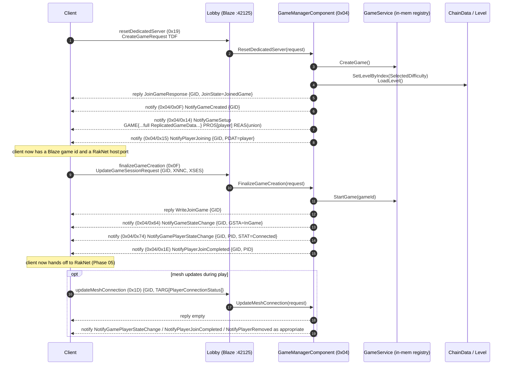

# Phase 04 — Blaze GameManager (component 0x04)

After auth + REST bootstrap, the client picks a level / playlist and asks Blaze to set up a "game" (a Blaze concept — a logical match container). For the dedicated-server flow that Darkspore uses, the relevant commands are `resetDedicatedServer` (0x19), `finalizeGameCreation` (0x0F), and `updateMeshConnection` (0x1D). Notifications back to the client carry the RakNet endpoint that the client then connects to in Phase 05.

---

## Command and notification IDs

`ReCap.Cpp/.../GameManagerComponent.cpp` enums + `ReCap.Server/.../GameManagerComponent.cs:233-328`:

### Commands

| Command | ID | C++ handler | C# handler |
|---|---|---|---|
| `createGame` | `0x01` | `CreateGame` (970) | ❌ (not in switch) |
| `destroyGame` | `0x02` | `DestroyGame` (984) | ❌ |
| `advanceGameState` | `0x03` | — | ❌ |
| `setGameSettings` | `0x04` | — | ❌ |
| `setPlayerAttributes` | `0x08` | `SetPlayerAttributes` (997) | ❌ |
| `joinGame` | `0x09` | `JoinGame` (1002) | ❌ |
| `removePlayer` | `0x0B` | `RemovePlayer` (1044) | ❌ |
| `startMatchmaking` | `0x0D` | `StartMatchmaking` (1066) | ❌ |
| `cancelMatchmaking` | `0x0E` | `CancelMatchmaking` (1075) | ❌ |
| `finalizeGameCreation` | `0x0F` | `FinalizeGameCreation` (1087) | `HandleFinalizeGameCreationPacket` (`GameManagerComponent.cs:40`) |
| `resetDedicatedServer` | `0x19` | `ResetDedicatedServer` (1115) | `HandleResetDedicatedServer` (`GameManagerComponent.cs:71`) |
| `updateMeshConnection` | `0x1D` | `UpdateMeshConnection` (1271) | `HandleUpdateMeshConnection` (`GameManagerComponent.cs:203`) |

> C# only handles 3 commands. For an offline / single-player flow that's enough; the other commands are matchmaking, party, and host-migration features that Darkspore single-player doesn't exercise.

### Notifications

| Notification | ID | C++ helper | C# helper |
|---|---|---|---|
| `NotifyGameCreated` | `0x0F` | `NotifyGameCreated` (680) | `NotifyGameCreated` Tdf at `GameManagerComponent.cs:876` |
| `NotifyGameRemoved` | `0x10` | `NotifyGameRemoved` (687) | `NotifyGameRemoved` Tdf (894) |
| `NotifyGameSetup` | `0x14` | `NotifyGameSetup` (695) | `NotifyGameSetup` Tdf (481) |
| `NotifyPlayerJoining` | `0x15` | `NotifyPlayerJoining` (864) | `NotifyPlayerJoining` Tdf (903) |
| `NotifyPlayerJoinCompleted` | `0x1E` | `NotifyPlayerJoinCompleted` (880) | `NotifyPlayerJoinCompleted` Tdf (912) |
| `NotifyPlayerRemoved` | `0x28` | `NotifyPlayerRemoved` (888) | Tdf (938) |
| `NotifyPlatformHostInitialized` | `0x47` | `NotifyPlatformHostInitialized` (898) | Tdf (981) |
| `NotifyGameStateChange` | `0x64` | `NotifyGameStateChange` (906) | Tdf (795) |
| `NotifyGameSessionUpdated` | `0x73` | `NotifyGameSessionUpdated` (928) | not used | 
| `NotifyGamePlayerStateChange` | `0x74` | `NotifyGamePlayerStateChange` (937) | Tdf (1071) |
| `NotifyCreateDynamicDedicatedServerGame` | `0xDC` | `NotifyCreateDynamicDedicatedServerGame` (946) | Tdf (1182) |

---

## `resetDedicatedServer` (0x19)

This is the workhorse — Darkspore enters the dedicated-server pool path here. Both sides build a fresh game object, fill `ReplicatedGameData`, and notify the client.

### C++ (`GameManagerComponent.cpp:1115-1269`)

1. Reads `user = request.get_user()`. Aborts if missing.
2. `game = Game::GameManager::CreateGame()` and `user->set_game(game)`.
3. `gameData.Read(request.get_request())` — pulls **everything** the client sent: hostNetwork (HNET), attributes (ATTR), capacity (PCAP), name (GNAM), settings (GSET), version (VSTR), playgroup id, presence mode, network topology, etc.
4. Populates `gameInfo`:
   - **`hostNetwork` taken straight from the client** (`gameInfo.hostNetwork = gameData.hostNetwork`).
   - Constants: `gpvh=0xABABABAB`, `gsid=0xCDCDCDCD`, `hses=13666`, `psas="ams"`, `seed=0xFAFAFAFA`, `uuid="71bc4bdb-82ec-494d-8d75-ca5123b827ac"`.
   - `networkQos = { dbps=128000, type=NatType::Open, ubps=2 }`.
   - `pHost = tHost = { id=userId, slot=0 }`.
5. Builds **one** `ReplicatedGamePlayer` for the requesting user only (`name = user->get_name()`, `state = PlayerState::Connecting`).
6. Pulls `levelId = attributes["SelectedDifficulty"]` and runs `chainData.SetLevelByIndex(levelId); chainData.SetStarLevel(0); chainData.SetCompleted(false);` then `game->LoadLevel()`. **This is where chain progress and level data are initialised.**
7. Replies with `WriteJoinGame(packet, gameInfo.id)` (TDF `GID=<gameId>`).
8. Sends 3 notifications, in order: `NotifyGameCreated`, `NotifyGameSetup(gameInfo, gamePlayers)`, then `NotifyPlayerJoining` for each player.

### C# (`GameManagerComponent.cs:71-201`)

1. Reads `CreateGameRequest` content.
2. `game = GameHandler.CreateGame()`; error → 0x6C0004.
3. `game.SetupPlayer(client.UserId, 0)` then `game.SetupBot(1..9)` — **9 bots** preloaded into the game registry on the RakNet side.
4. Replies with `JoinGameResponse { GameId, JoinState=JoinedGame }`.
5. Builds `hostAddr` with IpPairAddress where **both** internal and external are `127.0.0.1:42000` (loopback, hardcoded).
6. Builds `NotifyGameSetup`:
   - Copies fields from request: `AdminPlayerList`, `EntryCriteriaMap`, `GameAttribs`, `GameName`, `GameSettings`, `GameStatusURL`, `GameTypeName`, `IgnoreEntryCriteriaWithInvite`, `MeshAttribs`, `ServerNotResetable`, `NetworkTopology`, `SlotCapacities`, `PlaygroupId`, `PlaygroupIdSecret`, `MaxPlayerCapacity`, `PresenceMode`, `QueueCapacity`, `TeamCapacity`, `TeamIds`, `VoipNetwork`, `VersionString`.
   - Constants: matches C++ exactly (`GameProtocolVersionHash=0xABABABAB`, `GameReportingId=0xCDCDCDCD`, `TopologyHostSessionId=13666`, `PingSiteAlias="ams"`, `SharedSeed=0xFAFAFAFA`, `UUID="71bc4bdb-82ec-494d-8d75-ca5123b827ac"`, `NetworkQosData.DownstreamBitsPerSecond=128000`, `NatType.Open`, `UpstreamBitsPerSecond=2`).
   - `PlatformHostInfo.PlayerId = TopologyHostInfo.PlayerId = client.UserId`, slot 0.
   - Adds attributes:
     - `"ServerBuildVersion" = "1.0.903.854"` (always)
     - `"GameOwnerId" = client.UserId.ToString()` (if missing)
     - `"GameOwnerName" = "HelloDarkspore"` (if missing) — **hardcoded literal**
     - `"GameFlags" = "0"`, `"ExpectedPlayerCount" = "10"`, `"PrivateMatch" = "0"`
   - `HostNetworkAddressList` = single `hostAddr` (loopback).
   - `AdminPlayerList` always includes `client.UserId`.
7. Builds **one** `ReplicatedGamePlayer`:
   - `PlayerName = "HelloDarkspore"` (literal, **not** the account name)
   - `AccountLocale = 0x656E5553` (`enUS`)
   - `PlayerState = ActiveConnecting`
   - `PlayerSessionId = client.UserId`
   - `NetworkAddress` filled with the loopback `IpPairAddress`.
8. `GameSetupReason.DatalessSetupContext.SetupContext = DatalessContext.CreateGameSetupContext`.
9. Notifies `NotifyGameCreated` (0x0F), `NotifyGameSetup` (0x14), `NotifyPlayerJoining` (0x15).
10. **Never** calls `chainData.SetLevelByIndex / LoadLevel / SetCompleted`. Level state on the RakNet side is set later by `Game.SetupPlayer` and bot helpers (see Phase 06+).

### Divergences

| Item | C++ | C# | Status |
|---|---|---|---|
| HostNetwork | from `CreateGameRequest.hostNetwork` (client-provided) | hardcoded `127.0.0.1:42000` IpPair | ⚠️ Breaks LAN/non-loopback clients. |
| Player count in `NotifyGameSetup` PROS | 1 (the user) | 1 (still just the user; bots live on the RakNet side) | ✅ |
| Bots | none on the Blaze side | 9 created in `GameService` (`SetupBot(1..9)`) | ⚠️ Different game registry shape. |
| Player name | `user->get_name()` | `"HelloDarkspore"` literal | ⚠️ Cosmetic but visible in roster. |
| Player state | `Connecting` (2) | `ActiveConnecting` (2) | ✅ (same wire enum) |
| ChainData / level load | `chainData.SetLevelByIndex(SelectedDifficulty)` + `LoadLevel` | not done here; happens later in `Game.HandleHelloPlayerRequest` etc. | ⚠️ Late binding may explain mismatched ChainVote payloads downstream. |
| Constants | `gpvh`, `gsid`, `hses`, `seed`, `uuid`, `networkQos` | identical | ✅ |
| Extra attributes (`ServerBuildVersion`, `GameOwnerName`, `GameFlags`, `ExpectedPlayerCount`, `PrivateMatch`) | none | injected unconditionally | ⚠️ |
| `GameSetupReason` (REAS union) | `XboxClientAddress` member with `DCTX=CreateGame` (`GameManagerComponent.cpp:722-729`) | `DatalessSetupContext` member with `SetupContext=CreateGameSetupContext` (`GameManagerComponent.cs:188-189`) | ⚠️ Different union member chosen (0=Dataless vs 0=XboxClientAddress in C++ — same numeric value but different semantic shape on the wire). Verify the client parses both. |

> **Why this matters for the live bug.** The chain-vote payload (Phase 07) draws from `ChainData`. C++ initialises `ChainData` here, during `resetDedicatedServer`. C# defers initialisation to later code paths (RakNet `Game` setup). If something in the C# flow forgets to seed `ChainData.LevelByIndex` before the first `ChainVoteMsgs` goes out, the client receives a malformed blob and stalls in PreDungeon.

---

## `finalizeGameCreation` (0x0F)

Sent by the client after the RakNet socket is open and the player is fully loaded into the lobby UI.

### C++ (`GameManagerComponent.cpp:1087-1113`)

1. Resolves `user.game`. If missing, replies empty (TODO error).
2. `gameId = game->GetId(); Game::GameManager::StartGame(gameId);`
3. Replies `WriteJoinGame(packet, gameId)` (TDF `GID`).
4. Notifies `NotifyGameStateChange(InGame)`, `NotifyGamePlayerStateChange(Connected)`, `NotifyPlayerJoinCompleted`.

### C# (`GameManagerComponent.cs:40-69`)

1. Reads `UpdateGameSessionRequest` (`GID, XNNC, XSES`) — **ignores its content**.
2. Replies empty (`client.RespondTo(packet)`).
3. **`gameId = 1` hardcoded** (`GameManagerComponent.cs:51`).
4. Notifies `NotifyGameStateChange { GameState=InGame }` (0x64), `NotifyGamePlayerStateChange { PlayerState=ActiveConnected }` (0x74), `NotifyPlayerJoinCompleted` (0x1E).

### Divergences

| Item | C++ | C# | Status |
|---|---|---|---|
| `gameId` | from `user->game` | hardcoded `1` | ⚠️ Works when there's one game, breaks multi-game. |
| Reply payload | `WriteJoinGame {GID}` (TDF integer field) | empty | ⚠️ Verify client accepts empty. |
| `StartGame` | yes (`Game::GameManager::StartGame`) | not called explicitly (game state flips via notify only) | ⚠️ |
| Notify chain | StateChange → PlayerStateChange → JoinCompleted | identical sequence + same notify IDs | ✅ |
| Wire value of player state | `PlayerState::Connected` = 4 (per logs `ACTIVE_CONNECTED (4)`) | `PlayerState.ActiveConnected` = 4 | ✅ |

---

## `updateMeshConnection` (0x1D)

Client tells the server "I now have a connection to peer X". For dedicated-server topology there's only one mesh edge (client → server), so this fires once after RakNet handshake.

### C++ (`GameManagerComponent.cpp:1271-1314`)

1. Reads `TARG` (a list of `PlayerConnectionStatus { FLGS, PID, STAT }`).
2. For each `target`, logs status.
3. Replies empty.
4. If `target[0].state == Connecting`:
   - If `GameplayUser`: notify `GamePlayerStateChange(Connected)` + `PlayerJoinCompleted` for the calling user.
   - If `DedicatedServer`: same notifications for `target[0].PID`.
5. If `target[0].state == Reserved`: notify `PlayerRemoved(PlayerConnLost)`.

### C# (`GameManagerComponent.cs:203-231`)

1. Reads `UpdateMeshConnectionRequest { GID, TARG[PlayerConnectionStatus] }`.
2. Replies empty.
3. Iterates `request.Target`; if `PlayerConnectionState.Connected`:
   - Notifies `NotifyGamePlayerStateChange { PlayerState=ActiveConnected }` (0x74)
   - Notifies `NotifyPlayerJoinCompleted` (0x1E)

> Subtle but real: C++ keys off **`PlayerState::Connecting`** in the request (i.e. "the client is currently in the connecting state, please mark them connected"). C# keys off `PlayerConnectionState.Connected` in the request (i.e. "I have completed connection"). Different `STAT` semantics in the request, but the notify chain ends up the same. Worth double-checking which field the client actually sends.

### Divergences

| Item | C++ | C# | Status |
|---|---|---|---|
| Trigger field | request `STAT` (PlayerState enum) | request `STAT` (PlayerConnectionState enum) | ⚠️ Subtle. |
| Reserved → PlayerRemoved | yes | not handled | ⚠️ |
| DedicatedServer client type branch | yes | not differentiated | ⚠️ |

---

## Stub / missing handlers (C#)

| Command | ID | Required? | Notes |
|---|---|---|---|
| `createGame` | 0x01 | maybe | Used in non-dedicated flows. |
| `destroyGame` | 0x02 | yes if user can quit | Without it, the lobby keeps stale games. |
| `joinGame` | 0x09 | yes for multi-user | Single-player works without. |
| `removePlayer` | 0x0B | yes for player-kick | |
| `startMatchmaking` | 0x0D | probably not | |
| `cancelMatchmaking` | 0x0E | probably not | |
| `setPlayerAttributes` | 0x08 | maybe | Some lobby UIs ping this on join. |

---

## Parity table (Phase 04)

| Item | C++ | C# | Status |
|---|---|---|---|
| Component ID | `0x04` | `0x04` | ✅ |
| Commands handled | 10 | 3 | ⚠️ |
| `resetDedicatedServer` | implemented w/ ChainData/LoadLevel | implemented w/o ChainData init | ⚠️ |
| `finalizeGameCreation` | implemented w/ `StartGame` + reply payload | implemented; empty reply; hardcoded gameId=1 | ⚠️ |
| `updateMeshConnection` | full state machine (Reserved/Connecting/DS branches) | only Connected path | ⚠️ |
| `NotifyGameCreated` | `{GID}` | `{GameId}` | ✅ |
| `NotifyGameSetup` | full `ReplicatedGameData` + roster + `REAS=XboxClientAddress::DCTX` | full `ReplicatedGameData` + roster + `REAS=DatalessSetupContext::SetupContext` | ⚠️ Union member differs. |
| `NotifyGameStateChange` (0x64) | `{GID, GSTA}` | `{GameId, GameState}` | ✅ |
| `NotifyGamePlayerStateChange` (0x74) | `{GID, PID, STAT}` | `{GameId, PlayerId, PlayerState}` | ✅ |
| `NotifyPlayerJoinCompleted` (0x1E) | `{GID, PID}` | `{GameId, PlayerId}` | ✅ |
| Constants in GameData | match | match | ✅ |
| HostNetwork | from request | loopback hardcoded | ⚠️ |
| Player name | from user account | `"HelloDarkspore"` literal | ⚠️ |
| Extra attribs | none | 5 hardcoded keys | ⚠️ |
| ChainData init | here | deferred to RakNet phase | ⚠️ Could starve Phase 07. |
| Bots | none on Blaze; created by `Game::OnPlayerStart` later | 9 created here (`SetupBot 1..9`) | ⚠️ Different bot ownership. |

---

## Open audit items

1. **ChainData initialisation timing.** Confirm whether the C# `ChainData` block is populated **before** the first `ChainVoteMsgs` (0xA9) leaves the server. If `Game.HandleChainPlayerMsgs` is the first place that touches it, you may end up sending the default blob with `level=0/levelIndex=0/enemyNouns=[0,…,0]`, which the client cannot parse correctly. This is a likely root cause for the current PreDungeon stall.
2. **GameSetupReason union member.** C++ uses `XboxClientAddress` (member 0) with a nested `VALU { DCTX }`. C# uses `DatalessSetupContext` (member 0) directly. Both write member 0 on the wire, but the inner schema differs — confirm the client tolerates either.
3. **HostNetwork loopback.** Hardcoding 127.0.0.1 means non-local clients can't ever reach the RakNet socket. Replace with actual `ServerConfig.HostIP` / detected external IP.
4. **PlayerName "HelloDarkspore".** Replace with `account.Username`. The literal will show up in any roster UI.
5. **`gameId = 1` hardcode in FinalizeGameCreation.** Resolve from `client.UserId`'s tracked game.
6. **Reply payload for `finalizeGameCreation`.** C++ replies with `{GID}`. C# replies empty. Verify the client doesn't need `GID` echoed back.
7. **`destroyGame` handler.** Without it, leaving + rejoining the same character mid-session likely leaks game state in `GameService`.

---

## Files referenced

C++:

- `ReCap.Cpp/darkspore_server/source/Blaze/Component/GameManagerComponent.cpp`
- `ReCap.Cpp/darkspore_server/source/Blaze/Component/GameManagerComponent.h`
- `ReCap.Cpp/darkspore_server/source/Game/GameManager.cpp`
- `ReCap.Cpp/darkspore_server/source/Game/GameManager.h`
- `ReCap.Cpp/darkspore_server/source/Game/Instance.h`
- `ReCap.Cpp/darkspore_server/source/Game/Level.cpp`

C#:

- `ReCap.Server/Adapters/Blaze/Component/GameManager/GameManagerComponent.cs`
- `ReCap.Server/Adapters/Blaze/Component/GameManager/GameReportingComponent.cs`
- `ReCap.Server/Services/GameService.cs`
- `ReCap.Server/Domain/Gameplay/Game.cs`
- `ReCap.Server/Domain/Gameplay/ChainData.cs`
