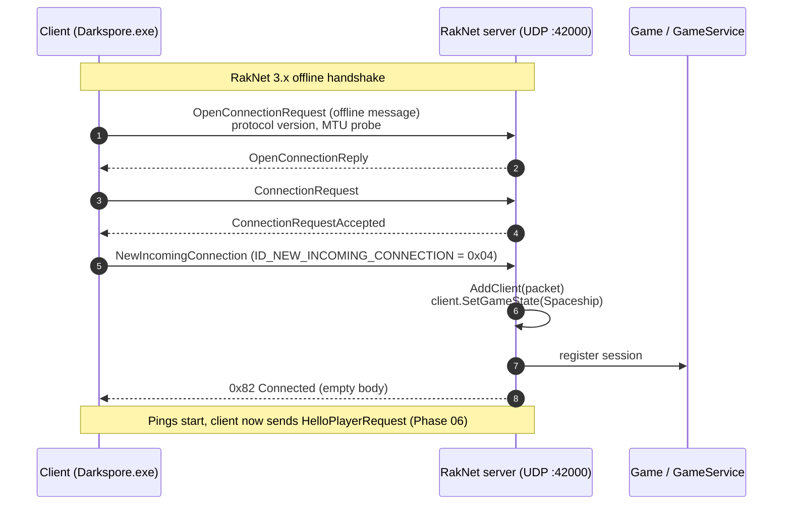

# Phase 05 — RakNet Connect

After Blaze tells the client the RakNet endpoint via `NotifyGameSetup.GameData.HostNetworkAddressList`, the client opens a UDP socket and runs the standard RakNet 3.x handshake. The server takes the first user-level packet (`ID_NEW_INCOMING_CONNECTION`) as the cue to mint a client/session, push the player into `Spaceship` state, and send `Connected` (0x82, empty body).



---

## Wire framing (recap)

Once user packets flow, every RakNet payload is a single byte `PacketID` (`RakNet/Types.h:24-102`) followed by packet-specific body. RakNet's reliability / fragmentation lives below this layer.

| Outgoing user packet | First byte |
|---|---|
| `Connected` | `0x82` |
| `HelloPlayer` | `0x80` |
| `PartyMergeComplete` | `0x85` |
| `GameState` | `0x8A` |

Incoming user packets in this phase: only `ID_NEW_INCOMING_CONNECTION` (system-level, ID `< ID_USER_PACKET_ENUM`). The `HelloPlayerRequest` follows in Phase 06.

---

## C++

### Server bring-up

`RakNet::Server::start(uint16_t port)` (`RakNet/Server.cpp:166-216`):

1. Spawns a dedicated `std::thread` that owns the `RakPeerInterface`.
2. `mSelf = RakNetworkFactory::GetRakPeerInterface()`
3. `SetTimeoutTime(0xFFFFFFFF, UNASSIGNED_SYSTEM_ADDRESS)` — disables disconnect-on-silence (Server.cpp:170).
4. `SocketDescriptor(port, nullptr)`; `Startup(maxConnections=4, sleepTimer=10, &socketDescriptor, 1)` (Server.cpp:175-178).
5. `SetMaximumIncomingConnections(4)` (Server.cpp:180).
6. `SetOccasionalPing(true)` (Server.cpp:181).
7. `SetUnreliableTimeout(0)` (Server.cpp:183) — disables unreliable retransmit timeout.
8. Main loop (Server.cpp:185-211):
   - Drain `mTasks` (a thread-safe queue used to schedule packet sends from non-network threads).
   - `mGame.ServerUpdate()` → if `true`, call `run_one()` to drain inbound packets.
   - `mGame.Update()` → if `true`, broadcast a `GameStatePacket` to every connected client with their own `(var, type)` merged from the game state.
   - `RakSleep(1)`.

> The C++ build uses **upstream RakNet 3.x** (the 2010-era source) directly. Protocol-level framing is "real" RakNet.

### Packet dispatch

`Server::run_one` (`RakNet/Server.cpp:234-264`):

- Pops every queued `Packet*` from `mSelf->Receive()`.
- Builds a `BitStream` from the body.
- Reads the first byte; if `ID_TIMESTAMP`, skips the timestamp prefix and re-reads.
- If `packetType < ID_USER_PACKET_ENUM` (system level), `ParseRakNetPackets(packet, packetType)` (Server.cpp:401-446):
  - `ID_DISCONNECTION_NOTIFICATION` → `RemoveClient`.
  - `ID_NEW_INCOMING_CONNECTION` → `OnNewIncomingConnection(packet)`.
  - `ID_CONNECTION_REQUEST`, `ID_INCOMPATIBLE_PROTOCOL_VERSION`, `ID_CONNECTION_LOST`, `ID_SND_RECEIPT_ACKED`, `ID_SND_RECEIPT_LOSS` handled with logging.
- Otherwise (`packetType >= ID_USER_PACKET_ENUM` = our `0x7F..0xCC`), `ParseSporeNetPackets(packet, packetType)` (Server.cpp:448-498).

### `OnNewIncomingConnection`

`Server.cpp:565-594`:

```cpp
const auto& client = AddClient(packet);   // creates Client + entry in mClients
if (!client) return;

client->SetGameState(GameState::Spaceship);  // wire 0x02

// Read and ignore: SystemAddress + N internal addresses + pongTime + time
SystemAddress systemAddress;
mInStream.Read(systemAddress);

std::array<SystemAddress, MAXIMUM_NUMBER_OF_INTERNAL_IDS> mySystemAddress;
for (auto& address : mySystemAddress) mInStream.Read(address);

RakNetTime pongTime; mInStream.Read(pongTime);
RakNetTime time;     mInStream.Read(time);

std::cout << "Player connected!" << ...;
SendConnected(client);  // 0x82 with empty body
```

`SendConnected` (Server.cpp:1279-1287):

```cpp
BitStream outStream;
outStream.Write(PacketID::Connected);   // single byte 0x82
mPeer->Send(&outStream, ...);
```

No body. Sent reliable-ordered.

---

## C#

### Server bring-up

`RakNetServer.ExecuteAsync(stoppingToken)` (`RakNetServer.cs:112-139`):

```csharp
_ = Task.Run(() => Listener.StartAsync(), stoppingToken);
IsRunning = true;
while (IsRunning) {
    var games = gameService.GetAllGames();
    foreach (var game in games) game.Update();
    await Task.Delay(50, stoppingToken);
}
```

The 50 ms loop is intentionally aligned to Phase 10 (gameplay) cadence. **There is no equivalent of `mGame.ServerUpdate()`**: the C# loop unconditionally calls `Game.Update()` every 50 ms, but does not drain incoming packets in the same loop. Packet ingestion is event-driven via `RakNetSession.PacketReceived` (`RakNetServer.cs:47`).

### Session lifecycle

`OnSessionConnected` (`RakNetServer.cs:37-52`):

1. Logs peer GUID + remote endpoint.
2. Guards against duplicate GUID registration (logs error and returns).
3. Subscribes 3 events on the session:
   - `PacketReceived` → `OnSessionReceiveRaw(session, packet)`
   - `OnNewIncomingConnection` → `OnSessionOnNewIncomingConnection(session)`
   - `Disconnected` → `OnSessionDisconnected(session)`
4. Inserts `new RakNetClient(session)` into `Clients[session.Guid.G]`.

> Note: `RakNexus` exposes a higher-level `OnNewIncomingConnection` event (semantically "incoming connection completed"). The C# server **does not** read the `SystemAddress` / internal address / pong-time block that the C++ side ignores — that parsing happens inside RakNexus, not in our layer.

### `OnSessionOnNewIncomingConnection`

`RakNetServer.cs:62`:

```csharp
private void OnSessionOnNewIncomingConnection(RakNetSession session)
    => SendPacket(session, new ConnectedPacket());
```

`ConnectedPacket` (`ConnectedPacket.cs`):

```csharp
public class ConnectedPacket : IRakNetPacket
{
    public PacketType Type => PacketType.Connected;     // 0x82
    public void ReadFrom(Stream stream) { }             // empty
    public void WriteTo(Stream stream)  { }             // empty
}
```

`SendPacket(session, packet)` (`RakNetServer.cs:152-179`) writes `(byte)Type` and the packet body, logs hex, and sends via `session.Send(bytes, MEDIUM_PRIORITY, RELIABLE_ORDERED, 0, 0)`.

### Default state

C++ explicitly sets `client->SetGameState(GameState::Spaceship)` before sending `Connected`. C# does **not** set state here. The `Game` is only attached on the first `HelloPlayerRequest` (Phase 06, `RakNetServer.cs:86-100`). Until that happens, the client has no associated `Game`. **If something other than `HelloPlayerRequest` arrives first, the dispatcher logs `No game, but received a packet …` and drops it** (`RakNetServer.cs:103-109`).

### RakNexus framing constants

`lib/RakNexus/src/Core/RakConstants.cs`:

```csharp
RAKNET_VERSION          = "3.902"
RAKNET_VERSION_NUMBER   = 3.902
RAKNET_PROTOCOL_VERSION = 13
MAXIMUM_MTU_SIZE        = 1492
MAXIMUM_NUMBER_OF_INTERNAL_IDS = 10
OFFLINE_MESSAGE_DATA_ID = { 00 FF FF 00 FE FE FE FE FD FD FD FD 12 34 56 78 }
```

> Darkspore was built against **RakNet 3.92**. RakNexus reports **3.902**. The protocol version byte (13) is the wire-relevant field — it must match what the client sends in `ID_OPEN_CONNECTION_REQUEST_2` or the server replies with `ID_INCOMPATIBLE_PROTOCOL_VERSION`. Verify the wire protocol byte is identical (protocol 13 is consistent across 3.9x).

---

## RakNet 3.92 wire framing — M4-1 audit (2026-05-24)

Read both sides side-by-side. Sources:

- Upstream RakNet 3.92 (Darkspore client + C++ server): `ReCap.Cpp/darkspore_server/build/_deps/raknet-src/Source/ReliabilityLayer.cpp`, `BitStream.cpp`, `DS_RangeList.h`, `MTUSize.h`, `PacketPriority.h`, `InternalPacket.h`, `RakNetDefines.h`, `CCRakNetSlidingWindow.h`.
- RakNexus: `lib/RakNexus/src/Protocol/{ReliabilityLayer,DatagramHeader,InternalPacket,FrameFlags,PacketEnums}.cs`, `src/Core/RakConstants.cs`.

### Build-time switches that change the wire

| Define (upstream) | Value in Darkspore build | Wire impact |
|---|---|---|
| `USE_SLIDING_WINDOW_CONGESTION_CONTROL` | `1` (`RakNetDefines.h:117`) | Sliding-window congestion mode, not UDT. |
| `INCLUDE_TIMESTAMP_WITH_DATAGRAMS` | `0` (derived in `ReliabilityLayer.h:41-47`) | Datagram and ACK headers do **NOT** carry the 4-byte `RakNetTimeMS sourceSystemTime` field. |
| `PREALLOCATE_LARGE_MESSAGES` | unset (default 0) | Receiver does not pre-allocate the full split-packet buffer on first chunk arrival. |

RakNexus also omits the timestamp in both `ProcessSendQueue` and `ProcessDatagram` — wire-compatible with the Darkspore build (which is the only build that matters). The `DatagramHeader.Serialize` method in `DatagramHeader.cs:18-44` writes `SourceSystemTime` but is **dead code** — `ProcessSendQueue`/`ProcessResendQueue`/`SendAcks` all build the header byte manually and never go through `DatagramHeader`.

### MTU + payload budget

| | Upstream RakNet 3.92 | RakNexus | Match? |
|---|---|---|---|
| `MAXIMUM_MTU_SIZE` | `1492` (`MTUSize.h:29`) | `1492` (`RakConstants.cs:8`) | ✅ |
| `UDP_HEADER_SIZE` | `28` (`CCRakNetSlidingWindow.h:41`, `CCRakNetUDT.h:32`) | `28` (`RakConstants.cs:13`) | ✅ |
| Max RakNet payload per datagram | `1492 - 28 = 1464` B (IPv4+UDP overhead removed) | `1464` B | ✅ |
| Per-message safety margin before split | `MAXIMUM_MTU_SIZE - UDP_HEADER_SIZE - GetMaxMessageHeaderLengthBits()/8` (≈ 4 B header for `RELIABLE_ORDERED` + ack-receipt typical) | `mtu - headerSize - 50` (`ReliabilityLayer.cs:508`) — hard-coded **50 B** safety margin | ⚠️ RakNexus is more conservative. Splits earlier than upstream; never under-splits. Wire-safe. |

### Datagram header (first byte after socket recv)

Upstream `DatagramHeaderFormat::Serialize` (`ReliabilityLayer.cpp:128-168`) is bit-packed MSB-first:

| Bit (MSB→LSB) | Field | Notes |
|---|---|---|
| 7 (mask `0x80`) | `isValid` | Always `1` for valid RakNet datagrams (offline-message magic differs — see `RakPeer.cpp:156`). |
| 6 (mask `0x40`) | `isACK` | Only set on pure-ACK datagrams. |
| 5 (mask `0x20`) | If `isACK`: `hasBAndAS`. Else: `isNAK`. | Mutually exclusive groups. |
| 4 (mask `0x10`) | If !ACK && !NAK: `isPacketPair` | Used for RTT pair measurement (rarely set). |
| 3 (mask `0x08`) | If !ACK && !NAK: `isContinuousSend` | Sender has more data queued (continuous burst hint). |
| 2 (mask `0x04`) | If !ACK && !NAK: `needsBAndAs` | Receiver should reply with B/AS in next ACK. |
| 1-0 | Padding | Zero. |

RakNexus build paths and the bytes they emit:

| Path | Source | Byte emitted |
|---|---|---|
| Regular reliable / unreliable datagram | `ReliabilityLayer.cs:147-149` (`ProcessSendQueue`) | `0x80` if idle, `0x88` if `!sendQueue.IsEmpty` (continuous send). `isPacketPair` and `needsBAndAs` never set. |
| Resent datagram | `ReliabilityLayer.cs:192` | `0x80` (never marks continuous on retransmission). |
| ACK | `ReliabilityLayer.cs:216-217` (`SendAcks`) | `0xC0` base, `\| 0x20` if `hasBAndAS` → `0xE0`. |
| NAK | `ReliabilityLayer.cs:77` | `0xA0` (valid + isNAK). |

After the header byte:

| Type | Body (after first-byte alignment) | Bytes |
|---|---|---|
| Datagram | `uint24 datagramNumber` (3 B) followed by 1+ internal packets | 3 B + payload |
| ACK | optional `float AS` (4 B if `hasBAndAS` set), then `RangeList<uint24>` | 0 / 4 B + range list |
| NAK | `RangeList<uint24>` (no AS) | range list |

RangeList wire format (`DS_RangeList.h:58-106`):

```
u16 countWritten         (aligned)
for each range:
    u8  minEqualsMax       (1 = single number, 0 = range pair)
    u24 minIndex
    if !minEqualsMax: u24 maxIndex
```

RakNexus `SerializeRangeList` (`ReliabilityLayer.cs:719-735`) produces byte-identical output (aligned-byte writes throughout; `uint24` writer matches upstream MSB-first 3-byte layout).

### InternalPacket header (per user message inside a datagram)

Upstream `ReliabilityLayer::WriteToBitStreamFromInternalPacket` (`ReliabilityLayer.cpp:2214-2268`) and `CreateInternalPacketFromBitStream` (`ReliabilityLayer.cpp:2273-2381`):

| Offset (bytes) | Field | Type | Always present? | Notes |
|---|---|---|---|---|
| `0` (bits 7-5) | `reliability` | 3 bits | yes | Values 0-7 per `PacketPriority.h:38-74`. |
| `0` (bit 4) | `hasSplitPacket` | 1 bit | yes | Lower 4 bits of byte 0 are padding (zero). |
| `1..2` | `dataBitLength` | u16 aligned (BE on big-endian hosts, native otherwise; payload is byte-aligned anyway) | yes | RakNet limits to `< 65535`. |
| `3..5` | `reliableMessageNumber` | uint24 | only if reliability is `RELIABLE / RELIABLE_SEQUENCED / RELIABLE_ORDERED / RELIABLE_WITH_ACK_RECEIPT / RELIABLE_ORDERED_WITH_ACK_RECEIPT` | Followed by `AlignWriteToByteBoundary` (no-op since uint24 already aligned). |
| `+3` | `orderingIndex` | uint24 | only if `UNRELIABLE_SEQUENCED / RELIABLE_SEQUENCED / RELIABLE_ORDERED / RELIABLE_ORDERED_WITH_ACK_RECEIPT` | `OrderingIndexType` = `MessageNumberType` = `uint24_t` (`InternalPacket.h:42`). |
| `+1` | `orderingChannel` | u8 aligned | same condition as `orderingIndex` | Range `0..31`. |
| `+4` | `splitPacketCount` | u32 aligned | only if `hasSplitPacket` | |
| `+2` | `splitPacketId` | u16 aligned | only if `hasSplitPacket` | `SplitPacketIdType` = `uint16_t` (`InternalPacket.h:33`). |
| `+4` | `splitPacketIndex` | u32 aligned | only if `hasSplitPacket` | |
| then | `data` | `BITS_TO_BYTES(dataBitLength)` bytes, aligned | yes | |

RakNexus `WriteInternalPacket` / `ReadInternalPacket` (`ReliabilityLayer.cs:576-672`) follows the exact same field order including split-trio (`Count, Id, Index`).

### One observable wire divergence — `WITH_ACK_RECEIPT` reliability byte

Upstream **downconverts** receipt-flavoured reliability values on the wire (`ReliabilityLayer.cpp:2223-2230`):

```cpp
if (UNRELIABLE_WITH_ACK_RECEIPT)       tempChar = UNRELIABLE;
else if (RELIABLE_WITH_ACK_RECEIPT)    tempChar = RELIABLE;
else if (RELIABLE_ORDERED_WITH_ACK_RECEIPT) tempChar = RELIABLE_ORDERED;
else                                    tempChar = (uint8_t)reliability;
```

The receiver thus sees `0/2/3` for these flavours. The "ack receipt" semantic is sender-local only.

RakNexus does **NOT** downconvert (`ReliabilityLayer.cs:580`). Combined with `RakNetSession.cs:333` (`var actualReliability = PacketReliability.UNRELIABLE_WITH_ACK_RECEIPT;` — every outgoing user packet is forced to type 5), every datagram leaves the C# server with `reliability = 5` in the 3-bit field. Upstream-RakNet receivers tolerate this (the `CreateInternalPacketFromBitStream` field-skip check at `ReliabilityLayer.cpp:2300-2334` produces the same fields-to-read for type 5 as for type 0), so the client decodes the message correctly. **Wire-incompatible only if a future RakNet implementation interprets reliability byte 5 differently than 0.** Today: harmless cosmetic divergence.

### Wire-format verdict

| Field | Wire-compatible? | Cite |
|---|---|---|
| MTU + payload budget | ✅ | both 1492 / 28 |
| Datagram header byte (Valid/ACK/NAK/PacketPair/ContinuousSend/NeedsB&AS) | ✅ | matches bit-mask layout |
| `sourceSystemTime` field | ✅ (omitted) | `INCLUDE_TIMESTAMP_WITH_DATAGRAMS == 0` |
| Datagram body: `uint24 datagramNumber` | ✅ | both 3 B MSB-first |
| ACK body: optional `float AS` + RangeList | ✅ | byte-identical |
| NAK body: RangeList (no AS) | ✅ | byte-identical |
| RangeList framing (`u16 count`, `u8 minEqMax`, `u24 min`, optional `u24 max`) | ✅ | byte-identical |
| InternalPacket header (`3-bit reliability + 1-bit hasSplit + 4-bit padding`, then aligned `u16 dataBitLength`) | ✅ | byte-identical |
| Conditional `reliableMessageNumber` (u24) | ✅ | byte-identical |
| Conditional `orderingIndex` (u24) + `orderingChannel` (u8) | ✅ | byte-identical |
| Conditional split-trio (`splitPacketCount u32`, `splitPacketId u16`, `splitPacketIndex u32`) | ✅ | order matches upstream |
| `reliability` byte downconvert for `*_WITH_ACK_RECEIPT` | ⚠️ omitted in RakNexus; harmless because upstream client tolerates types `>= UNRELIABLE_WITH_ACK_RECEIPT` in the 3-bit field | `ReliabilityLayer.cs:580` |
| Split-packet safety margin | ⚠️ RakNexus subtracts a constant 50 B vs upstream's exact `GetMaxMessageHeaderLengthBits/8` (typically 7-19 B). Splits earlier; never under-splits | `ReliabilityLayer.cs:508` |

**M4-1 verdict: wire-compatible with RakNet 3.92 / protocol-13 for every flow Darkspore exercises.** Two cosmetic divergences (`WITH_ACK_RECEIPT` downconvert + over-conservative split margin). No fix required for either; both flagged in `project-protocol-bugs` memory under Tier-D.

---

## RakNet system packets seen in this phase

| ID | Constant (RakNet 3.92) | Direction | Both sides handle? |
|---|---|---|---|
| `0x00` | `ID_OPEN_CONNECTION_REQUEST` (`OpenConnectionRequest`) | Client → Server | inside RakNexus / RakNet (transparent) |
| `0x01` | `ID_OPEN_CONNECTION_REPLY` | Server → Client | inside layer |
| `0x02` | `ID_REMOTE_DISCONNECTION_NOTIFICATION` | broadcast | n/a |
| `0x03` | `ID_REMOTE_CONNECTION_LOST` | broadcast | n/a |
| `0x04` | `ID_REMOTE_NEW_INCOMING_CONNECTION` | broadcast | n/a |
| ... | ... | ... | |
| `0x13` | `ID_NEW_INCOMING_CONNECTION` | Client → Server | C++ Server.cpp:409-413, C# RakNexus event |
| `0x15` | `ID_DISCONNECTION_NOTIFICATION` | Client → Server | C++ Server.cpp:403-407, C# session `Disconnected` |
| `0x16` | `ID_CONNECTION_LOST` | local | C++ Server.cpp:424-429 |
| `0x17` | `ID_CONNECTION_REQUEST_ACCEPTED` | Server → Client | inside layer |

> The exact numeric values of the system packet IDs depend on which RakNet build is loaded. The Darkspore client was shipped with RakNet 3.92 and uses the IDs from that header. RakNexus must mirror them exactly.

---

## Parity table (Phase 05)

| Item | C++ | C# | Status | Notes |
|---|---|---|---|---|
| UDP port | 42000 (constructor arg) | 42000 (`Program.cs:134`) | ✅ |
| RakNet implementation | upstream RakNet 3.92 | `RakNexus` (custom port; `lib/RakNexus`) | ✅ M4-1 audited (2026-05-24); wire-compatible. |
| `RAKNET_PROTOCOL_VERSION` | 13 (header) | 13 (`RakConstants.cs:7`) | ✅ |
| RakNet version string | "3.92" | "3.902" | ⚠️ Display only; non-wire. |
| `MAX_MTU` | 1492 (`MTUSize.h:29`) | 1492 (`RakConstants.cs:8`) | ✅ |
| `UDP_HEADER_SIZE` | 28 (`CCRakNetSlidingWindow.h:41`) | 28 (`RakConstants.cs:13`) | ✅ |
| Effective per-datagram payload | 1464 B | 1464 B | ✅ |
| `INCLUDE_TIMESTAMP_WITH_DATAGRAMS` | 0 (sliding-window mode) | omitted | ✅ |
| Datagram header byte layout | bit-packed `valid/ACK/NAK/PacketPair/ContinuousSend/NeedsB&AS` | matches via hand-built constants `0x80/0x88/0xC0/0xE0/0xA0` | ✅ |
| `RELIABLE_*_WITH_ACK_RECEIPT` reliability byte | downconverted to non-receipt value on wire | NOT downconverted (`ReliabilityLayer.cs:580`) | ⚠️ Cosmetic; receiver tolerates. |
| Split-packet trio order | `splitPacketCount, splitPacketId, splitPacketIndex` (`ReliabilityLayer.cpp:2257-2261`) | identical order (`ReliabilityLayer.cs:607-611`) | ✅ |
| Split safety margin per fragment | exact `GetMaxMessageHeaderLengthBits/8` | hard-coded `50` B (`ReliabilityLayer.cs:508`) | ⚠️ Conservative; wire-safe. |
| RangeList framing | `u16 count` + per-range `u8 minEqMax + u24 min [+ u24 max]` | byte-identical | ✅ |
| Max incoming connections | 4 (`SetMaximumIncomingConnections`) | RakNexus default — verify | ❓ |
| Timeout | infinite (`SetTimeoutTime(0xFFFFFFFF)`) | RakNexus default — verify | ❓ |
| Occasional ping | on (`SetOccasionalPing(true)`) | RakNexus default — verify | ❓ |
| Unreliable timeout | 0 (no unreliable retransmit timeout) | RakNexus default — verify | ❓ |
| `Connected` (0x82) body | empty (`Server.cpp:1279`) | empty (`ConnectedPacket.cs:11-13`) | ✅ |
| `SetGameState(Spaceship)` on connect | yes (`Server.cpp:572`) | not set here; deferred to `HelloPlayerRequest` (`RakNetServer.cs:86-100`) | ⚠️ Window where state is undefined. |
| Read trailing handshake metadata (SystemAddress, internal IDs, pongTime, time) | yes, then ignores (`Server.cpp:575-587`) | inside RakNexus, not exposed | ✅ |
| Packet dispatch loop | drained in `run_one` (`Server.cpp:234-264`) | event-driven via `session.PacketReceived` (`RakNetServer.cs:47`) | ⚠️ Different model; same observable effect. |
| Game-loop cadence | per-iteration `Update`/`ServerUpdate` (`Server.cpp:194-208`) | 50 ms `Task.Delay` loop calling `game.Update()` per registered game (`RakNetServer.cs:122-130`) | ⚠️ |
| `mGame.ServerUpdate()` distinct from `Update()` | yes | no — only `Update()` | ⚠️ Could matter if `ServerUpdate` does anything important. |
| Multi-client broadcast | one `SendGameState` per client merging shared state with per-client `(var,type)` (`Server.cpp:201-207`) | broadcast goes through `Game.Update()` (Phase 10) | ⚠️ |

---

## Open audit items

1. **RakNexus parity vs RakNet 3.92.** Compare reliability layer (especially `RELIABLE_ORDERED` priority ordering, fragmented packet reassembly, ACK / receipt handling). Any timing-sensitive packet (`LabsPlayerUpdate` and friends) is allergic to reordering.
2. **No `ServerUpdate` analogue.** If the C++ codebase grows `ServerUpdate` work (housekeeping, retries), C# silently misses it. For now `ServerUpdate` does nothing visible, but track this.
3. **Default state on connect.** Set the C# session's state to `Spaceship` in `OnSessionOnNewIncomingConnection` so it matches C++ semantics; otherwise the first `GameStatePacket` broadcast races against `HelloPlayerRequest`.
4. **Max connections / timeout / occasional ping / unreliable timeout.** Audit `RakNexus` defaults vs C++ explicit settings. Long-idle players on macOS Wi-Fi can drop the session if defaults differ.
5. **Handshake trailing block.** RakNexus already skips it, but be sure the bytes consumed match what the client sent — otherwise the next user-level read offsets are wrong.

---

## Files referenced

C++:

- `ReCap.Cpp/darkspore_server/source/RakNet/Server.cpp`
- `ReCap.Cpp/darkspore_server/source/RakNet/Server.h`
- `ReCap.Cpp/darkspore_server/source/RakNet/Client.cpp`
- `ReCap.Cpp/darkspore_server/source/RakNet/Types.h`

C#:

- `ReCap.Server/Adapters/RakNet/RakNetServer.cs`
- `ReCap.Server/Adapters/RakNet/RakNetClient.cs`
- `ReCap.Server/Adapters/RakNet/Packets/ConnectedPacket.cs`
- `ReCap.Server/Adapters/RakNet/Packets/IRakNetPacket.cs`
- `ReCap.Server/Adapters/RakNet/Packets/PacketActivator.cs`
- `lib/RakNexus/src/Core/RakConstants.cs`
- `lib/RakNexus/src/Network/RakNetSession.cs`
- `lib/RakNexus/src/Protocol/MessageIdentifiers.cs`
- `lib/RakNexus/src/Protocol/MessageFilter.cs`
