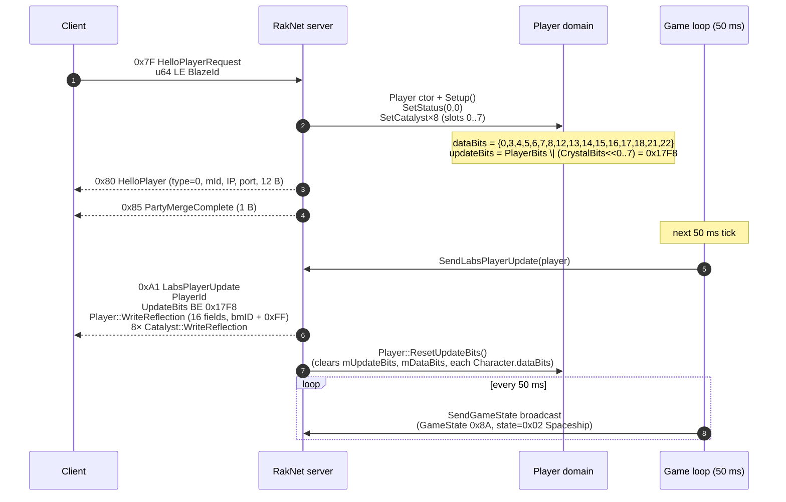
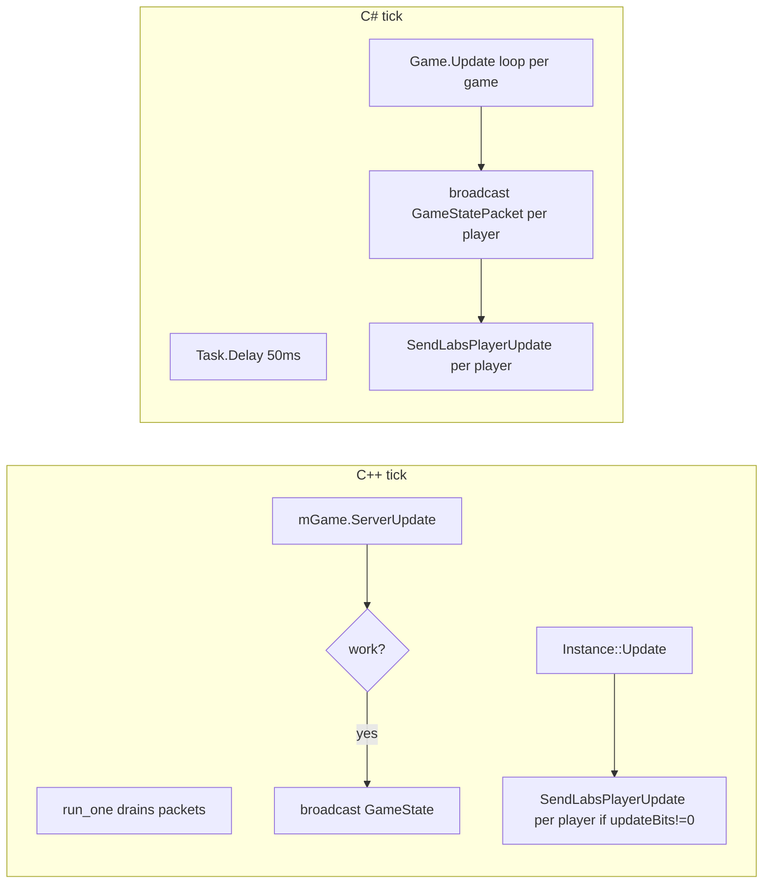

# Phase 06 — Spaceship (`state = 0x02`)

The first RakNet user-level packet from the client is `HelloPlayerRequest` (0x7F). The server materialises the player, populates initial state, and sends:

1. `HelloPlayer` (0x80, ~12 B)
2. `PartyMergeComplete` (0x85, ~1 B)
3. First `LabsPlayerUpdate` (0xA1) on the next 50 ms tick

The LPU emitted here is the **single largest source of subtle bugs** in the C# port. Everything beneath uses byte offsets from the C++ source for cross-reference.



---

## `HelloPlayerRequest` (0x7F)

Body: `u64 LE` BlazeId. The whole packet is `1 (type) + 8 (id) = 9 B`.

> **FROZEN (CLAUDE.md):** the UserId is **LE**, parsed via plain `BinaryReader` on C# (`BinaryReader.ReadUInt64`). C++ uses `Read<uint64_t>(stream, blazeId)` which for `BitStream::Read<T>` is LE too. ✅

### C++ (`Server.cpp:596-641`)

```cpp
uint64_t blazeId;
Read(mInStream, blazeId);

client->SetUser(SporeNet::Get().GetUserManager().GetUserById(blazeId));
const auto& player = client->GetPlayer();
if (!player) return;

// Crystals
for (uint32_t i = 0; i < 7; ++i) {
    player->SetCatalyst(
        Game::Catalyst(Game::CatalystType::AoEDamage,
                       utils::random::get(Game::CatalystRarity::Common, Game::CatalystRarity::Epic),
                       utils::random::get<uint8_t>(0, 1)),
        i);
}
player->SetCatalyst(
    Game::Catalyst(Game::CatalystType::Health, Game::CatalystRarity::Rare, false),
    7);

auto& gameStateData = client->GetGameStateData();
gameStateData.state = static_cast<uint32_t>(GameState::Spaceship);
gameStateData.type  = Blaze::GameType::Chain;

SendHelloPlayer(client);
SendPartyMergeComplete(client);
```

### C# (`Game.cs:70-95` `AttachPlayer`, called from `RakNetServer.cs:86-100`)

```csharp
// RakNetServer.OnSessionReceiveRaw, on HelloPlayerRequest:
client.UserId = helloPlayerRequestPacket.UserId;
var account = accountService.getAccountById(client.UserId);
var game = gameService.GetGameByPlayer(account)
        ?? gameService.CreateGame();
client.Game = game;
game.AttachPlayer(account, client);

// Game.AttachPlayer(account, client):
var player = new Player(account.Id, slot) { Client = client };
Players.Add(slot, player);

ushort crystalBits8 = 0;
for (int i = 0; i < 8; i++)
    crystalBits8 |= (ushort)(LabsPlayerUpdatePacket.CrystalBits << i);
player.SetUpdateBits((ushort)(LabsPlayerUpdatePacket.PlayerBits | crystalBits8));

OnHelloPlayer(player);          // sends 0x80
OnPartyMergeComplete(player);   // sends 0x85
SendLabsPlayerUpdate(player.Client);
```

Differences worth flagging:

| Item | C++ | C# |
|---|---|---|
| Slot allocation | `mPlayerIndex` set in Player ctor by caller | `byte slot` resolved from `ExpectedPlayers[account.Id]` |
| Catalyst contents | random AoE 0..3 rarity for slots 0..6, slot 7 = Health/Rare | populated later in `CreatePlayerData`: 8 slots × {NounId=0x02FB89EB, Rarity=2} hardcoded (`Game.cs:230-237`) |
| Catalyst data bit (`CrystalData=13`) | not set on the wire here (set only inside `Player::WriteReflection` if dataBit 13 happens to be set) | C# leaves bit 13 out of the initial set (FROZEN) |
| `CrystalBonuses` (`UpdateCatalystBonuses`) | runs after each `SetCatalyst`, sets dataBit 14 + PlayerBits | not invoked; CatalystBonuses array stays all-false |
| Wire state | set to `0x02 Spaceship` immediately | C# state machine starts at `GameState.Initializing` and flips to `Spaceship` only after `HandleDebugPing` (`Game.cs:270-272`) | 

> **Bug surface:** C++ flips to `Spaceship` (0x02) **before** the first LPU goes out. C# sits in `Initializing` until the client sends a `DebugPing`. The first `GameStatePacket` broadcast (50 ms after attach) will therefore carry state `Initializing` on the wire on C#, **not** `Spaceship`. Verify against the C# enum mapping.

---

## `HelloPlayer` (0x80)

C++ payload (`Server.cpp:1235`+):

```
u8   PacketID = 0x80
u8   playerType    (0 = "first player")
u8   mId           (player slot index)
u32  internal IP   (BE? LE? — currently zero on C++)
u16  internal port
u32  external IP
u16  external port
```

12 B total (without the leading PacketID byte; 13 B counting it).

C# (`HelloPlayerPacket.cs`):

```csharp
writer.Write(PlayerType);     // u8
writer.Write(GameplayIndex);  // u8
```

> Static analysis of the client's `HelloPlayer` parser (`FUN_00a93d50`) confirms the payload is exactly 8 bytes: `type` (1 byte), `gameplayIndex` (1 byte), `IPv4` (4 bytes, Network Byte Order/BE), `Port` (2 bytes). The C# `HelloPlayerPacket` only writes 2 bytes; the rest is implicitly zero because `RakNetServer.SendPacket` writes only what `WriteTo` produces. It must be updated to write all 8 bytes.

---

## `PartyMergeComplete` (0x85)

Both sides: 1-byte packet (`PacketID = 0x85`), no body. ✅

---

## First `LabsPlayerUpdate` (0xA1)

### Wire structure

```
u8  PacketID = 0xA1
u8  playerId               // Player::GetId() / Player.Slot
u16 BE updateBits          // 0x17F8 expected

[if updateBits & PlayerBits (0x1000)]
   Player::WriteReflection() — see below

[for i = 0..2 if updateBits & (CharacterBits << i)]
   Character::WriteReflection()  (variable size; nothing in this phase)

[for i = 0..8 if updateBits & (CrystalBits << i)]
   Catalyst::WriteReflection()   (each ~3-12 B depending on bits)
```

In Spaceship the only bits set are `PlayerBits | (CrystalBits << 0..7)` = 0x17F8 — so 1 PlayerReflection block + 8 Catalyst reflection blocks.

### `Player::WriteReflection` schema (24-field reflection serializer)

`reflection_serializer<N>` with `N > 16` switches to "byte-ID per field + 0xFF terminator" (`bmID`).

| Bit | Field | C++ type | Bytes BE | C++ at | C# at | Status |
|---|---|---|---|---|---|---|
| 0 | DataSetup | `bool` | 1 | `Player.cpp:483` | `LabsPlayerUpdatePacket.cs:104` | ✅ |
| 1 | CurrentDeckIndex | `int32` | 4 | 484 | 105 | ✅ |
| 2 | QueuedDeckIndex | `int32` | 4 | 485 | 106 | ✅ |
| 3 | mCharacterData (3 × WriteTo @ 0x620 each) | raw 3×0x620 | 4704 | 486 | 108-115 | ✅ but bit not set in C# initial |
| 4 | mPlayerIndex | `u8` | 1 | 487 | 117 | ✅ |
| 5 | mTeam | `u8` | 1 | 488 | 118 | ✅ |
| 6 | mPlayerOnlineId | `u64` | 8 | 489 | 119 | ✅ |
| 7 | mStatus | `u32` | 4 | 490 | 120 | ✅ |
| 8 | mStatusProgress | `f32` | 4 | 491 | 121 | ✅ |
| 9 | mCurrentCreatureId | `u32` | 4 | 492 | — | ⚠️ Not initial in either |
| 10 | mEnergyPoints | `f32` | 4 | 493 | — | ⚠️ |
| 11 | mbIsCharged | `bool` | 1 | 494 | — | ⚠️ |
| 12 | mDNA | `int32` | 4 | 495 | 122 | ✅ |
| 13 | mCatalysts (9 × WriteTo @ 16 each) | raw 144 | 144 | 496 | 124-131 | ✅ but bit not set in C# initial |
| 14 | mCatalystBonuses[8] | `bool[8]` | 8 | 497 | 133-140 | ✅ but bit not set in C# initial |
| 15 | mAvatarLevel | `u32` | 4 | 498 | 142 | ✅ |
| 16 | mAvatarXP | `f32` | 4 | 499 | 143 | ✅ |
| 17 | mChainProgression | `u32` | 4 | 500 | 144 | ✅ but bit not set in C# initial |
| 18 | mLockCamera | `bool` | 1 | 501 | 145 | ✅ |
| 19 | mbLockedOverdrive | `bool` | 1 | 502 | 146 | ⚠️ Not initial in either |
| 20 | mbLockedCrystals | `bool` | 1 | 503 | 147 | ⚠️ |
| 21 | mLockedAbilityMin | `u32` | 4 | 504 | 148 | ✅ |
| 22 | mLockedDeckIndexMin | `u32` | 4 | 505 | 149 | ✅ |
| 23 | mDeckScore | `u32` | 4 | 506 | 150 | ✅ |

### Initial dataBits — the FROZEN divergence

| Source | dataBits set when first LPU goes out |
|---|---|
| **C++** | `{0, 3, 4, 5, 6, 7, 8, 12, 13, 14, 15, 16, 17, 18, 21, 22}` — 16 bits |
| **C#** | `{0, 4, 5, 6, 7, 8, 12, 15, 16, 18, 21, 22}` — 12 bits |
| **Δ** | C# drops `{3, 13, 14, 17}` (CharacterData, CrystalData, CrystalBonuses, ChainProgression) |

🔒 **FROZEN** — see `feedback_initial_lpu_divergence.md` and the warning in `CLAUDE.md`. Adding `{3, 13, 14, 17}` "to match C++" empirically breaks chain vote (the client never sends `ChainPlayerMsgs(byteCount=6)`).

### Initial updateBits

| Source | updateBits at first send |
|---|---|
| C++ | `PlayerBits \| (CrystalBits << 0..7)` = `0x1000 \| 0x07F8` = **`0x17F8`** |
| C# | `PlayerBits \| (CrystalBits << 0..7)` = `0x1000 \| 0x07F8` = **`0x17F8`** |

✅ Wire-level updateBits match. The dataBits inside `Player::WriteReflection` differ as listed above.

### `bmID` encoding (24-field reflection)

For each set dataBit `i`, the writer emits a byte `i` followed by the field bytes. After all fields, a final `0xFF` terminates. Example wire bytes for C# (12-bit case):

```
00  <bool DataSetup>
04  <u8 PlayerIndex>
05  <u8 Team>
06  <u64 BE PlayerOnlineId>
07  <u32 BE Status>
08  <f32 BE StatusProgress>
0C  <i32 BE DNA>
0F  <u32 BE AvatarLevel>
10  <f32 BE AvatarXP>
12  <bool LockCamera>
15  <u32 BE LockedAbilityMin>
16  <u32 BE LockedDeckIndexMin>
FF  <-- terminator
```

For C++ (16-bit case) the wire additionally includes bytes `03 <3×Character.WriteTo>` (~14 KB) and `0D <9×Catalyst.WriteTo>` (144 B) and `0E <bool[8]>` (8 B) and `11 <u32 BE ChainProgression>` (4 B). The total payload size for the first LPU is therefore wildly different — **C# emits a ~70 B LPU; C++ emits a ~14.5 KB LPU**.

> Practical implication: a much larger LPU may force the client into a different deserialisation path. The empirical evidence (chain vote works on C# 12 bits, breaks on 16 bits) suggests the client tolerates the smaller LPU and chokes on the larger one in some way related to `CharacterData` placeholders during Spaceship state. Keep frozen.

---

## `Catalyst::WriteReflection`

```
bm1: 1 byte (≤8 fields, here N=2)
[bit 0] u32 BE NounId
[bit 1] u16 BE Rarity
```

C++ (`Catalyst.cpp:WriteReflection`) writes both fields. C# (`LabsPlayerUpdatePacket.cs:248-257`) writes both.

When `LabsPlayerUpdatePacket.WriteTo` loops through Catalysts (`LabsPlayerUpdatePacket.cs:46-55`), each catalyst's reflection produces:

```
03  <Catalyst i=0>  (bm1 + fields)
03  <Catalyst i=1>
...
03  <Catalyst i=7>
```

Wait — those aren't byte-IDs because Catalysts are **top-level**, not inside a parent reflection. They are emitted with their own internal bitmap (`bm1 = 0x03`, both fields present). Then **no terminator** because Catalyst uses the ≤8 path.

> The "8× catalyst at top level" arrangement is what `CLAUDE.md` calls out as a footgun — these aren't inside `Player::WriteReflection`'s field 13; they're emitted **after** the Player reflection terminator (`0xFF`).

### Catalyst payload values

| Source | NounId | Rarity | Notes |
|---|---|---|---|
| C++ | random catalyst type / rarity (`OnHelloPlayerRequest`) | 0..3 random | Slot 7 forced to Health/Rare. |
| C# | **hardcoded `0x02FB89EB`** for all 8 slots, Rarity `2` | constant | `Game.cs:234-235`. |

> Cosmetic, but the wire blob diverges every login.

---

## `Game.Update()` broadcast cadence

`Game.cs:37-54` runs every 50 ms (from `RakNetServer.cs:122-130`) and **unconditionally** sends a `GameStatePacket` followed by an LPU per player. C++ only broadcasts `GameState` when `mGame.Update()` returns `true` (i.e. something changed) — see `Server.cpp:198-208`.



C# sends a `GameStatePacket` **and** an LPU every single 50 ms tick. C++ only sends `GameStatePacket` on change; LPU is gated by `updateBits != 0` in `SendLabsPlayerUpdate`.

> If C# sends LPU when `UpdateBits == 0`, `SendLabsPlayerUpdate` early-returns (`Game.cs:163-164`), so that's safe. But the unconditional GameState broadcast is excessive. Whether the client tolerates duplicate `GameState` every tick is an open question.

---

## Parity table (Phase 06)

| Item | C++ | C# | Status |
|---|---|---|---|
| `HelloPlayerRequest` parse (u64 LE) | `Server.cpp:598-599` | `HelloPlayerRequestPacket.cs` | ✅ |
| State → Spaceship before first send | `Server.cpp:634` | deferred to `HandleDebugPing` (`Game.cs:270-272`) | ⚠️ Race window. |
| `SetCatalyst × 8` with real values | `Server.cpp:612-630` | catalysts populated in `CreatePlayerData` with hardcoded `0x02FB89EB` | ⚠️ |
| `UpdateCatalystBonuses` (dataBit 14, PlayerBits) | yes (`Player.cpp:515-537`) | not called | ⚠️ |
| `SendHelloPlayer` | `Server.cpp:1235`, body = 12 B (BitStream BE; last 4 bytes ignored by client) | `Game.cs:98-106`, body = 2 B | ❌ M4-4 (2026-05-24) — client requires **8 B** per `FUN_00a93d50`: `u8 type, u8 gameplayIndex, u32 BE IPv4, u16 BE Port`. C# misses 6 B; C++ over-writes 4 B harmlessly. |
| `SendPartyMergeComplete` | `Server.cpp:1288` | `Game.cs:108-111` | ✅ |
| Initial dataBits | 16 bits `{0,3..8,12..18,21,22}` | 12 bits `{0,4..8,12,15,16,18,21,22}` | 🔒 |
| Initial updateBits | `0x17F8` | `0x17F8` | ✅ |
| `Player::WriteReflection` field order | 0..23 | 0..23 (`LabsPlayerUpdatePacket.cs:104-150`) | ✅ |
| Reflection encoding | `<24>` → `bmID + 0xFF` | `ReflectionSerializer(writer, 24)` | ✅ |
| Catalyst WriteReflection (top-level loop) | 8 catalysts emitted at slots 0..7 | identical loop (`LabsPlayerUpdatePacket.cs:46-55`) | ✅ |
| Catalyst NounId/Rarity values | randomised per session | hardcoded `0x02FB89EB`, Rarity 2 | ⚠️ |
| `ResetUpdateBits` semantics | clears `mUpdateBits`, `mDataBits`, **and** each Character.dataBits | clears `player.UpdateBits` + `pd.ResetDataBits()`; characters are stored in PlayerData and reset implicitly via dataBits | ⚠️ Verify Character.dataBits cleared correctly. |
| Periodic GameState broadcast | only when `mGame.Update()` returns true | every 50 ms unconditionally | ⚠️ |
| Periodic LPU | gated by `updateBits != 0` | gated by `updateBits != 0` (`Game.cs:163-164`) | ✅ |
| `DeckScore` initial | from squad (or 0) | hardcoded 500 | ⚠️ |
| `AvatarLevel`/`AvatarXP` | from account | hardcoded 30 / 0 | ⚠️ |
| `ChainProgression` initial | `mUser->get_account().chainProgression` | hardcoded 10; dataBit 17 not set | ⚠️ |

---

## Open audit items

1. **State race on attach.** Set the wire state to `Spaceship` (`0x02`) immediately in `AttachPlayer` before any tick fires, mirroring `Server.cpp:572`. The first `GameStatePacket` should not advertise `Initializing`.
2. **`HelloPlayer` payload size.** ✅ **Confirmed M4-4 (2026-05-24)** via client static analysis (`FUN_00a93d50`): wire body is **8 B** = `u8 type, u8 gameplayIndex, u32 BE IPv4, u16 BE Port`. C++ writes 12 B (4 B trailing zeros — harmlessly ignored); C# writes only 2 B (misses IP + Port — **broken**). Fix in `HelloPlayerPacket.cs` — write the 4 B IPv4 + 2 B port from the session's `SystemAddress`. Tier-A bug in `project-protocol-bugs`.
3. **`UpdateCatalystBonuses` not invoked in C#.** Even though dataBit 14 is intentionally not in the initial bits, the `CatalystBonuses[8]` array stays all-false. The first LPU does not include them, but later LPUs (after `SetCatalyst`) should set bit 14 + PlayerBits, just like C++. Currently no path does.
4. **Catalyst constants.** Replace the hardcoded `0x02FB89EB` / `Rarity=2` with per-account / randomised values once the rest of the flow stabilises.
5. **Unconditional `GameStatePacket` broadcast every tick.** Add a "dirty" flag like C++'s `mGame.Update() == true` short-circuit, otherwise the client receives ~20 GameState packets per second permanently.
6. **`DeckScore`/`AvatarLevel`/`ChainProgression` hardcoded.** Wire these to the actual SQLite account so the launcher / HUD reflects the right values.
7. **`ResetUpdateBits` parity for Characters.** Confirm `LabsCharacterData` carries its own `_dataBits` that gets cleared between LPUs. Otherwise the next time `CharacterMask` gets set, the wire will repeat stale Character fields.

---

## Files referenced

C++:

- `recap_server_develop/darkspore_server/source/Game/Player.h`
- `recap_server_develop/darkspore_server/source/Game/Player.cpp`
- `recap_server_develop/darkspore_server/source/Game/Character.cpp`
- `recap_server_develop/darkspore_server/source/Game/Catalyst.cpp`
- `recap_server_develop/darkspore_server/source/RakNet/Server.cpp`

C#:

- `ReCap.Server/Domain/Gameplay/Player.cs`
- `ReCap.Server/Domain/Gameplay/Game.cs`
- `ReCap.Server/Adapters/RakNet/Packets/LabsPlayerUpdatePacket.cs`
- `ReCap.Server/Adapters/RakNet/Packets/HelloPlayerPacket.cs`
- `ReCap.Server/Adapters/RakNet/Packets/HelloPlayerRequestPacket.cs`
- `ReCap.Server/Adapters/RakNet/Packets/PartyMergeCompletePacket.cs`
- `ReCap.Server/Adapters/RakNet/Packets/ChainPlayerMsgsPacket.cs`
- `ReCap.Server/Adapters/RakNet/ReflectionSerializer.cs`
