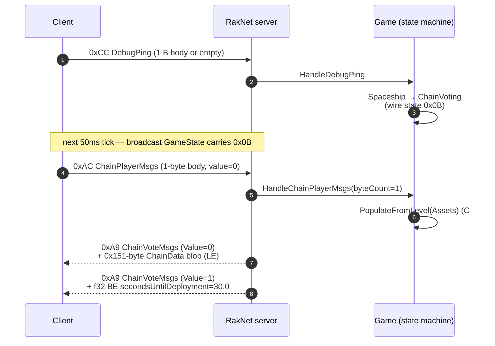

# Phase 07 — ChainVoting (`state = 0x0B`)

Client leaves Spaceship by sending one `DebugPing` (0xCC). Server flips wire state to `ChainVoting (0x0B)`. Client then sends `ChainPlayerMsgs` (0xAC, body 1 byte, value=0) to request the chain-vote payload. Server replies with two back-to-back `ChainVoteMsgs` (0xA9): one carrying the 0x151-byte chain blob and one carrying `secondsUntilDeployment = 30.0`. The client now shows the level / enemies / countdown UI.



---

## State transition — `DebugPing` in Spaceship state

### C++ (`Server.cpp:1134+ OnDebugPing`, Spaceship branch around `~1145`)

C++ flips `gameStateData.state = ChainVoting (0x0B)`. No immediate reply packet — the next `SendGameState` broadcast (driven from `Server::start` main loop, `Server.cpp:194-208`) carries the new state.

### C# (`Game.cs:264-287` `HandleDebugPing`)

```csharp
switch (State)
{
    case GameState.Initializing:
        State = GameState.ChainVoting;
        break;

    case GameState.ChainVoting:
        sender.SendPacket(new ChainVoteMsgsPacket { Value = 0, ChainData = Chain });
        break;
    ...
}
```

> ⚠️ **Behavioural divergence on first ping.** C# enum starts at `Initializing`, not `Spaceship`. The first `DebugPing` flips it to `ChainVoting` (skipping any Spaceship-specific behaviour C++ would do here). Second ping triggers the chain blob — but C++ never relies on a second ping; the chain blob is triggered by `ChainPlayerMsgs(1)`.
>
> ⚠️ **Extra path:** C# returns a `ChainVoteMsgsPacket Value=0` on the second `DebugPing` while in `ChainVoting`. C++ does not do this. The client may end up with duplicate blob responses (one from `DebugPing` path, one from `ChainPlayerMsgs(1)` path).

### Wire state codes (recap)

| Logical | C++ value | C# enum | wire byte |
|---|---|---|---|
| Spaceship | `0x02` | `GameState.Spaceship`? (verify) | `0x02` |
| ChainVoting | `0x0B` | `GameState.ChainVoting` | `0x0B` |
| PreDungeon | `0x05` | `GameState.PreDungeon` | `0x05` |
| Dungeon | `0x06` | `GameState.Dungeon` | `0x06` |
| ChainCashOut | `0x0C` | `GameState.ChainCashOut`? | `0x0C` |

> **Verify the C# enum-to-wire mapping.** If `GameState.Initializing` maps to anything other than `0x02`, the `GameStatePacket` broadcast in Phase 06 announces the wrong state. Check `GameplayState.cs` and confirm the integer values match the C++ wire constants exactly.

---

## `ChainPlayerMsgs` (0xAC) parse

| `byteCount` (excluding type byte) | Meaning | C++ branch | C# branch |
|---|---|---|---|
| 0 | header-only ping | none | none (default in `ChainPlayerMsgsPacket.cs` switch) |
| 1 | client confirms vote action | `Server.cpp:994-1003` | `Game.cs:293-306` |
| 2 | reserved / unknown | `Server.cpp:1006-1008` (empty) | `ChainPlayerMsgsPacket.cs:29-32` reads `Value, Ready` but no handler runs |
| 6 | client picks squad — go to PreDungeon | `Server.cpp:1011-1019` → `PrepareGameStart` | `Game.cs:307-323` (Phase 08) |

### Body layouts

```
byteCount=1
  u8 Value    // 0 → request chain vote, 2 → cashout

byteCount=2 (C++ unused; C# reads but no handler)
  u8 Value
  u8 Ready

byteCount=6
  u8 Value
  u8 Unknown
  u32 BE SquadId   // !! Big-endian (FROZEN), see CLAUDE.md
```

---

## `ChainVoteMsgs` (0xA9) — Value 0 (the big blob)

### C++ send path (`Server.cpp:2140-2182`)

```cpp
BitStream outStream(8);
outStream.Write(PacketID::ChainVoteMsgs);    // 0xA9
Write<uint8_t>(outStream, value);             // 0
data.WriteTo(outStream);                       // 0x151 bytes
Send(outStream, client);
```

`Write<T>` wraps `BitStream::Write` with a `bswap` (host→BE) — see `RakNet/Types.h:217-227`. **In C++ the chain blob is therefore written as 0x151 bytes of BE 32-bit integers / floats.**

### C# send path (`ChainVoteMsgsPacket.cs:30-50` + `WriteChainData` 52-164)

```csharp
writer.Write(Value);             // u8

switch (Value) {
case 0:
    WriteChainData(writer, ChainData);   // builds a 0x170 buffer, writes 0x151 bytes
    break;
case 1:
    writer.WriteBE(SecondsUntilDeployment); // f32 BE
    break;
case 2:
    writer.Write(StayInParty);        // u8 bool
    break;
}
```

`WriteChainData` uses **`BinaryPrimitives.WriteUInt32LittleEndian`** for every u32 (line 56) and writes float bits the same way (line 57). **The C# chain blob is therefore 0x151 bytes of LE 32-bit integers / floats.**

### 🔒 FROZEN: LE wins

| Reality check | Result |
|---|---|
| C++ writes BE | matches the wrapper convention used everywhere else in the codebase |
| C# writes LE | empirically what the client wants — flipping to BE breaks the level / enemies UI |
| CLAUDE.md `feedback_chainvote_le.md` | confirms LE is correct |

This is the only known case where C# diverges from C++ for endianness and is **right**. Treat the C++ source here as a known bug-by-omission and keep C# LE.

### Buffer layout — per-offset C++ vs C# diff (M4-2 audit, 2026-05-24)

Audit walked `Types.cpp:1176-1332` (`ChainVoteData::WriteTo`) alongside `ChainVoteMsgsPacket.cs:52-164` (`WriteChainData`) byte-by-byte. Both writers produce a `0x151`-byte payload after the leading `Value` byte. The endianness inversion (C++ BE / C# LE) is documented above and is **🔒 frozen** — C# is the correct wire form. The diff below reports **structural offset alignment**, not byte-for-byte equality of integer encodings.

#### Branch A — `!mCompletedLevel` (normal vote, every gameplay session)

| Offset | C++ (`Types.cpp`) | C# (`ChainVoteMsgsPacket.cs`) | Status |
|---|---|---|---|
| `0x00..0x03` | `Write<u32>(mLevel)` | `writeUInt32(0x00, Level)` | ✅ aligned |
| `0x04..0x07` | `Write<u32>(mLevelIndex)` | `writeUInt32(0x04, LevelIndex)` | ✅ |
| `0x08..0x0B` | `Write<u32>(mStarLevel)` | `writeUInt32(0x08, StarLevel)` | ✅ |
| `0x0C..0x0F` | `Write<float>(30·60·1000)` | `writeFloat(0x0C, 30·60·1000f)` | ✅ |
| `0x10` | `Write<u8>(mProgression)` | `buffer[0x10] = Progression` | ✅ |
| `0x11..0x28` | enemies `[0..5]` × u32 | enemies `[0..5]` × u32 at `0x11 + i·4` | ✅ |
| `0x29..0x30` | levelNouns `[0..1]` × u32 | levelNouns `[0..1]` × u32 at `0x29 + i·4` | ✅ |
| `0x31..0x38` | gap (skipped via next `SetWriteOffset(0x39)`, zero) | gap (buffer pre-zero) | ✅ |
| `0x39..0x3C` | `Write<u32>(0)` party value | `writeUInt32(0x39, 0)` | ✅ |
| `0x3D..0x40` | `Write<u32>(hash("fmv_02_zelems.vp6"))` | identical FNV | ✅ |
| `0x41..0x44` | second `fmv_02_zelems` | identical | ✅ |
| `0x45..0x48` | `vo_ship_flow_reinfect_zelems` | identical | ✅ |
| `0x49..0x4C` | `Write<u32>(0)` completion flag | `writeUInt32(0x49, 0)` | ✅ |
| `0x4D..0xD8` | gap (skipped via `SetWriteOffset(0xD9)`, zero) | gap (buffer pre-zero) | ✅ |
| `0xD9..0xDC` | `Write<u32>(0)` party override | `writeUInt32(0xD9, 0)` | ✅ |
| `0xDD..0xE0` | `Write<u32>(hash("fmv_03_nocturna.vp6"))` | identical | ✅ |
| `0xE1..0xE4` | second `fmv_03_nocturna` | identical | ✅ |
| `0xE5..0xE8` | gap (cursor jumps via `SetWriteOffset(0xE9)`, stays zero) | **explicit** `writeUInt32(0xE5, 0)` | ✅ same bytes, different mechanism |
| `0xE9..0xEC` | `Write<u32>(mLevel)` | `writeUInt32(0xE9, Level)` | ✅ |
| **`0xED..0x104`** | **6 × `Write<u32>` of `{10, 20, 30, 40, 50, 60}` at cursor 0xED** | — | ❌ **offset divergence — see below** |
| **`0xEE..0x105`** | — | **6 × `writeUInt32` of `{10, 20, 30, 40, 50, 60}` at hardcoded `tailOffset = 0xEE`** | ❌ |
| `0x105..0x150` (C++) / `0x106..0x150` (C#) | gap, zero | gap, zero | ✅ |

#### ❌ Real divergence — trailing 6-u32 block is 1 byte off

C++ never sets the cursor before its final six `Write<u32>` calls — the cursor sits at `0xED` after the `Write<u32>(mLevel)` at `0xE9..0xEC`. C# uses an explicit `tailOffset = 0xEE` (see `ChainVoteMsgsPacket.cs:155`). The block therefore occupies a different range in each writer:

- C++ writes bytes `[0xED .. 0x104]` (24 bytes of BE u32s)
- C# writes bytes `[0xEE .. 0x105]` (24 bytes of LE u32s)

If the client reads this section, C++ and C# present different content. The **🔒 LE-is-correct** rule (from `feedback_chainvote_le.md`) suggests the C# offset is also correct — otherwise the levels/enemies UI would already be broken. Treat C++ as the source of the 1-byte slip; the surrounding offsets (`0xE9..0xEC` for `mLevel`, gap before the tail) leave room for both. **No action required**, but flagged in the audit list below.

#### Branch B — `mCompletedLevel` (post-cashout review screen)

Both writers expand the conditional blocks at offsets `0x4D..0xD8` (per-player chain summary) and `0xEE..0x151` (planet data). Walk:

| Offset | C++ | C# | Status |
|---|---|---|---|
| `0x00..0x07` | `MinorDifficulty, MajorDifficulty` | `MinorDifficulty, MajorDifficulty` | ✅ |
| `0x08..0x0F` | `Write<float>(15·60·1000); Write<float>(30·60·1000)` | identical | ✅ |
| `0x10..0x30` | progression + enemies + levelNouns | identical | ✅ |
| `0x31..0x38` | `Write<u32>(4); Write<u32>(3)` | `writeUInt32(0x31, 4); writeUInt32(0x35, 3)` | ✅ |
| `0x39..0x4C` | identical to Branch A | identical | ✅ |
| `0x4D..0x50` | `Write<u32>(0)` | `writeUInt32(0x4D, 0)` | ✅ |
| `0x51..0x54` | `Write<u32>(mLevelIndex)` | `writeUInt32(0x51, LevelIndex)` | ✅ |
| `0x55..0x64` | DNA loop `30, 60, 90, 120` | DNA loop `30, 60, 90, 120` | ✅ |
| `0x65..0x74` | unknown loop `40, 80, 120, 160` | unknown loop `40, 80, 120, 160` | ✅ |
| `0x76..0xD9` | 4 × summary entries, stride `0x19`, each = `{pveKills u32, unk u32, dmgDealt f32, dmgTaken f32, healDone f32, healRecv f32, playerIdx u8}` | identical formula | ✅ |
| `0xD9..0xDC` | `Write<u32>(0)` **clobbers** the `playerIdx u8` at byte `0xD9` written by summary[3] | identical clobber | ✅ (same bug both sides — last summary's `playerIndex` always read as 0) |
| `0xDD..0xE4` | nocturna fmv × 2 | identical | ✅ |
| `0xE5..0xE8` | gap, zero | explicit `writeUInt32(0xE5, 0)` | ✅ |
| `0xE9..0xEC` | `mLevel` | `Level` | ✅ |
| `0xEE..0x151` | 4 × planet-data entries, stride `0x19`, last entry ends at `0x152` (exclusive) — fills exactly to the `0x151` boundary | identical formula | ✅ |
| **after `0x151`** | 6 × `Write<u32>(10..60)` past buffer, **truncated** by trailing `SetWriteOffset(writeOffset + size)` | 6 × `writeUInt32(0x152..0x16D)` past buffer, **truncated** by `writer.Write(buffer, 0, 0x151)` | ✅ both discard |

In the Completed path, the trailing six u32 block lives entirely past the wire-visible `0x151` window on **both** sides, so neither client receives it. The truncation mechanism differs (C# slice vs. C++ rollback) but the wire output matches.

#### Header sizing

The C# `WriteChainData` declares `byte[] buffer = new byte[0x170]` to give itself headroom and slices the first `0x151` bytes to the wire (`ChainVoteMsgsPacket.cs:163`). The C++ side calls `ReallocateStream(stream, bytes_to_bits(0x151))` so the same `0x151` byte length is guaranteed. Both writers are robust against the over-write attempts in the Completed branch.

#### Default content gaps (C# only — when `Assets == null`)

`ChainData()` constructor (`ChainData.cs:25-34`) seeds **only 5** of the 6 enemy hashes (`EnemyNouns[5]` stays `0`) and **no** level nouns (`LevelNouns[0]`, `LevelNouns[1]` both `0`). C++ `ChainVoteData::ChainVoteData()` (`Types.cpp:1067-1075`) seeds all 6 enemies and both level nouns. If `--assetdata-path` is not provided to the C# server, `Chain.PopulateFromLevel(Assets)` is not called and the missing slots stay zero on the wire. With `--assetdata-path` set, `PopulateFromLevel` overwrites everything from the planet config, so the gap closes.

### Asset-driven enemy / level nouns (C# only)

C# `Game.cs:289-301` calls `Chain.PopulateFromLevel(Assets)` before sending the blob whenever `Assets != null` (i.e. `--assetdata-path` was provided). This pulls the planet config from `AssetData_Binary.package` and replaces the `EnemyNouns` / `LevelNouns` arrays with real hashes (`ChainData.cs:36-97`). C++ uses static defaults seeded in `RakNet/Types.cpp:1067-1075`:

```cpp
mEnemyNouns[0] = utils::hash_id("VerdanthBasicMelee.Noun");
mEnemyNouns[1] = utils::hash_id("ZelemBasicHybrid.Noun");
...
mLevelNouns[0] = utils::hash_id("ZelemBoss.Noun");
mLevelNouns[1] = utils::hash_id("NomadSpacetimeAgent.Noun");
```

> The C# behaviour is the more correct one — the enemies displayed in the UI should match the chosen level. C++ ships with placeholder data because `ChainData` is mutated later in `GameManagerComponent::ResetDedicatedServer` (`GameManagerComponent.cpp:1245-1252`) which calls `chainData.SetLevelByIndex(levelId)` and `game->LoadLevel()`.

---

## `ChainVoteMsgs` — Value 1 (countdown)

### C++ (`Server.cpp:2165-2171`)

```cpp
float secondsUntilDeployment = 30.0f;
Write<float>(outStream, secondsUntilDeployment);
```

`Write<float>` does `bswap → BE`. So 4 bytes BE float.

### C# (`ChainVoteMsgsPacket.cs:44`)

```csharp
writer.WriteBE(SecondsUntilDeployment);
```

`WriteBE(float)` (C# `Util.WriteBE`) is BE. ✅ Matches.

Total packet body: `u8 Value=1 + f32 BE secondsUntilDeployment` = 5 bytes total including the leading 0xA9 PacketID byte.

---

## `ChainVoteMsgs` — Value 2 (cashout)

C++ `Server.cpp:2173-2177`: `bool stayInParty = false;` `Write<bool>(stream, stayInParty);` — 1 byte body.
C# `ChainVoteMsgsPacket.cs:47`: `writer.Write(StayInParty);` — 1 byte body.

✅ matches.

---

## Trigger sequencing comparison

| Step | C++ trigger | C# trigger |
|---|---|---|
| Wire state Spaceship → ChainVoting | first `DebugPing` while in Spaceship | first `DebugPing` while in `Initializing` |
| Send 0x151 chain blob | `ChainPlayerMsgs(byteCount=1, value=0)` | `ChainPlayerMsgs(byteCount=1, value=0)` **and** `DebugPing` while in `ChainVoting` |
| Send `secondsUntilDeployment` | immediately after blob, same handler | immediately after blob, same handler (`Game.cs:299`) |
| Asset-driven enemy nouns | no (relies on default values + `ResetDedicatedServer` mutation) | yes (`PopulateFromLevel(Assets)`) |

---

## Parity table (Phase 07)

| Item | C++ | C# | Status | Notes |
|---|---|---|---|---|
| State flip on Spaceship `DebugPing` | yes (→ 0x0B) | yes (Initializing → ChainVoting) | ⚠️ Initial state differs. |
| `ChainPlayerMsgs` body parse | by `bytesToRead` (1 / 2 / 6) | by `ByteCount` (1 / 2 / 6) | ✅ |
| `byteCount=2` action | none | reads `Value, Ready` but no dispatch | ⚠️ |
| `ChainVoteMsgs Value=0` blob length | 0x151 bytes | 0x151 bytes | ✅ |
| Blob endianness | BE (`Write<uint32_t>` + bswap) | LE (`BinaryPrimitives.WriteUInt32LittleEndian`) | 🔒 **LE is correct on the wire** — C++ is the buggy side here. |
| Blob `0x00..0x0F` layout | mLevel/mLevelIndex/mStarLevel/30·60·1000 | identical | ✅ |
| Blob `0x10 progression` | u8 | u8 | ✅ |
| Blob `0x11..0x28 enemies[6]` | 6 × u32 | 6 × u32 | ✅ |
| Blob `0x29..0x30 levelNouns[2]` | 2 × u32 | 2 × u32 | ✅ |
| Blob `0x39..0x44 party/cinematic` | identical | identical | ✅ |
| Blob `0x45..0x4C voiceover/completion` | identical | identical | ✅ |
| Blob `0xD9..0xEC` (party-override + nocturna fmvs) | yes | yes (C# writes explicit `0` at `0xE5..0xE8`; C++ leaves alloc-zero — same bytes) | ✅ M4-2 |
| Blob `0xED/0xEE` tail (6 u32 = 10/20/30/40/50/60) | present, **starts at `0xED`** (cursor continuation) | present, **starts at `0xEE`** (hardcoded `tailOffset`) | ⚠️ M4-2 — 1-byte offset divergence in `!CompletedLevel` path. LE rule says C# is correct on the wire. |
| `mCompletedLevel` branch | conditional 0x4D..0xD8 block + per-player chain summary at 0x76 step 0x19 | symmetric in C# (`ChainVoteMsgsPacket.cs:87-128`) | ✅ |
| Defaults for enemy / level nouns | static FNV hashes seeded in `RakNet/Types.cpp:1067-1075` | overridden from level asset via `PopulateFromLevel(Assets)` if `--assetdata-path` provided | ⚠️ C# is asset-driven; C++ is static. |
| Send sequence on `ChainPlayerMsgs(1, 0)` | `SendChainVoteMessages(client, 0)` then `(client, 1)` | identical | ✅ |
| Send sequence on `ChainPlayerMsgs(1, 2)` (cashout) | `SendChainVoteMessages(client, 2)` | `Game.cs:302-305`: sends `Value=2 StayInParty=false` | ✅ |
| Duplicate blob on `DebugPing` while in `ChainVoting` | no | yes (`Game.cs:274-276`) | ⚠️ Extra packet may confuse the client. |
| `ChainVoteMsgs Value=1` body | f32 BE secondsUntilDeployment | f32 BE secondsUntilDeployment | ✅ |
| `ChainVoteMsgs Value=2` body | u8 stayInParty | u8 StayInParty | ✅ |

---

## Open audit items

1. **State enum mapping.** Verify `GameplayState.cs` wire values match C++ exactly. If `Initializing` is `0x00` (the default `enum` starting value), the first `GameStatePacket` after `AttachPlayer` advertises a state the client doesn't understand. Use the same numbering as the C++ wire constants (`Spaceship = 0x02` as the first valid state).
2. **Drop the duplicate blob on `DebugPing` (ChainVoting branch).** C++ has no equivalent. Remove the `ChainVoteMsgsPacket Value=0` send from `Game.HandleDebugPing` to avoid double-blobs.
3. ~~**Confirm the `0xEE` tail bytes don't corrupt parsing.**~~ **Resolved (M4-2, 2026-05-24).** C# tail sits at `0xEE..0x105`, fully inside the `0x151` window, no collisions with any earlier write. C++ writes the same 6 u32s at `0xED..0x104` (1 byte earlier, no `SetWriteOffset` before the loop). Since the **🔒 LE-correct** rule comes from working-client observation, the C# offset `0xEE` is the canonical wire position. No fix needed; documented in the diff table above.
4. **Asset-driven enemy / level nouns.** Confirm the path works without `--assetdata-path`. If `Assets == null`, the constructor defaults in `ChainData.cs:25-34` only fill 5 of 6 enemy slots and 0 level nouns; the 6th enemy and both level nouns stay 0 on the wire. C++ defaults fill all 6 enemies + 2 levels.
5. **`byteCount=2` C# handler missing.** Implement an explicit no-op or document that the client never actually sends 2-byte `ChainPlayerMsgs` so the path can stay empty.
6. **`mCompletedLevel` last-summary `playerIndex` clobber (both sides).** The summary loop writes `playerIdx = 3` to byte `0xD9` for the 4th entry, then `SetWriteOffset(0xD9)` + `Write<u32>(0)` overwrites it with the party-value-override zero. Reading `mChainSummary[3].playerIndex` from the wire yields `0`. C# replicates this faithfully. If the client UI shows player-4 stats incorrectly attributed, this is the cause. C++ behaviour confirmed at `Types.cpp:1276-1281`; C# at `ChainVoteMsgsPacket.cs:127-131`. Probably harmless because the planet-data block at `0xEE+` carries its own `playerIndex` byte per entry.

---

## Files referenced

C++:

- `recap_server_develop/darkspore_server/source/RakNet/Server.cpp`
- `recap_server_develop/darkspore_server/source/RakNet/Types.h`
- `recap_server_develop/darkspore_server/source/RakNet/Types.cpp` (`ChainVoteData::WriteTo`)
- `recap_server_develop/darkspore_server/source/Blaze/Component/GameManagerComponent.cpp` (`ResetDedicatedServer` calls `chainData.SetLevelByIndex` + `LoadLevel`)

C#:

- `ReCap.Server/Domain/Gameplay/ChainData.cs`
- `ReCap.Server/Domain/Gameplay/Game.cs` (`HandleDebugPing`, `HandleChainPlayerMsgs`)
- `ReCap.Server/Adapters/RakNet/Packets/ChainVoteMsgsPacket.cs`
- `ReCap.Server/Adapters/RakNet/Packets/ChainPlayerMsgsPacket.cs`
- `ReCap.Server/Domain/Gameplay/GameplayState.cs`
