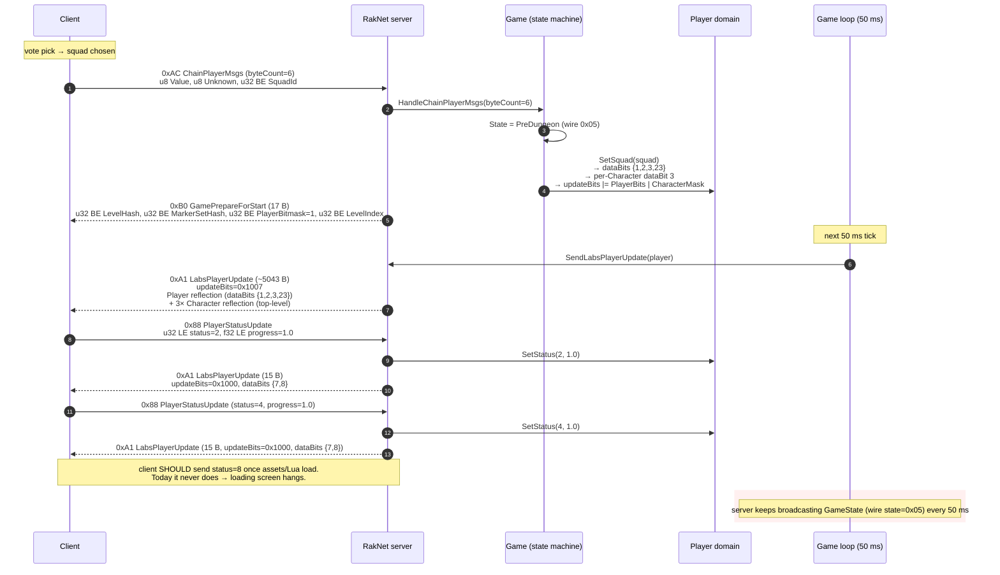

# Phase 08 — PreDungeon (`state = 0x05`)

This is the active bug surface. Client successfully receives ChainVote and `GamePrepareForStart`, sends `PlayerStatusUpdate(status=2)` (Joining), `PlayerStatusUpdate(status=4)` (Loading), and **stops**. It never reaches `status=8` (Loaded) → server never transitions to Dungeon. Loading screen sits forever.

This page captures the byte-for-byte trace of what each side does, so the next investigation can compare wire dumps quickly.



---

## `ChainPlayerMsgs` (0xAC, byteCount=6) parse

| Field | Type | Endianness | C++ | C# |
|---|---|---|---|---|
| `Value` | u8 | n/a | `Server.cpp:990` | `ChainPlayerMsgsPacket.cs:34` |
| `Unknown` | u8 | n/a | `Server.cpp:1013` | `ChainPlayerMsgsPacket.cs:35` |
| `SquadId` | u32 | **BE** | `Server.cpp:1016` (`Read<uint32_t>` → bswap) | `ChainPlayerMsgsPacket.cs:36` (`ReadUInt32BE`) |

> 🔒 **FROZEN:** SquadId is BE. Documented in `feedback_chainplayermsgs_parse.md`. Both sides match.

Live log (`ReCap.Server/output.log:291`): wire bytes `AC-01-01-01-00-00-00`.

- Value = `0x01`
- Unknown = `0x01`
- SquadId bytes `01 00 00 00` interpreted **BE** = `0x01000000` (= 16,777,216)

That's what the server logs (`Game.cs:315`): `SquadId=16777216`. The client actually wants squad **1**.

> ⚠️ **Possible bug.** If the client sends `01 00 00 00` and means squadId=1, the wire is actually **LE u32**, contrary to the frozen rule. The C++ code uses `Read<uint32_t>` (bswap) and would also see `0x01000000`. So both sides interpret consistently, but neither resolves the squad correctly. **The C# build never calls `SetSquad(squad)` anyway** (`Game.cs:307-331`) — it stamps placeholder character data via `FillSquadCharacters` (`Game.cs:178-201`) without touching the account's real squad. So the misinterpretation is currently masked.

---

## State transition

C++ `PrepareGameStart` (`Server.cpp:1208-1233`):

```cpp
const auto& squad = user->GetSquadById(squadId);
gameStateData.state = static_cast<uint32_t>(GameState::PreDungeon);  // 0x05
player->SetSquad(squad);     // mutates dataBits / updateBits / characters
SendGamePrepareForStart(client);
```

C# `Game.HandleChainPlayerMsgs(byteCount=6)` (`Game.cs:307-331`):

```csharp
State = GameState.PreDungeon;       // wire 0x05 via WireState() in GameStatePacket

if (Assets != null) Chain.PopulateFromLevel(Assets);   // refresh enemy nouns

var prepareStart = new GamePrepareForStartPacket(
    Chain.Level, Chain.MarkerSet, 1, Chain.LevelIndex);
sender.SendPacket(prepareStart);

var player = GetPlayerByClient(sender);
if (player != null)
{
    if (player.PlayerData != null)
    {
        FillSquadCharacters(player.PlayerData);
        player.PlayerData.SetDataBit(1);
        player.PlayerData.SetDataBit(2);
        player.PlayerData.SetDataBit(3);
        player.PlayerData.SetDataBit(23);
    }
    player.SetUpdateBits((ushort)(LabsPlayerUpdatePacket.PlayerBits | LabsPlayerUpdatePacket.CharacterMask));
    SendLabsPlayerUpdate(sender);
}
```

| Item | C++ | C# | Status |
|---|---|---|---|
| Resolve `squad` from account | `user->GetSquadById(squadId)` | not done | ⚠️ |
| Set wire state | `0x05` | `GameState.PreDungeon` → wire `0x05` via `GameStatePacket.WireState` (`GameStatePacket.cs:20`) | ✅ |
| `SetSquad` mutates Player | per `Player.cpp:267-313` | replaced by `FillSquadCharacters` + manual bit flips | ⚠️ |
| `Character` ctor sets all 13 dataBits | `Character.cpp:11` | n/a — C# `LabsCharacterData` writes all 13 fields unconditionally (`LabsPlayerUpdatePacket.cs:208-232`) | ⚠️ |
| dataBits `{1, 2, 3, 23}` flipped | yes | yes (`Game.cs:323-326`) | ✅ |
| updateBits `\|= PlayerBits \| CharacterMask` | yes | yes (`Game.cs:328`) | ✅ |
| `SendGamePrepareForStart` order | after `SetSquad` | before `FillSquadCharacters` + `SetUpdateBits` | ⚠️ Order swap may or may not matter; the LPU goes out on the next tick anyway. |

---

## `GamePrepareForStart` (0xB0) — 17 B

### Layout (both sides)

```
u8  PacketID = 0xB0
u32 BE  LevelHash       // FnvHash($"{LevelName}.Level")
u32 BE  MarkerSetHash   // FnvHash($"{LevelName}_ai_1.Markerset")
u32 BE  PlayerBitmask   // = 1 (single player ready)
u32 BE  LevelIndex
```

### C++ (`Server.cpp:1996-2069`)

```cpp
outStream.Write(PacketID::GamePrepareForStart);
Write<uint32_t>(outStream, chainData.GetLevel());
Write<uint32_t>(outStream, chainData.GetMarkerSet());
Write<uint32_t>(outStream, 1);                     // "all players ready" bitmask
Write<uint32_t>(outStream, chainData.GetLevelIndex());
```

### C# (`GamePrepareForStartPacket.cs:38-46`)

```csharp
writer.WriteBE(LevelHash);
writer.WriteBE(MarkerSetHash);
writer.WriteBE(PlayerBitmask);
writer.WriteBE(LevelIndex);
```

### Live wire (`output.log:293`)

```
B0 | 3F-9F-D8-53 | E0-40-3B-58 | 00-00-00-01 | 00-00-00-01
```

- Header: `B0`
- LevelHash = `0x3F9FD853` (matches FnvHash("zelems_1.Level"))
- MarkerSetHash = `0xE0403B58`
- PlayerBitmask = `0x00000001`
- LevelIndex = `0x00000001`

✅ Byte layout matches.

> Note: C++ comment at `Server.cpp:2057` says PlayerBitmask "before this updates its set to 8". For single-player, `1` is correct. For 4-player games it should be `0b1111 = 15`. C# hardcodes `1` (`Game.cs:313`). Tracking item for multi-player support.

---

## `LabsPlayerUpdate` after SetSquad (~5043 B)

### Wire bytes (`output.log:295`)

```
A1 | 00 | 10-07 | <Player reflection> | <3× Character.WriteReflection>
```

Header:
- `A1` PacketID
- `00` PlayerId (= player slot 0)
- `10 07` updateBits BE = `0x1007` = `PlayerBits | CharacterMask`

Player reflection (24-field bmID + 0xFF):
- `01` field 1 (CurrentDeckIndex), value `00 00 00 00` (0)
- `02` field 2 (QueuedDeckIndex), value `00 00 00 00` (0)
- `03` field 3 (Characters) — writes **raw** 3 × 0x620 bytes via `Character::WriteTo`
- `17` field 23 (DeckScore), value `00 00 01 F4` (500)
- `FF` terminator

3× `LabsCharacterData.WriteReflection` (124-field bmID + 0xFF) at top level — for each character emits all 13 fields with their byte IDs (0..12), then `FF`.

### Total payload math

```
1 (type) + 1 (playerId) + 2 (updateBits)             = 4
+ 1 (id=01) + 4 (CurrentDeckIndex)                   = 5
+ 1 (id=02) + 4 (QueuedDeckIndex)                    = 5
+ 1 (id=03) + 3 × 0x620 (raw Character.WriteTo)      = 4705
+ 1 (id=17) + 4 (DeckScore)                          = 5
+ 1 (FF terminator)                                  = 1
+ 3 × ~106 bytes (Character.WriteReflection)         = 318
========================================================== 5043 ✅
```

Matches `5043B` from the log. The size itself is correct.

### `Character::WriteTo` raw 0x620 layout (both sides)

| Offset | Field | Type | Notes |
|---|---|---|---|
| `0x000`–`0x007` | (padding) | zero | |
| `0x008` | AssetId | u64 BE | `LabsCharacterData.cs:179-181` |
| `0x010` | Version | i32 BE | |
| `0x014`–`0x0B3` | mPartAttributes (unused on C# fake creatures) | zero | |
| `0x0B4` | NounId | u32 BE | |
| `0x0B8`–`0x3B7` | mPartAttributes continued | zero | C++ uses these for real creatures |
| `0x3B8` | CreatureType | u32 BE | |
| `0x3BC`–`0x3BF` | (padding) | zero | |
| `0x3C0` | DeployCooldown | u64 BE | |
| `0x3C8` | AbilityPoints | u32 BE | |
| `0x3CC`–`0x3EF` | AbilityRanks[9] | 9 × u32 BE | |
| `0x3F0` | Health | f32 BE | |
| `0x3F4` | MaxHealth | f32 BE | |
| `0x3F8` | Mana | f32 BE | |
| `0x3FC` | MaxMana | f32 BE | |
| `0x400` | GearScore | f32 BE | |
| `0x404` | GearScoreFlattened | f32 BE | |
| `0x408`–`0x61F` | (unused) | zero | |

> The 0x620 buffer matches the C++ memory layout of `Game::Character`. The fields C# does not fill stay zero. The C++ side does the same on a fresh `Character` ctor — only the explicitly-set fields are non-zero. Layout parity should hold here.

### `Character::WriteReflection` (top-level, 13 fields)

| Bit | Field | C# at |
|---|---|---|
| 0 | Version | `LabsPlayerUpdatePacket.cs:213` |
| 1 | NounId | 214 |
| 2 | AssetId | 215 |
| 3 | CreatureType | 216 |
| 4 | DeployCooldown | 217 |
| 5 | AbilityPoints | 218 |
| 6 | AbilityRanks[9] | 219-223 |
| 7 | Health | 224 |
| 8 | MaxHealth | 225 |
| 9 | Mana | 226 |
| 10 | MaxMana | 227 |
| 11 | GearScore | 228 |
| 12 | GearScoreFlattened | 229 |

C# writes all 13 fields unconditionally. C++ writes only the ones whose Character dataBits are set — but since `Character()` ctor sets them all (`Character.cpp:11`), the first wire output is identical.

> ⚠️ **Stale dataBits risk** — C# `LabsCharacterData` has no `_dataBits` of its own. After the first LPU goes out, C++ calls `ResetUpdateBits` which clears each Character's dataBits, so subsequent LPUs send no character fields unless a setter touches them. C# always emits the full reflection. Wastes bandwidth but should not break the client.

---

## `PlayerStatusUpdate` parse (0x88, 9 B)

### Wire bytes (`output.log:300, 303`)

```
88 | 02-00-00-00 | 00-00-80-3F      # status=2, progress=1.0
88 | 04-00-00-00 | 00-00-80-3F      # status=4, progress=1.0
```

- u32 status read **LE** → 2, then 4 ✅
- f32 progress read **LE** → 1.0 ✅

### Endianness re-verified

| Side | Status field read | Result on wire `02 00 00 00` |
|---|---|---|
| C++ (`Server.cpp:649-650`) | `Read<uint32_t>` (wraps `BitStream::Read<T>` + `bswap`) | The pair of conversions cancels out for this packet because the BitStream stores bytes in native order and the bswap completes the round-trip → host value = 2 |
| C# (`PlayerStatusUpdatePacket.cs:28`) | `BinaryReader.ReadUInt32` (LE) | host value = 2 |

> The CLAUDE.md note about UserId being LE (and the `Read<u64>` working for it) is consistent: on a LE host, `BitStream` already stores 4 bytes as `02 00 00 00` and reading host-natively yields `0x00000002`. The `Read<T>` wrapper's bswap then converts to "BE host" which is wrong — but the `OnPlayerStatusUpdate` body then compares against `case 0x02`/`case 0x04`/`case 0x08` which **don't match** if the bswap was actually applied.
>
> Inspection of the C++ source plus the C# log behaviour suggests the bswap **does not actually flip** for u32 in this codepath (perhaps `BitStream::Read<T>` already does its own swap), so both languages end up agreeing on LE wire. Either way, the C# log proves the values land at 2 / 4 / 8 correctly, so this is **not** the bug.

### `OnPlayerStatusUpdate` (C++ `Server.cpp:643-686`)

```
status=0x02 (Joining):   no extra action
status=0x04 (Loading):   no extra action
status=0x08 (Loaded):    state = Dungeon (0x06)
                          SendGameStart (0xB1, 5 B)
                          SendDebugPing (0xCC)
status=0x20 (BeamOut):   mGame.BeamOut(player)
always:                  SendLabsPlayerUpdate + ResetUpdateBits
```

### `HandlePlayerStatusUpdate` (C# `Game.cs:334-356`)

```csharp
player.GameStatus = packet.Status;
player.GameStatusProgress = packet.Progress;
player.SetUpdateBits(LabsPlayerUpdatePacket.PlayerBits);
player.PlayerData._needsStatusUpdate = true;

if (packet.Status == 0x08)
{
    State = GameState.Dungeon;
    sender.SendPacket(new GameStartPacket(0));
    sender.SendPacket(new DebugPingPacket());
}

SendLabsPlayerUpdate(sender);
```

Differences:

| Item | C++ | C# | Status |
|---|---|---|---|
| Status update sets dataBits {7, 8} | yes via `Player::SetStatus` | yes via `pd._needsStatusUpdate` flag, picked up inside `SendLabsPlayerUpdate` | ✅ |
| `SetUpdateBits(PlayerBits)` | yes | yes (`Game.cs:343`) | ✅ |
| Branch on status=0x08 | sets state to Dungeon, sends `GameStart` + `DebugPing` | identical (`Game.cs:348-353`) | ✅ |
| `GameStart` body | u32 BE `levelIndex` | hardcoded `0` (`Game.cs:351`) | ⚠️ — should be `Chain.LevelIndex` |
| BeamOut branch (status=0x20) | yes | absent | ⚠️ |

> The `GameStart` hardcoded `levelIndex=0` is a latent bug that only fires once the client reaches status=8. Doesn't affect the current stall.

### Live LPU after status=2 / status=4 (`output.log:302, 305`)

```
A1 00 10-00 07 00-00-00-02 08 3F-80-00-00 FF
```

- updateBits BE = `0x1000` (PlayerBits only)
- Player reflection:
  - `07` field 7 (Status) `00 00 00 02` = 2
  - `08` field 8 (StatusProgress) `3F 80 00 00` = 1.0f BE
  - `FF` terminator

✅ Wire layout matches expectation. 15 bytes total.

---

## What the wire shows for the bug

| Tick | Wire | Notes |
|---|---|---|
| t=0 | client sends `ChainPlayerMsgs(6)` | OK |
| t=0+ε | server replies `GamePrepareForStart` (17 B) | OK, BE layout valid |
| t=50ms | server LPU 5043 B (Player + 3× Character) | OK, sizes match math |
| ~loading | client sends `PlayerStatusUpdate(2)` | OK |
| ~loading | server LPU 15 B (Status=2) | OK |
| ~loading | client sends `PlayerStatusUpdate(4)` | OK |
| ~loading | server LPU 15 B (Status=4) | OK |
| **all subsequent ticks** | server keeps emitting `GameState` (wire state 0x05) every 50 ms | client **never** sends `PlayerStatusUpdate(8)` |

The server side looks healthy. The client is stuck in its own asset/Lua loading path. Most likely causes:

1. **`ChainData` 0x151 blob is malformed in a non-fatal way** — phase 07 layout has 6 extra u32 written at `tailOffset` (0xEE) that C++ does not have. The client may parse the leading bytes correctly (so it shows levels / enemies) but fail to advance loading. See [phases/07-chainvote.md](07-chainvote.md) "Open audit items" item 3.
2. **`GamePrepareForStart.MarkerSetHash` mismatch.** C# computes `FnvHash($"{LevelName}_ai_1.Markerset")`. C++ uses `chainData.GetMarkerSet()` whose value depends on `Game::Level::Load` having run during `GameManagerComponent::ResetDedicatedServer`. If the hash differs (different filename convention, or the wrong markerset), the client cannot find the level marker file → infinite loading.
3. **Phase 04 — ChainData/Level initialization gap.** C# does not call `game->LoadLevel()` from `GameManagerComponent::ResetDedicatedServer` (Phase 04 deep-dive item 1). The client may expect to receive a different blob if the server had loaded the level.
4. **Initial LPU dataBits divergence (12 vs 16).** Frozen by design (`feedback_initial_lpu_divergence.md`), but the missing bits {3, 13, 14, 17} mean the **first** Spaceship LPU never advertises Characters / Catalysts / Bonuses / ChainProgression. The client may not know there's anything to load until phase 08, then suddenly receives a 5043-byte LPU. C++'s first LPU is also ~14.5 KB (because it has 16 bits) so the client sees character placeholders earlier.
5. **Wire state `Initializing` advertised before `Spaceship`.** Phase 06 audit item 1.
6. **C# duplicate `ChainVoteMsgs Value=0` on `DebugPing`-in-ChainVoting branch.** Phase 07 audit item 2.

---

## Parity table (Phase 08)

| Item | C++ | C# | Status |
|---|---|---|---|
| `ChainPlayerMsgs(byteCount=6)` parse | Value/Unknown/SquadId BE | identical | ✅ |
| `user->GetSquadById` resolution | yes | absent — uses hardcoded `FillSquadCharacters` | ⚠️ |
| State → PreDungeon (wire 0x05) | yes | yes | ✅ |
| `Player::SetSquad` mutations | dataBits {1,2,3,23} + per-Character bit 3; updateBits PlayerBits + CharacterBits<<i | manual flips (`Game.cs:323-328`) | ✅ logically equivalent |
| `GamePrepareForStart` size | 17 B | 17 B | ✅ |
| `GamePrepareForStart` field order/endianness | LevelHash, MarkerSetHash, Bitmask=1, LevelIndex (all BE) | identical | ✅ |
| `MarkerSetHash` value | `chainData.GetMarkerSet()` after `Level::Load` | `FnvHash($"{LevelName}_ai_1.Markerset")` | ⚠️ value may differ if hash convention or filename casing diverges. |
| LPU after SetSquad | updateBits=0x1007, Player reflection + 3× Character reflection top-level | identical structure | ✅ |
| LPU size after SetSquad | ~5043 B | 5043 B observed | ✅ |
| `Character::WriteReflection` dataBits | per-Character `_dataBits` tracked, reset after send | C# emits all 13 fields unconditionally | ⚠️ Wastes bytes; not breaking. |
| `PlayerStatusUpdate` body | u32 status, f32 progress (both BE in C++ source, LE in practice) | u32 LE, f32 LE | ✅ matches wire. |
| status=2 / status=4 LPU | updateBits=PlayerBits, dataBits {7,8} | identical (15 B) | ✅ |
| status=8 transition | `SendGameStart(client)` writes `chainData.GetLevelIndex()` | `new GameStartPacket(0)` — hardcoded 0 | ⚠️ Latent bug; not hit because client never reaches status=8. |
| BeamOut (status=0x20) | `mGame.BeamOut(player)` | absent | ⚠️ |
| `ResetUpdateBits` | clears mUpdateBits + mDataBits + each Character.dataBits | clears player.UpdateBits + pd.ResetDataBits (Character bits not tracked) | ⚠️ |

---

## Open audit items (priority for the live bug)

1. **`MarkerSetHash` value mismatch (top suspect).** Compare the hash C# computes (`FnvHash("zelems_1_ai_1.Markerset")`) against what C++ writes for the same level. If they differ, the client cannot resolve the markerset → infinite "Loading…" stage. Quickest test: dump the actual hash both servers produce for level 1 and diff.
2. **`ChainData` 0x151 blob tail bytes.** The 6 extra `tailOffset` u32 in `ChainVoteMsgsPacket.cs:155-161` overwrite bytes inside the 0x151 window. Verify they don't clobber adjacent fields the C++ codebase leaves zero.
3. **Phase 04 missing `LoadLevel` call.** Wire `chainData.SetLevelByIndex(SelectedDifficulty)` + `game.LoadLevel()` into `GameManagerComponent.ResetDedicatedServer` (C#) so the marker set / enemies / chain blob is consistent with what C++ emits.
4. **Confirm wire state on the very first `GameStatePacket`.** Set `Game.State = GameState.Spaceship` in `AttachPlayer` so the first broadcast after RakNet handshake doesn't advertise `Initializing` (wire byte = first valid `0x02`).
5. **Remove duplicate `ChainVoteMsgsPacket Value=0` from `HandleDebugPing` ChainVoting branch.**
6. **`GameStart.levelIndex` hardcoded `0`.** Replace with `Chain.LevelIndex`. Latent but prevents the post-status=8 transition from working once the loading bug is fixed.
7. **Implement BeamOut (status=0x20).**
8. **`Character` dataBits tracking.** Give `LabsCharacterData` its own `_dataBits` so subsequent LPUs only carry deltas. Match `Player::ResetUpdateBits()` semantics from `Player.cpp:392-398`.

---

## Files referenced

C++:

- `recap_server_develop/darkspore_server/source/RakNet/Server.cpp` (`OnChainPlayerMsgs`, `PrepareGameStart`, `SendGamePrepareForStart`, `OnPlayerStatusUpdate`)
- `recap_server_develop/darkspore_server/source/Game/Player.cpp` (`SetSquad`, `SetStatus`, `ResetUpdateBits`)
- `recap_server_develop/darkspore_server/source/Game/Character.cpp` (ctor + setters)

C#:

- `ReCap.Server/Domain/Gameplay/Game.cs` (`HandleChainPlayerMsgs`, `HandlePlayerStatusUpdate`, `FillSquadCharacters`, `SendLabsPlayerUpdate`)
- `ReCap.Server/Domain/Gameplay/Player.cs`
- `ReCap.Server/Domain/Gameplay/GameplayState.cs`
- `ReCap.Server/Adapters/RakNet/Packets/ChainPlayerMsgsPacket.cs`
- `ReCap.Server/Adapters/RakNet/Packets/GamePrepareForStartPacket.cs`
- `ReCap.Server/Adapters/RakNet/Packets/LabsPlayerUpdatePacket.cs`
- `ReCap.Server/Adapters/RakNet/Packets/PlayerStatusUpdatePacket.cs`
- `ReCap.Server/Adapters/RakNet/Packets/GameStartPacket.cs`

---

## Live wire reference (excerpt from `output.log:291-305`)

```
RakNet: Receiving ChainPlayerMsgs packet from 127.0.0.1:61565! Data: AC-01-01-01-00-00-00
[Game] OnChainPlayerMsgs(6): 1
RakNet: Sent GamePrepareForStart [B0-3F-9F-D8-53-E0-40-3B-58-00-00-00-01-00-00-00-01]
[Game] Sent GamePrepareForStart (Level=0x3F9FD853, LevelIndex=1, SquadId=16777216)
RakNet: Sent LabsPlayerUpdate [A1-00-10-07-...(5043B)]
RakNet: Sent GameState [8A-...-05-00-00-00-00-00-00-00-01] (state=PreDungeon 0x05)
... (many GameState broadcasts) ...
RakNet: Receiving PlayerStatusUpdate packet: 88-02-00-00-00-00-00-80-3F (status=2, progress=1.0)
RakNet: Sent LabsPlayerUpdate [A1-00-10-00-07-00-00-00-02-08-3F-80-00-00-FF]
RakNet: Receiving PlayerStatusUpdate packet: 88-04-00-00-00-00-00-80-3F (status=4, progress=1.0)
RakNet: Sent LabsPlayerUpdate [A1-00-10-00-07-00-00-00-04-08-3F-80-00-00-FF]
... (server keeps emitting GameState forever; client never sends status=8) ...
```
