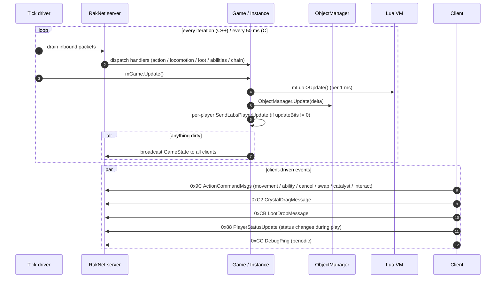

# Phase 10 — Gameplay loop

Once a player is in Dungeon, the server runs a steady-state tick that:

1. Drains inbound RakNet packets.
2. Updates the object manager (locomotion, AI, cooldowns).
3. Broadcasts `GameState` when something changed.
4. Sends a per-player `LabsPlayerUpdate` (gated by `updateBits != 0`).
5. Dispatches action handlers (movement, ability use, loot, swap, etc.) as messages arrive.

This page covers tick cadence, action handlers, and broadcast semantics. Phase 09 covers the Dungeon-entry burst.



---

## Outer loop

### C++ (`Server.cpp:185-211`)

```cpp
while (is_running()) {
    // drain scheduler queue
    while (!mTasks.empty()) { mTasks.front()(); mTasks.pop(); }

    if (mGame.ServerUpdate()) {
        run_one();              // drain RakNet inbound queue
    }

    if (mGame.Update()) {       // returns true once every 50 ms
        // broadcast GameState per-client (merging per-client (var, type))
        const auto& gameStateData = mGame.GetStateData();
        for (const auto& [_, client] : mClients) {
            auto& clientGameStateData = client->GetGameStateData();
            clientGameStateData.var = gameStateData.var;
            clientGameStateData.type = gameStateData.type;
            SendGameState(client, clientGameStateData);
        }
    }

    RakSleep(1);
}
```

- One-thread design: this is the `mThread` spun by `Server::start` (`Server.cpp:166-216`).
- `ServerUpdate()` returns true whenever there's network work to do (e.g. a queued task ready).
- `mGame.Update()` returns true at most every 50 ms — that's the gameplay tick.
- `RakSleep(1)` keeps CPU usage manageable.

### C# (`RakNetServer.cs:122-130`)

```csharp
while (IsRunning) {
    var games = gameService.GetAllGames();
    foreach (var game in games) {
        game.Update();
    }
    await Task.Delay(50, stoppingToken);
}
```

No drain-packets loop here — incoming UDP is handled in event callbacks (`OnSessionReceiveRaw`, see Phase 05). The tick body just calls `Game.Update` per registered game.

`Game.Update` (`Game.cs:37-54`):

```csharp
foreach (var player in Players.Values) {
    if (player.Client == null) continue;

    var gameState = new GameStatePacket {
        GameTime    = (ulong)(DateTime.UtcNow - StartTime).TotalMilliseconds,
        TimeElapsed = (ulong)(DateTime.UtcNow - StartTime).TotalMilliseconds,
        State       = State,
        GameType    = 0
    };
    player.Client.SendPacket(gameState);
    SendLabsPlayerUpdate(player.Client);
}
```

| Item | C++ | C# | Status |
|---|---|---|---|
| Tick cadence | `RakSleep(1)` busy loop; `Update()` returns true every 50 ms | `Task.Delay(50)` — fixed 50 ms | ⚠️ Cosmetic difference. |
| Inbound packet drain | `run_one()` once per outer iteration | event-driven (`PacketReceived`) | ⚠️ Different model. |
| Scheduler tasks | `mTasks.pop()` drained each iteration | absent (`Phase 00` finding) | ❌ |
| `Lua->Update()` per 1 ms | yes | absent | ❌ |
| `ObjectManager::Update(delta/1000.f)` | yes (`Instance.cpp:463`) | absent | ❌ |
| Per-player `SendLabsPlayerUpdate` if updateBits != 0 | yes | yes (`Game.cs:163-164`) | ✅ |
| Broadcast `GameState` | gated by `mGame.Update() == true` (every 50 ms) | every 50 ms unconditionally per player | ⚠️ Excessive but harmless. |
| `GameState` per-client `(var, type)` merge | yes | not done (`GameTime`/`TimeElapsed` are the same for all players, `GameType=0` hardcoded) | ⚠️ |

> Verified in live log (`output.log:280-359`): C# sends a `GameStatePacket` (`8A` …) ~every 50 ms. C++ would do the same as long as `mGame.Update()` keeps returning true.

---

## `Instance::Update` body (C++)

`Instance.cpp:452-481`:

```cpp
bool Instance::Update() {
    auto newGameTime = utils::get_milliseconds();

    if (auto delta = (newGameTime - mGameTimeLua); delta >= 1) {
        mGameTimeLua = newGameTime;
        mLua->Update();
    }

    if (auto delta = (newGameTime - mGameTime); delta >= 50) {
        mGameTime = newGameTime;
        mObjectManager->Update(delta / 1000.f);
        for (const auto& [_, player] : mPlayers) {
            SendLabsPlayerUpdate(player);
        }

        const auto& client = mServer->GetClient(static_cast<uint8_t>(0));
        if (client) {
            auto& objective = mObjectives.front();
            if (objective.id == utils::hash_id("FinishLevelQuickly")) {
                objective.value = static_cast<uint32_t>(GetTimeElapsed() / 1000);
                mServer->SendObjectiveUpdate(client, 0, utils::hash_id("vo_ship_obelisk_accessed"));
            }
        }

        return true;
    }

    return false;
}
```

C# `Game.Update` does **none** of this beyond the LPU send. No object manager update, no Lua update, no objective progression. Acceptable while gameplay isn't implemented; required once it is.

---

## Action handlers

Triggered by inbound RakNet packets after the player is in Dungeon.

### `ActionCommandMsgs` (0x9C)

C++ `OnActionCommandMsgs` (`Server.cpp:688-984`) routes by `ActionCommand` subtype:

| Subtype | Handler | C# equivalent |
|---|---|---|
| `Movement (3)` | `mGame.MoveObject(object, locomotionData)` | `Game.HandleActionCommand` case 3 → sends `ObjectPlayerMovePacket` directly |
| `StopMovement (4)` | `locomotionData->Stop()` | case 4 → sends `ObjectPlayerMovePacket` with `goalFlags=0x020` |
| `SwitchCharacter (5)` | `mGame.SwapCharacter(player, command.value)` | case 5 → `Console.WriteLine` only (no logic) |
| `UseCharacterAbility (7)` | preloads ability + `mLua->GetAbility(id).Tick(...)` via `Instance::UseAbility` | absent |
| `UseSquadAbility (8)` | similar | absent |
| `CatalystPickup (9)` | `mGame.PickupCatalyst(player, object)` | absent |
| `Cancel (10)` | `mGame.CancelAction` | absent |
| `UseInteractableObject (11)` | `mGame.InteractWithObject` | absent |
| `Dance (12)` / `Taunt (13)` | animation packets | absent |

### `CrystalDragMessage` (0xC2)

C++ `OnCrystalDragMessage` (`Server.cpp:1024-1090`): per-crystal slot moves (drag from inventory to grid, swap, etc.). C# not implemented.

### `LootDropMessage` (0xCB)

C++ `OnLootDropMessage` (`Server.cpp:1091-1132`). C# not implemented.

### `PlayerStatusUpdate` during gameplay

Beyond the predungeon transitions (Phase 08), the client can send:

- `status = 0x20` (BeamOut) → C++ calls `mGame.BeamOut(player)` (Phase 06 deep-dive open audit item #7).
- Other status values during chain progression / failure / cashout.

C# only handles status `0x08` (Phase 08 transition).

---

## Server-driven gameplay packets

Once gameplay is live, the server pushes:

| Packet | C++ helper | C# packet | C# emits? |
|---|---|---|---|
| `ObjectCreate` (0x8C) | `SendObjectCreate` | `ObjectCreatePacket` | ✅ (in Phase 09 marker loop) |
| `ObjectUpdate` (0x8D) | `SendObjectUpdate` | `ObjectUpdatePacket` | partial |
| `ObjectDelete` (0x8E) | `SendObjectDelete` | absent | ❌ |
| `ObjectJump` (0x8F) | `SendObjectJump` | absent | ❌ |
| `ObjectTeleport` (0x90) | `SendObjectTeleport` | absent | ❌ |
| `ObjectPlayerMove` (0x91) | `SendObjectPlayerMove` | `ObjectPlayerMovePacket` | ✅ |
| `ForcePhysicsUpdate` (0x92) | `SendForcePhysicsUpdate` | absent | ❌ |
| `PhysicsChanged` (0x93) | `SendPhysicsChanged` | absent | ❌ |
| `LocomotionDataUpdate` (0x94) | `SendLocomotionDataUpdate` | `LocomotionDataUpdatePacket` | ✅ |
| `AttributeDataUpdate` (0x96) | `SendAttributeDataUpdate` | absent | ❌ |
| `CombatantDataUpdate` (0x97) | `SendCombatantDataUpdate` | absent | ❌ |
| `InteractableDataUpdate` (0x98) | `SendInteractableDataUpdate` | absent | ❌ |
| `AgentBlackboardUpdate` (0x99) | yes | absent | ❌ |
| `LootDataUpdate` (0x9A) | yes | absent | ❌ |
| `ServerEvent` (0x9B) | flag-based event broadcaster | absent | ❌ |
| `ActionCommandResponse` (0xA8) | yes | `ActionCommandResponsePacket` | ✅ (partial) |
| `LabsPlayerUpdate` (0xA1) | per-tick | per-tick | ✅ |
| `ModifierCreated / Updated / Deleted` (0xA2-A4) | yes | absent | ❌ |
| `SetAnimationState` / `SetObjectGfxState` (0xA5-A6) | yes | absent | ❌ |
| `PlayerCharacterDeploy` (0xA7) | yes | yes | ✅ |
| `CombatEvent` (0xBA) | yes | absent | ❌ |
| `GravityForceUpdate` (0xC0) | yes | absent | ❌ |
| `CooldownUpdate` (0xC1) | yes | absent | ❌ |

The minimum to make a player move + attack a single enemy requires: `ObjectCreate`, `ObjectUpdate`, `ObjectPlayerMove`, `LocomotionDataUpdate`, `AttributeDataUpdate`, `CombatantDataUpdate`, `ActionCommandResponse`, `CombatEvent`, `ServerEvent`, `CooldownUpdate`. Currently the C# port covers ~3 of those.

---

## `ResetUpdateBits` semantics on tick

C++ `Player::ResetUpdateBits` (`Player.cpp:392-398`):

```cpp
void Player::ResetUpdateBits() {
    mUpdateBits = 0;
    mDataBits.reset();
    for (auto& character : mCharacterData) {
        character.ResetUpdateBits();
    }
}
```

C# `Player.ResetUpdateBits` (`Player.cs:24-27`):

```csharp
public void ResetUpdateBits() => UpdateBits = 0;
```

`Game.SendLabsPlayerUpdate` additionally calls `pd.ResetDataBits()` (`Game.cs:174`).

> Missing in C#: per-Character `_dataBits` clear. Without tracking dataBits per Character, subsequent LPUs always emit all 13 character fields. Wasteful, not (currently) broken.

---

## `Instance::SwapCharacter` (combat-time hero swap)

C++ `Instance.cpp:533-549`: validates `player->SwapCharacter(creatureIndex)` then sends `LabsPlayerUpdate` (with `updateBits = PlayerBits` and dataBit 1) and `PlayerCharacterDeploy`. Used both from the Dungeon-entry burst and from the in-game switch-hero action.

C# does **not** implement runtime SwapCharacter (Phase 09 finding). Action subtype 5 logs to console only.

---

## Parity table (Phase 10)

| Item | C++ | C# | Status |
|---|---|---|---|
| Outer loop drain `mTasks` | yes (`Server.cpp:187-191`) | absent | ❌ |
| `Lua->Update()` per 1 ms | yes | absent | ❌ |
| `ObjectManager.Update(delta)` per 50 ms | yes (`Instance.cpp:463`) | absent | ❌ |
| Per-player `SendLabsPlayerUpdate` (gated) | yes | yes | ✅ |
| Broadcast `GameState` (dirty flag) | yes | unconditional every 50 ms | ⚠️ |
| `GameState` per-client `(var, type)` merge | yes | not done | ⚠️ |
| `ActionCommandMsgs` movement | full state machine (locomotion goal flags, teleport, partial goal) | inlined into `ObjectPlayerMovePacket`; no `LocomotionData.Stop()` | ⚠️ |
| `ActionCommandMsgs` stop | locomotion stop | empty goalFlags=0x020 | ⚠️ |
| `ActionCommandMsgs` switch character | `mGame.SwapCharacter` | `Console.WriteLine` only | ❌ |
| `ActionCommandMsgs` ability | full Lua-driven path | absent | ❌ |
| `ActionCommandMsgs` catalyst pickup | yes | absent | ❌ |
| `ActionCommandMsgs` cancel/interact/dance/taunt | yes | absent | ❌ |
| `CrystalDragMessage` | yes (`Server.cpp:1024`) | absent | ❌ |
| `LootDropMessage` | yes (`Server.cpp:1091`) | absent | ❌ |
| `ServerEvent` (broadcast) | yes (long event-id table at `Server.cpp:298-336`) | absent | ❌ |
| `CombatEvent` | yes | absent | ❌ |
| `CooldownUpdate` | yes | absent | ❌ |
| Objective progression in `Instance::Update` | yes (`FinishLevelQuickly` ticker) | absent | ❌ |
| Object lifecycle (`Create`/`Update`/`Delete`) | full | `Create` partial, `Update` partial, no `Delete` | ⚠️ |
| `Player::ResetUpdateBits` per-Character | yes | character bits not tracked | ⚠️ |
| Runtime `SwapCharacter` | yes | absent | ❌ |
| Multi-client broadcasts | iterates `mClients` | iterates `Players.Values` | ✅ structurally |

---

## Open audit items

1. **Wire an `ObjectManager` analogue.** Without it, every gameplay packet handler degenerates into stubs and the dungeon experience is empty.
2. **Per-Character dataBits.** Add `_dataBits` to `LabsCharacterData` so subsequent LPUs match C++ delta semantics.
3. **Gate `GameStatePacket` on a dirty flag.** Today's unconditional 50-ms broadcast is wasteful.
4. **Implement movement / locomotion server-side.** Currently the client tells the server where it's going, the server echoes back the move packet, but nothing in the server-side world tracks it.
5. **Implement combat events.** `CombatEvent`, `AttributeDataUpdate`, `CombatantDataUpdate`, `CooldownUpdate`, `ModifierCreated`, `SetAnimationState`. Without these, abilities have no visual effect.
6. **`ServerEvent` broadcaster.** The text/voiceover events catalogued in `Server.cpp:298-336` drive nearly every UI cue (low health, overdrive ready, horde incoming, etc.).
7. **Loot / Catalyst flows.** `LootDropMessage`, `CrystalDragMessage`, `LootDataUpdate`, `CatalystPickup`. The whole loot lifecycle is C++-only today.
8. **Objective progression.** Honor the `FinishLevelQuickly` style tickers from `Instance::Update`.
9. **`BeamOut` (status=0x20).** Currently silently ignored.

---

## Files referenced

C++:

- `ReCap.Cpp/darkspore_server/source/RakNet/Server.cpp` (`run_one`, `OnActionCommandMsgs`, `OnCrystalDragMessage`, `OnLootDropMessage`, broadcasts)
- `ReCap.Cpp/darkspore_server/source/Game/Instance.cpp` (`Update`, `MoveObject`, `UseAbility`, `SwapCharacter`, `DropLoot`, `DropCatalyst`)
- `ReCap.Cpp/darkspore_server/source/Game/ObjectManager.cpp` (`Update`)
- `ReCap.Cpp/darkspore_server/source/Game/Lua.cpp`
- `ReCap.Cpp/darkspore_server/source/Game/ServerEvent.h`

C#:

- `ReCap.Server/Adapters/RakNet/RakNetServer.cs` (`ExecuteAsync` 50 ms loop)
- `ReCap.Server/Domain/Gameplay/Game.cs` (`Update`, `SendLabsPlayerUpdate`, `HandleActionCommand`)
- `ReCap.Server/Domain/Gameplay/Player.cs` (`ResetUpdateBits`)
- `ReCap.Server/Adapters/RakNet/Packets/GameStatePacket.cs`
- `ReCap.Server/Adapters/RakNet/Packets/LabsPlayerUpdatePacket.cs`
- `ReCap.Server/Adapters/RakNet/Packets/ObjectPlayerMovePacket.cs`
- `ReCap.Server/Adapters/RakNet/Packets/LocomotionDataUpdatePacket.cs`
- `ReCap.Server/Adapters/RakNet/Packets/ActionCommandMsgsPacket.cs`
- `ReCap.Server/Adapters/RakNet/Packets/ActionCommandResponsePacket.cs`
