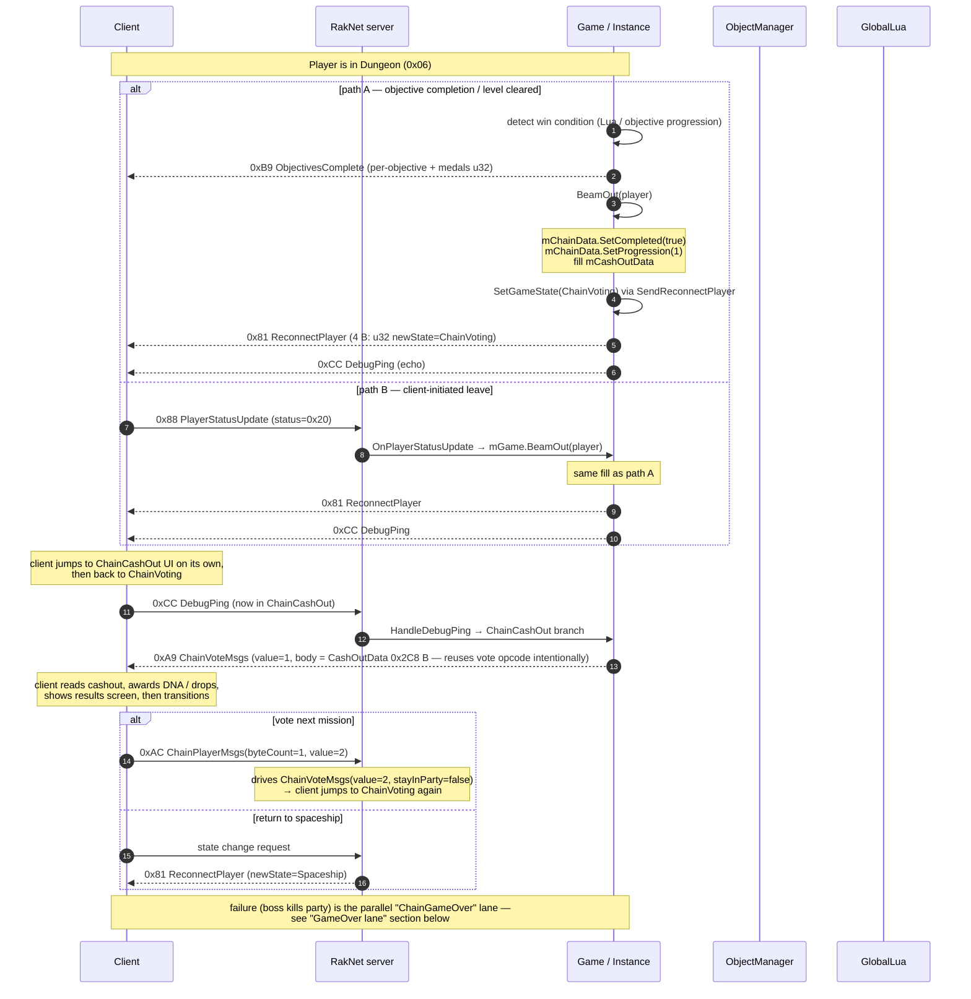

# Phase 11 — ChainCashOut (`state = 0x0C`)

Terminal phase of a successful Chain run. When the dungeon clears (or `BeamOut` fires), the server flips state from `Dungeon` to `ChainCashOut`, ships a `CashOutData` reward blob (DNA, planets completed, medal tallies, drop chances), then steers the client back into `ChainVoting` (for another mission) or `Spaceship` (back to the lobby).

This phase is **entirely absent on the C# side today** — `Game.HandleDebugPing` has no `ChainCashOut` case, `PlayerStatusUpdate` handles only `status=0x08`, and there is no `BeamOut`, `ReconnectPlayer`, `SendChainGame`, or `ChainCashOutMsgs` plumbing.



---

## State machine recap

C++ `IsValidStateChange` (`Client.cpp:12-49`) enumerates the legal transitions touching this phase:

| From | To | Note |
|---|---|---|
| `Dungeon` | any | Dungeon is fall-through — client must be steered explicitly. |
| `ChainVoting` | `Spaceship`, `PreDungeon`, **`ChainCashOut`** | Only path *into* `ChainCashOut`. |
| `ChainCashOut` | `Spaceship` | Only path *out* of `ChainCashOut`. |
| `GameOver` | `Spaceship` | Loss path mirrors cashout's exit. |

> Practical consequence: a player in `Dungeon` is moved to `ChainCashOut` by first hopping through `ChainVoting` (via `SendReconnectPlayer(ChainVoting)`), then the client raises its own transition into `ChainCashOut` once it parses the cashout payload. The server never writes the literal value `0x0C` into `gameStateData.state` — it relies on the client's state machine.

> Counter-evidence from C++: `BeamOut` calls `SendReconnectPlayer(client, GameState::ChainVoting)` even though the player just completed the dungeon. The `ChainData.completed=true` + `progression=1` is what tips the client toward `ChainCashOut` instead of replaying the vote. **This is the path observed in real captures.**

---

## C++ — `recap_server`

### `Instance::BeamOut` (`Instance.cpp:856-880`)

```cpp
void Instance::BeamOut(const PlayerPtr& player) {
    const auto& client = mServer->GetClient(player->GetId());
    if (client) {
        mChainData.SetCompleted(true);
        mChainData.SetProgression(1);

        mCashOutData.mDna = 50;
        mCashOutData.mPlanetsCompleted = 2;
        mCashOutData.mGoldMedals.fill(3);
        mCashOutData.mSilverMedals.fill(1);
        mCashOutData.mBronzeMedals.fill(4);
        mCashOutData.mUniqueChances.fill(50);
        mCashOutData.mRareChances.fill(30);

        mServer->SendReconnectPlayer(client, GameState::ChainVoting);
        mServer->SendDebugPing(client);
    }
    // commented-out: ClientEvent PlayerCashOut path
}
```

Defaults are placeholder constants (DNA=50, planetsCompleted=2, all medals filled). The cashout payload is the **same blob** regardless of objective outcome — production values would be derived from `mObjectives` + RNG.

### `Server::OnPlayerStatusUpdate` (`Server.cpp:643-686`)

```cpp
case 0x20: {
    mGame.BeamOut(player);
    break;
}
```

`status=0x20` is the client-initiated exit (player presses **Beam Out** in HUD). It funnels through the same `BeamOut` as the auto-completion path.

### `Server::OnDebugPing` ChainCashOut branch (`Server.cpp:1173-1176`)

```cpp
case GameState::ChainCashOut: {
    SendChainCashOutMessages(client, 1);
    break;
}
```

Triggered after the client transitions itself into `ChainCashOut` (in response to the `ReconnectPlayer` + the `chainData.completed=true` signal). The client pings to request the cashout body.

### `Server::SendChainCashOutMessages` (`Server.cpp:2184-2196`)

```cpp
void Server::SendChainCashOutMessages(const ClientPtr& client, uint8_t value) {
    BitStream outStream(8);
    outStream.Write(PacketID::ChainVoteMsgs);   // ✅ intentional — client expects CashOut under vote opcode

    Write<uint8_t>(outStream, value);
    if (value != 0) {
        mGame.GetCashOutData().WriteTo(outStream);
    }

    Send(outStream, client);
}
```

> **~~Bug surface~~ Intentional design:** The C++ `Server::SendChainCashOutMessages` writes `ChainVoteMsgs (0xA9)`, not `ChainCashOutMsgs (0xAB)`. Originally this looked like a bug, but **client-side static analysis proves it is correct**:
>
> 1. The client's main message subscription function (`FUN_0053d2c0`) registers handlers for 38 GMS message IDs. **GMS ID 44 (`kGmsChainCashOutGMSMsgs` / wire `0xAB`) is NOT in the subscription table.** Neither is GMS ID 42 (`kGmsChainVoteGMSMsgs` / wire `0xA9`) — both are handled through the game state system (`cChainCashOutState`, `cChainVotingState`) via `BinaryReader::BindFormatContext`, not the protocol transport subscription path.
> 2. The client distinguishes CashOut from Vote data by reading the `value` byte: when `value != 0`, it parses the 0x2C8-byte `CashOutData` body; when `value == 0`, it parses the vote payload.
> 3. **Conclusion:** The C# port must also use opcode `0xA9` (`ChainVoteMsgs`), matching the C++ server exactly. Using `0xAB` would cause the client to drop the packet.
>
> The client session initialization (`FUN_00a92ef0` / `snclient_session.cpp`) registers only 4 session-level handlers (GMS IDs 1, 3, 5, 7 — including `HelloPlayer` at ID 1). The 38 gameplay-level subscriptions in `FUN_0053d2c0` include `DebugPing` (ID `0x4D` / 77) but skip all Chain* messages, confirming they use a separate dispatch path.

### `Server::SendReconnectPlayer` (`Server.cpp:1268-1277`)

```cpp
void Server::SendReconnectPlayer(const ClientPtr& client, GameState gameState) {
    if (client->SetGameState(gameState)) {
        BitStream outStream(8);
        outStream.Write(PacketID::ReconnectPlayer);

        Write<uint32_t>(outStream, static_cast<uint32_t>(gameState));

        Send(outStream, client);
    }
}
```

5 bytes total: `u8 PacketID(0x81) + u32 BE newState`.

### `Server::SendObjectivesComplete` (`Server.cpp:2233-2253`)

```cpp
void Server::SendObjectivesComplete(const ClientPtr& client) {
    BitStream outStream(8);
    outStream.Write(PacketID::ObjectivesComplete);

    const auto& objectives = mGame.GetObjectives();

    uint8_t count = static_cast<uint8_t>(objectives.size());
    uint32_t medals = 0;

    Write<uint8_t>(outStream, count);
    for (uint8_t i = 0; i < count; ++i) {
        const auto& objective = objectives[i];
        objective.WriteTo(outStream);

        medals |= (static_cast<uint32_t>(objective.medal) << (8 * i));
    }

    Write<uint32_t>(outStream, medals);

    Send(outStream, client);
}
```

Distinct from `CashOutData`. Layout:

```
u8  packetId  = 0xB9
u8  count
for i in 0..count:
    Objective::WriteTo                     // id, value, medal, etc.
u32 medals  = packed (medal<<(8*i))
```

> ⚠️ The C# `ObjectivesCompletePacket.cs` currently writes a 712-byte `CashOutData` blob and labels it "0xB9". That is wrong — `ObjectivesComplete` is per-objective, while `CashOutData` belongs to `ChainCashOutMsgs (0xAB)` (or `ChainVoteMsgs (0xA9)` per the bug above). See "Open audit items" #1.

### `CashOutData::WriteTo` (`Instance.cpp:30-52`)

```cpp
void CashOutData::WriteTo(RakNet::BitStream& stream) const {
    constexpr auto size = bytes_to_bits(0x2C8);    // 712 bytes

    auto writeOffset = ReallocateStream(stream, size);

    stream.SetWriteOffset(writeOffset + bytes_to_bits(0x00));
    Write(stream, mPlanetsCompleted);
    Write(stream, mDna);

    stream.SetWriteOffset(writeOffset + bytes_to_bits(0x34));
    for (const auto medalCount : mGoldMedals)   { Write(stream, medalCount); }
    for (const auto medalCount : mSilverMedals) { Write(stream, medalCount); }
    for (const auto medalCount : mBronzeMedals) { Write(stream, medalCount); }

    stream.SetWriteOffset(writeOffset + bytes_to_bits(0x64));
    for (const auto chance : mUniqueChances) { Write(stream, chance); }
    for (const auto chance : mRareChances)   { Write(stream, chance); }

    stream.SetWriteOffset(writeOffset + size);
}
```

Total 0x2C8 (712) bytes, with **explicit absolute offsets** — most of the buffer is zero-filled. Field layout:

| Offset | Field | Type | Notes |
|---|---|---|---|
| `0x000` | `mPlanetsCompleted` | u32 | Counter shown in cashout summary. |
| `0x004` | `mDna` | f32 | DNA reward — currency for character upgrades. |
| `0x008..0x033` | (gap, zero) | — | 44 bytes reserved. |
| `0x034..0x043` | `mGoldMedals[4]` | u32[4] | Per-objective gold tally. |
| `0x044..0x053` | `mSilverMedals[4]` | u32[4] | |
| `0x054..0x063` | `mBronzeMedals[4]` | u32[4] | |
| `0x064..0x073` | `mUniqueChances[4]` | u32[4] | Drop-table unique odds. |
| `0x074..0x083` | `mRareChances[4]` | u32[4] | Drop-table rare odds. |
| `0x084..0x2C7` | (gap, zero) | — | 580 bytes reserved (UI / loot tables / unused). |

> Same BE/LE caveat as `ChainData`: the buffer is laid down via `RakNet::Write` wrappers which (in the C++ reference codebase) use the `bswap` path → **Big-Endian** per primitive. **Pending audit:** verify by capture; if the client choked on BE cashout, falling back to LE (matching `ChainData`) would be the first thing to try.

### Per-call mutation cheat sheet (Phase 11)

| Call | dataBits set | updateBits set | Notes |
|---|---|---|---|
| `Player::SetStatus(0x20, 0)` | `{7, 8}` | `\|= PlayerBits` | Triggers `BeamOut`. |
| `ChainData::SetCompleted(true)` | — | — | Mutates ChainData fields `progression` + `completionFlag` (next vote blob carries it). |
| `ChainData::SetProgression(1)` | — | — | Same. |
| `CashOutData.fill(...)` | — | — | Pure state; serialized only via `SendChainCashOutMessages`. |
| `SendReconnectPlayer(ChainVoting)` | — | — | Calls `Client::SetGameState`; emits `ReconnectPlayer (0x81, 5 B)`. |

### GameOver lane (parallel terminal flow)

When the party wipes (all 3 characters dead, no resurrect orb) the server should take the **`GameOver`** lane instead of `ChainCashOut`:

```
GameOver  state = 0x0D (per Client.h:29 / Server.cpp:145)
ChainGameOverMsgs (0xAE)
ChainGameMsgs(state=1)  → "mission failed", drives client into GameOver
```

C++ has the helper `SendChainGame(client, state)` (`Server.cpp:2334-2348`) — `state=1` = mission failed → `GameOver`. The cashout body is **not** sent on failure. Once in `GameOver`, the only legal next transition is `Spaceship`.

This lane is not wired in C++ either (the `BeamOut` happy path is the only ground-truth code path observed). Document it as a known terminal but **unverified** flow.

---

## C# — `ReCap.Server`

### Current state (none)

- `Game.cs:264-287` — `HandleDebugPing` switches on `Initializing / ChainVoting / PreDungeon / Dungeon`. No `ChainCashOut` arm.
- `Game.cs:334-356` — `HandlePlayerStatusUpdate` handles only `Status == 0x08`. `0x20` (BeamOut) is dropped on the floor.
- `Game.cs` — no `BeamOut`, no `SendReconnectPlayer`, no `SendChainGame`, no `SendChainCashOutMessages` helpers.
- `Domain/Gameplay/` — no `CashOutData` class.
- `Adapters/RakNet/PacketType.cs` — `ReconnectPlayer (0x81)`, `ChainLevelResultsMsgs (0xAA)`, `ChainCashOutMsgs (0xAB)`, `ChainGameMsgs (0xAD)`, `ChainGameOverMsgs (0xAE)` are all in the enum.
- `Adapters/RakNet/Packets/PacketActivator.cs:23,156,159,166,169` — `ReconnectPlayer`, `ChainLevelResultsMsgs`, `ChainCashOutMsgs`, `ChainGameMsgs`, `ChainGameOverMsgs` are **case stubs with empty bodies**. No packet classes exist.
- `Adapters/RakNet/Packets/ObjectivesCompletePacket.cs` — exists, but **mis-encoded**: writes a 712-byte raw `CashOutData` instead of `count + per-objective + medals u32`. Will produce a malformed `ObjectivesComplete` packet the moment it's sent.

### Packets to implement (in dependency order)

| Wire ID | Name | Direction | Body |
|---|---|---|---|
| `0x81` | `ReconnectPlayerPacket` | S→C | `u32 BE newState` (5 B) |
| `0xA9` | `ChainVoteMsgsPacket` | S→C | `u8 value, [if value!=0] CashOutData 0x2C8 BE` — **also carries CashOut payload** (see note below) |
| ~~`0xAB`~~ | ~~`ChainCashOutMsgsPacket`~~ | — | **Not used on the wire.** Client has no handler for `0xAB`. CashOut payload is sent via `0xA9` with `value=1`. |
| `0xAD` | `ChainGameMsgsPacket` | S→C | `u8 state` (0=fade-to-black/return-to-vote, 1=mission-failed/GameOver, 2=observer-noop) |
| `0xAE` | `ChainGameOverMsgsPacket` | S→C | TBD; not invoked in C++ either |
| `0xAA` | `ChainLevelResultsMsgsPacket` | S→C | TBD; not invoked in C++ either |

Plus fix:

- `ObjectivesCompletePacket` body → `u8 count` + per-objective `WriteTo` + `u32 medals`.

### Game.cs work

```csharp
case GameState.ChainCashOut:
    sender.SendPacket(new ChainVoteMsgsPacket { Value = 1, CashOutData = CashOut });  // uses 0xA9, not 0xAB!
    break;
```

```csharp
private void HandlePlayerStatusUpdate(...) {
    // ... existing 0x08 path ...
    if (packet.Status == 0x20)
    {
        BeamOut(sender);
    }
}

private void BeamOut(RakNetClient sender)
{
    Chain.Completed = true;
    Chain.Progression = 1;

    CashOut.Dna = 50f;
    CashOut.PlanetsCompleted = 2;
    Array.Fill(CashOut.GoldMedals,   3u);
    Array.Fill(CashOut.SilverMedals, 1u);
    Array.Fill(CashOut.BronzeMedals, 4u);
    Array.Fill(CashOut.UniqueChances, 50u);
    Array.Fill(CashOut.RareChances,   30u);

    sender.SendPacket(new ReconnectPlayerPacket { NewState = (uint)GameState.ChainVoting });
    sender.SendPacket(new DebugPingPacket());
}
```

`Domain/Gameplay/CashOutData.cs` should hold the 0x2C8 layout. Best modeled with explicit absolute offsets in `WriteTo`, mirroring `Instance.cpp:30-52`.

### `ChainData.Completed` / `ChainData.Progression`

The cashout flow relies on flags inside `ChainData`. Audit `ReCap.Server/Domain/Gameplay/ChainData.cs` for `Completed` (offset `0x49`, u32 in C++) and `Progression` (offset `0x10`, u8 in C++) and confirm they survive a round-trip.

---

## Parity table (Phase 11)

| Item | C++ | C# | Status |
|---|---|---|---|
| `GameState.ChainCashOut` enum | `0x0C` | `0x0C` | ✅ |
| State machine: `Dungeon` → `ChainCashOut` | via `ChainVoting` hop (`Client.cpp:42`) | no transitions wired | ❌ |
| `OnPlayerStatusUpdate(status=0x20)` → `BeamOut` | `Server.cpp:678-681` | dropped silently | ❌ |
| `Instance::BeamOut` | `Instance.cpp:856-880` | absent | ❌ |
| `ChainData.completed=true` on cashout | `Instance.cpp:859` | `ChainData.Completed` exists? need confirm | ❓ |
| `ChainData.progression=1` on cashout | `Instance.cpp:860` | `ChainData.Progression` exists? need confirm | ❓ |
| `CashOutData` model | `Instance.h:86-102` | absent | ❌ |
| `CashOutData::WriteTo` 0x2C8 B | `Instance.cpp:30-52` | absent | ❌ |
| `SendReconnectPlayer` (0x81, 5 B) | `Server.cpp:1268-1277` | absent (`PacketActivator` stub only) | ❌ |
| `OnDebugPing` ChainCashOut branch | `Server.cpp:1173-1176` | `Game.HandleDebugPing` missing arm | ❌ |
| `SendChainCashOutMessages(value=1)` | `Server.cpp:2184-2196` (wire ID = ChainVoteMsgs!) | absent | ❌ |
| `ChainVoteMsgs (0xA9)` carries CashOut | intentional — `value!=0` → CashOut body | no packet class | ❌ |
| `ChainCashOutMsgs (0xAB)` | NOT used on wire; client has no handler | enum only; dead code | ✅ (no-op) |
| `SendObjectivesComplete` layout | per-objective + medals u32 (`Server.cpp:2233-2253`) | wrong: raw 712-B CashOutData | ⚠️ |
| `SendChainGame(state)` (0xAD) | `Server.cpp:2334-2348` | absent | ❌ |
| `ChainGameOverMsgs` (0xAE) | declared, never invoked | enum only | ❓ |
| `ChainLevelResultsMsgs` (0xAA) | declared, never invoked | enum only | ❓ |
| `GameState.GameOver` (0x0D) | `Client.h:29` / `Server.cpp:145` | absent from `GameplayState.cs` | ❌ |

---

## Open audit items

1. **Fix `ObjectivesCompletePacket` (0xB9) body.** Currently sends raw 0x2C8 `CashOutData`; must be `u8 count + per-objective WriteTo + u32 medals`. The cashout blob belongs to a different packet entirely.
2. ~~**Capture the wire opcode.**~~ **RESOLVED:** Client static analysis confirms `0xA9` is correct. The client has no handler for `0xAB`. CashOut payload rides the `ChainVoteMsgs` opcode with `value=1`. C# must use `0xA9`.
3. **Implement `ReconnectPlayerPacket` (0x81)** — 5-byte `u8 + u32 BE state` body. Required by both `BeamOut` and the future `Dungeon → Spaceship` exit.
4. **Add `CashOutData` class** mirroring `Instance.cpp:30-52` offsets exactly. Use the same absolute `SetWriteOffset` semantics (or pre-zero the buffer and patch in fields at fixed offsets) to keep the 0x2C8 layout untouched.
5. **Add `ChainCashOut` case to `Game.HandleDebugPing`** that sends the cashout body.
6. **Handle `PlayerStatusUpdate` `status=0x20`** in `Game.HandlePlayerStatusUpdate` and route to `BeamOut`.
7. **Add `ChainGameMsgsPacket` (0xAD)** for the failure / observer lanes — at minimum `state=0` (fade-to-black, returns to vote) and `state=1` (mission failed → GameOver).
8. **Add `GameState.GameOver = 0x0D`** to `GameplayState.cs` so the failure lane has somewhere to transition to.
9. **Wire `ChainData.Completed` + `ChainData.Progression`** in C# `ChainData.cs` so the post-cashout `ChainVoteMsgs(value=0)` re-emits the blob with `completionFlag=true` (which is what the client uses to choose the cashout UI over a fresh vote).
10. **Decide the success trigger.** C++ uses `BeamOut` only — there is no objective-completion → cashout path in the reference code. Either match C++ (cashout only on player-initiated beam-out) or extend with an objective-driven trigger once the gameplay loop is alive.
11. **Open question — `mObjectives` consumption.** `SendObjectivesComplete` per-objective `WriteTo` is well defined, but `objective.value` is hand-set to `1` and `objective.medal` to `Gold` for every objective in C++ (`Instance.cpp:62-77`). Real medal/value derivation is missing on **both** sides.

---

## Files referenced

C++:

- `recap_server_develop/darkspore_server/source/RakNet/Client.cpp` (`IsValidStateChange`, `to_string`)
- `recap_server_develop/darkspore_server/source/RakNet/Server.cpp`
  (`OnPlayerStatusUpdate`, `OnDebugPing`, `SendReconnectPlayer`, `SendChainCashOutMessages`,
  `SendObjectivesComplete`, `SendChainGame`)
- `recap_server_develop/darkspore_server/source/RakNet/Server.h` (`PacketID` declarations 0x81/0xAA/0xAB/0xAD/0xAE)
- `recap_server_develop/darkspore_server/source/RakNet/Types.h` (PacketID enum)
- `recap_server_develop/darkspore_server/source/Game/Instance.cpp` (`CashOutData::WriteTo`, `BeamOut`)
- `recap_server_develop/darkspore_server/source/Game/Instance.h` (`CashOutData` class layout)

C#:

- `ReCap.Server/Domain/Gameplay/Game.cs` (`HandleDebugPing`, `HandlePlayerStatusUpdate`)
- `ReCap.Server/Domain/Gameplay/GameplayState.cs` (`ChainCashOut`)
- `ReCap.Server/Domain/Gameplay/ChainData.cs` (`Completed`, `Progression` — verify)
- `ReCap.Server/Adapters/RakNet/PacketType.cs` (`ReconnectPlayer`, `ChainLevelResultsMsgs`, `ChainCashOutMsgs`, `ChainGameMsgs`, `ChainGameOverMsgs`)
- `ReCap.Server/Adapters/RakNet/Packets/PacketActivator.cs` (empty-arm stubs)
- `ReCap.Server/Adapters/RakNet/Packets/ObjectivesCompletePacket.cs` (mis-encoded body)
- `ReCap.Server/Adapters/RakNet/Packets/GameStatePacket.cs` (state → byte mapping)
