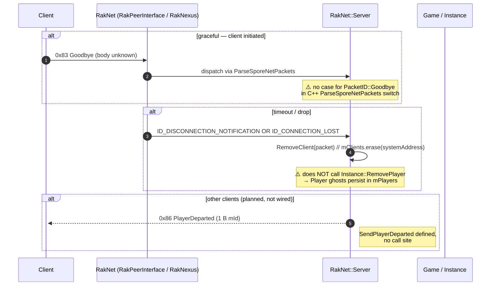

# Phase 13 — Disconnect / Shutdown

End-of-life for a session, by any path:

1. **Graceful** — client sends `Goodbye (0x83)` before tearing down the UDP socket
2. **RakNet-detected** — UDP timeout / FIN raises `ID_DISCONNECTION_NOTIFICATION` or `ID_CONNECTION_LOST`
3. **Server-side cleanup** — `RemoveClient` drops the session from `mClients`, `RemovePlayer` drops the `Player` entry from `Instance::mPlayers`
4. **Lobby notification** *(planned, never wired)* — `SendPlayerDeparted (0x86)` informs other clients

After cleanup the player slot is reusable. There is **no reconnect-mid-session** flow today: a fresh `ID_NEW_INCOMING_CONNECTION` re-runs Phase 05–06 from scratch.



---

## Packet IDs (0x83 – 0x89)

| ID | Name | Direction | Used? |
|---|---|---|---|
| `0x83` | Goodbye | C→S | declared, no parser case |
| `0x86` | PlayerDeparted | S→C | helper defined, no call site |
| `0x87` | VoteKickStarted | both | declared, no helper, no parser |
| `0x89` | GameAborted | both | declared, no helper, no parser |

Sources: `Server.h:40,43,44,46` / `Types.h:46-49`.

---

## C++ — `recap_server`

### RakNet meta-events (`Server.cpp:401-446`)

```cpp
void Server::ParseRakNetPackets(Packet* packet, uint8_t packetType) {
    switch (packetType) {
        case ID_DISCONNECTION_NOTIFICATION: {
            RemoveClient(packet);
            std::cout << "ID_DISCONNECTION_NOTIFICATION from " << packet->systemAddress.ToString(true) << std::endl;
            break;
        }
        case ID_NEW_INCOMING_CONNECTION: { OnNewIncomingConnection(packet); break; }
        case ID_CONNECTION_REQUEST: { /* log only */ break; }
        case ID_INCOMPATIBLE_PROTOCOL_VERSION: { /* log only */ break; }
        case ID_CONNECTION_LOST: {
            // TODO: try to reconnect?
            RemoveClient(packet);
            std::cout << "ID_CONNECTION_LOST from " << packet->systemAddress.ToString(true) << std::endl;
            break;
        }
        case ID_SND_RECEIPT_ACKED: { /* ack receipt */ break; }
        case ID_SND_RECEIPT_LOSS:  { /* drop receipt */ break; }
        default: { /* unhandled */ break; }
    }
}
```

`ID_DISCONNECTION_NOTIFICATION` and `ID_CONNECTION_LOST` both funnel into `RemoveClient`. The `// TODO: try to reconnect?` comment is the only hint that reconnect was ever planned.

### `Server::RemoveClient` (`Server.cpp:516-520`)

```cpp
void Server::RemoveClient(Packet* packet) {
    if (packet) {
        mClients.erase(packet->systemAddress);
    }
}
```

**That's the whole cleanup.** Notably absent:
- No `mGame.RemovePlayer(client->GetPlayerId())`
- No broadcast `SendPlayerDeparted` to surviving clients
- No `Instance::Stop` if the last player leaves the game
- No `Player::~Player` invocation through anything other than the `shared_ptr` ref-count going to zero — which it does, because `Client` holds a `PlayerPtr`. So the `Player` lifetime *does* end, but `Instance::mPlayers` still holds the entry by id. Memory leak shape: small, accumulates per session.

### `Server::SendPlayerDeparted` (`Server.cpp:1297-1304`)

```cpp
void Server::SendPlayerDeparted(const ClientPtr& client) {
    // Packet size: 0x01
    BitStream outStream(8);
    outStream.Write(PacketID::PlayerDeparted);
    outStream.Write<uint8_t>(client->mId);

    Send(outStream, client);
}
```

Body: `u8 packetId(0x86) + u8 mId`. Function defined, **zero call sites** (grep returns only the definition). Dead code, but worth preserving in C# since the multi-client path will need it once two players can share a `GameInstance`.

### `Goodbye (0x83)`, `VoteKickStarted (0x87)`, `GameAborted (0x89)`

- All three are declared in `Server.h:40,44,46` and `Types.h:46-49`.
- No parser case in `Server::ParseSporeNetPackets` (`Server.cpp:458+`) for any of them.
- No `Send` helper.
- No call sites.

These look like reservations for future protocol features the reference dev never built.

### `Instance::RemovePlayer` (`Instance.cpp:217-219`)

```cpp
void Instance::RemovePlayer(int64_t id) {
    mPlayers.erase(id);
}
```

Defined. Called only from `Instance::AddPlayer` clean-up paths (in case a player by the same id already exists). **Not invoked from `RemoveClient`.**

### Process-level shutdown

Handled separately (Phase 00 — Boot, "Shutdown order"). `SIGINT/SIGTERM` stops `mIoService`, then `Application::OnExit` resets unique_ptrs. RakNet sessions are torn down via `RakPeerInterface::Shutdown` indirectly when `mGame.Stop()` releases `mServer`.

---

## C# — `ReCap.Server`

### `RakNetServer.OnSessionDisconnected` (`RakNetServer.cs:54-60`)

```csharp
private void OnSessionDisconnected(RakNetSession session)
{
    Logger.info($"RakNet: Peer 0x{session.Guid.G:X16} disconnected {session.Address}!");

    if (!Clients.Remove(session.Guid.G))
        Logger.error($"RakNet: Peer 0x{session.Guid.G:X16} had no assigned client!");
}
```

Symmetric gap to C++: removes the `RakNetClient` from `Clients` but does **not**:
- Remove the player from the attached `Game` (no `game.RemovePlayer(client.Account)` call)
- Broadcast `PlayerDeparted` to other clients in the same game
- Stop the `Game` instance when it goes empty (the `GameService` keeps the entry indefinitely)
- Surface a reason code (`session.Disconnected += reason => ...` discards `reason`)

### `RakNetSession.Disconnected` event source

Provided by `lib/RakNexus`. Triggers on the C# equivalents of `ID_DISCONNECTION_NOTIFICATION` and `ID_CONNECTION_LOST`. Whether RakNexus distinguishes between graceful-FIN and timeout in the `reason` field is unverified — see Milestone 4 audit item in [ROADMAP.md](../../planning/ROADMAP.md).

### Packet handling

- `Adapters/RakNet/PacketType.cs:9,12,13,15` declare `Goodbye (0x83)`, `PlayerDeparted (0x86)`, `VoteKickStarted (0x87)`, `GameAborted (0x89)`.
- `Adapters/RakNet/Packets/PacketActivator.cs:30,41,44,51` — all four are **empty `break` arms** with no packet classes.
- No `IRakNetPacket` implementations exist for any of the four.
- `Game.HandlePacket` has no switch case for any of the four (none would fire anyway since `PacketActivator` returns `null`).

### Process shutdown

Handled by `Program.cs:151-157` (HttpListenerException elevation-retry fallback): `raknet.Listener.Stop() → lobby.Stop() → redirector.Stop() → restClientAdapter.Stop()`. No explicit `RemoveAllPlayers` or "drain `mClients`" — relies on process exit. See Phase 00 deep-dive.

---

## Parity table (Phase 13)

| Item | C++ | C# | Status |
|---|---|---|---|
| `ID_NEW_INCOMING_CONNECTION` handler | `Server.cpp:409-411` | `OnSessionOnNewIncomingConnection` (`RakNetServer.cs:62`) | ✅ |
| `ID_DISCONNECTION_NOTIFICATION` handler | `Server.cpp:403-407` | `session.Disconnected += ... OnSessionDisconnected` (`RakNetServer.cs:49,54`) | ✅ structurally; `reason` discarded |
| `ID_CONNECTION_LOST` handler | `Server.cpp:424-428` | folded into `OnSessionDisconnected` (no separate branch) | ⚠️ Cannot distinguish timeout vs graceful. |
| `RemoveClient` | `Server.cpp:516-520`: `mClients.erase` only | `Clients.Remove(...)`  (`RakNetServer.cs:58`) | ✅ structurally |
| Remove player from game on disconnect | **missing** | **missing** | ❌ Both. Symmetric leak shape. |
| Broadcast `PlayerDeparted (0x86)` | helper exists, no call site | absent | ❌ |
| `PlayerDepartedPacket` class | written inline in helper | `PacketActivator:41` empty stub; no class | ❌ |
| `Goodbye (0x83)` parser | absent | `PacketActivator:30` empty stub | ❌ |
| `GoodbyePacket` class | n/a | absent | ❌ |
| `VoteKickStarted (0x87)` | declared, no helper, no parser | `PacketActivator:44` empty stub | ❌ |
| `GameAborted (0x89)` | declared, no helper, no parser | `PacketActivator:51` empty stub | ❌ |
| `Instance::RemovePlayer` | defined (`Instance.cpp:217-219`), called only by `AddPlayer` clean-up | `GameService` exposes no `RemovePlayer`/`DetachPlayer` | ❌ |
| Empty-game cleanup | absent | absent | ❌ |
| `ID_SND_RECEIPT_ACKED` / `ID_SND_RECEIPT_LOSS` | log-only branches (`Server.cpp:431,436`) | not surfaced from RakNexus | ❓ |
| Reconnect mid-session | `// TODO: try to reconnect?` (`Server.cpp:425`) | absent | ❌ |
| Process shutdown order | `Main.cpp:203-217` (`OnExit`) | `Program.cs:151-157` fallback only | ⚠️ |
| Clean SIGINT/SIGTERM | `mSignals.async_wait` (`Main.cpp:47`) | absent (relies on process kill) | ❌ |

---

## Open audit items

1. **Detach player from game on disconnect.** Both sides leak the `Player` entry in `Instance::mPlayers` / `Game.Players`. Add `Instance::RemovePlayer(client->GetPlayerId())` to C++ `RemoveClient`; add `client.Game?.DetachPlayer(client)` to C# `OnSessionDisconnected`.
2. **Implement `PlayerDepartedPacket (0x86)`** (1-byte body: `u8 mId`). Broadcast to all surviving clients in the same game on disconnect, so the lobby UI updates.
3. **Distinguish timeout vs graceful disconnect** in C#. Confirm what `RakNexus`'s `Disconnected` event provides as `reason`; if it's a string/enum, surface it in the log and decide downstream behaviour (e.g. retain `Game` for 30 s to allow reconnect on timeout).
4. **Empty-game cleanup.** When the last player leaves, `GameService` should dispose the `Game`. Otherwise stale entries accumulate. Audit `Services/GameService.cs` for a `RemoveGame(int id)` API.
5. **Reconnect mid-session.** Decide whether to attempt it. C++ left a `TODO`. If implemented, requires:
   - `ReconnectPlayer (0x81)` from server → client (already specified in Phase 11)
   - state-snapshot replay so the client picks up where it left off
   - timeout grace window before the `Game` is GC'd
6. **`Goodbye (0x83)` body capture.** Currently zero info on the payload. Capture a clean close from the official client.
7. **`VoteKickStarted (0x87)` semantics.** Was this ever implemented in any Maxis build? Without a capture, treat as reserved.
8. **`GameAborted (0x89)` semantics.** Same as above — reserved until proven otherwise.
9. **Add SIGINT/SIGTERM handling to C#.** Currently relies on process kill, which means no clean RakNet `CloseConnection` broadcast, no SQLite `DbContext.Dispose`, no log flush.

---

## Files referenced

C++:
- `recap_server_develop/darkspore_server/source/RakNet/Server.cpp` (`ParseRakNetPackets`, `RemoveClient`, `SendPlayerDeparted`)
- `recap_server_develop/darkspore_server/source/RakNet/Server.h` (`Goodbye`, `PlayerDeparted`, `VoteKickStarted`, `GameAborted`)
- `recap_server_develop/darkspore_server/source/RakNet/Types.h` (PacketID enum)
- `recap_server_develop/darkspore_server/source/Game/Instance.cpp` (`RemovePlayer`)
- `recap_server_develop/darkspore_server/source/Main.cpp` (`OnExit`, `mSignals`)

C#:
- `ReCap.Server/Adapters/RakNet/RakNetServer.cs` (`OnSessionConnected`, `OnSessionDisconnected`)
- `ReCap.Server/Adapters/RakNet/RakNetClient.cs` (`Game` ownership)
- `ReCap.Server/Adapters/RakNet/PacketType.cs` (`Goodbye`, `PlayerDeparted`, `VoteKickStarted`, `GameAborted`)
- `ReCap.Server/Adapters/RakNet/Packets/PacketActivator.cs:30,41,44,51` (empty stubs)
- `ReCap.Server/Services/GameService.cs` (no `RemoveGame`)
- `ReCap.Server/Program.cs:151-157` (shutdown fallback)
