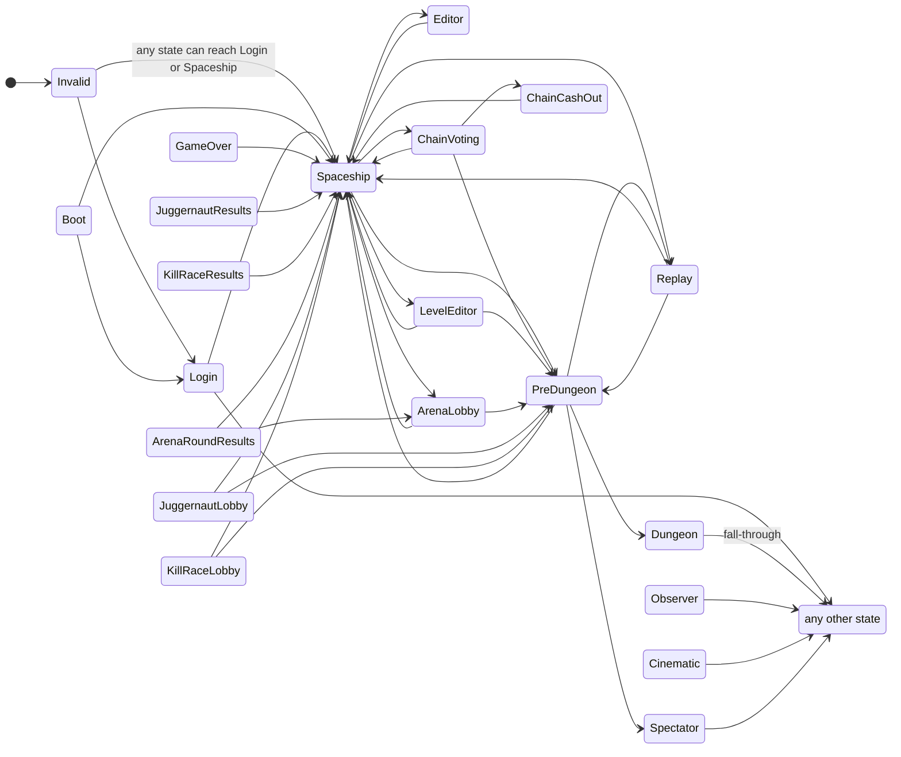

# Game State Machine

Authoritative reference for every `GameState` value and every legal transition between them. Phase docs that previously inlined the state graph link here.

The state lives on each `Client` (`mGameState`). Changes go through `Client::SetGameState(newState)` which calls `IsValidStateChange(from, to)` (`Client.cpp:12-49`). Invalid transitions are logged and **rejected** — the state stays put.

---

## All 21 states

Source: `RakNet/Client.h:14-37` (canonical) and `RakNet/Server.cpp:132-155` (mirror used inside the gameplay namespace).

| Code | Name | Notes |
|---|---|---|
| `0x00` | `Invalid` | Sentinel — only initial value. Always allowed to transition to anything. |
| `0x01` | `Login` | Authentication phase. |
| `0x02` | `Spaceship` | Lobby / between-mission state. Default landing after auth. |
| `0x03` | `Editor` | Creature editor. |
| `0x04` | `LevelEditor` | Map / level editor. |
| `0x05` | `PreDungeon` | Loading screen before a Chain dungeon. |
| `0x06` | `Dungeon` | Active gameplay in a Chain dungeon. |
| `0x07` | `Observer` | Read-only observer. |
| `0x08` | `Cinematic` | Cutscene playback. |
| `0x09` | `Spectator` | Live spectator (PvP). |
| `0x0A` | `Replay` | Recorded replay playback. |
| `0x0B` | `ChainVoting` | Mission/planet selection vote. |
| `0x0C` | `ChainCashOut` | Post-dungeon reward screen. |
| **`0x0D`** | **`GameOver`** | Failure terminal. **`Quit` is `0x0E`, NOT `GameOver`.** Common mis-cite. |
| `0x0E` | `Quit` | Process exit signalled. |
| `0x0F` | `ArenaLobby` | Arena (PvP) pre-match lobby. |
| `0x10` | `ArenaRoundResults` | Arena post-round summary. |
| `0x11` | `JuggernautLobby` | Juggernaut mode lobby. |
| `0x12` | `JuggernautResults` | Juggernaut results. |
| `0x13` | `KillRaceLobby` | KillRace mode lobby. |
| `0x14` | `KillRaceResults` | KillRace results. |
| `0x15` | `Count` | Sentinel / array sizing — not a real state. |

`Boot` (some derivatives reference it) does not exist in the canonical `Client.h` enum but is referenced by `IsValidStateChange` — likely a historical artefact.

---

## Transition graph



The diagram above is simplified — see the literal C++ switch below for the full rule.

---

## C++ `IsValidStateChange` — verbatim

`ReCap.Cpp/darkspore_server/source/RakNet/Client.cpp:12-49`:

```cpp
bool IsValidStateChange(GameState fromState, GameState toState) {
    if (toState == GameState::Login && fromState != GameState::Login) {
        return true;
    } else if (toState == GameState::Spaceship && fromState != GameState::Spaceship) {
        return true;
    }

    switch (fromState) {
        case GameState::Login:
        case GameState::Dungeon:
        case GameState::Observer:
        case GameState::Cinematic:
        case GameState::Spectator:
            return true;

        case GameState::Editor:
        case GameState::ChainCashOut:
        case GameState::GameOver:
        case GameState::JuggernautResults:
        case GameState::KillRaceResults:
            return toState == GameState::Spaceship;

        case GameState::LevelEditor:
        case GameState::Replay:
        case GameState::ArenaLobby:
        case GameState::JuggernautLobby:
        case GameState::KillRaceLobby:
            return toState == GameState::Spaceship || toState == GameState::PreDungeon;

        case GameState::Boot:
            return toState == GameState::Login || toState == GameState::Spaceship;

        case GameState::Spaceship:
            return toState == GameState::Editor
                || toState == GameState::LevelEditor
                || toState == GameState::PreDungeon
                || toState == GameState::Replay
                || toState == GameState::ChainVoting
                || toState == GameState::ArenaLobby;

        case GameState::PreDungeon:
            return toState == GameState::Spaceship
                || toState == GameState::Dungeon
                || toState == GameState::Spectator
                || toState == GameState::Replay;

        case GameState::ChainVoting:
            return toState == GameState::Spaceship
                || toState == GameState::PreDungeon
                || toState == GameState::ChainCashOut;

        case GameState::ArenaRoundResults:
            return toState == GameState::Spaceship || toState == GameState::ArenaLobby;
    }

    return false;
}
```

---

## Transition matrix (only legal rows shown)

| From → | To |
|---|---|
| **any** | `Login`, `Spaceship` (always allowed when from ≠ same) |
| `Login` | any |
| `Dungeon` | any (fall-through) |
| `Observer` | any |
| `Cinematic` | any |
| `Spectator` | any |
| `Editor` | `Spaceship` only |
| `ChainCashOut` | `Spaceship` only |
| `GameOver` | `Spaceship` only |
| `JuggernautResults` | `Spaceship` only |
| `KillRaceResults` | `Spaceship` only |
| `LevelEditor` | `Spaceship`, `PreDungeon` |
| `Replay` | `Spaceship`, `PreDungeon` |
| `ArenaLobby` | `Spaceship`, `PreDungeon` |
| `JuggernautLobby` | `Spaceship`, `PreDungeon` |
| `KillRaceLobby` | `Spaceship`, `PreDungeon` |
| `Boot` | `Login`, `Spaceship` |
| `Spaceship` | `Editor`, `LevelEditor`, `PreDungeon`, `Replay`, `ChainVoting`, `ArenaLobby` |
| `PreDungeon` | `Spaceship`, `Dungeon`, `Spectator`, `Replay` |
| `ChainVoting` | `Spaceship`, `PreDungeon`, `ChainCashOut` |
| `ArenaRoundResults` | `Spaceship`, `ArenaLobby` |

Anything not listed: **reject and log** (`Client.cpp:108-110`):

```cpp
std::cout << "Invalid state change from " << to_string(mGameState)
          << " to " << to_string(newState) << std::endl;
```

---

## Lifecycle scenarios

### Happy-path Chain mission (full success loop)

```
Invalid → Login → Spaceship           // Phase 02-05
       → ChainVoting → PreDungeon     // Phase 07-08
       → Dungeon                       // Phase 09-10
       → ChainVoting → ChainCashOut    // Phase 11 (via SendReconnectPlayer(ChainVoting))
       → Spaceship                     // re-arm
```

`Dungeon → ChainVoting` is a "fall-through" legal — `Dungeon` is in the `return true` cluster, so any `to` is fine. The server uses `SendReconnectPlayer(ChainVoting)` (`Server.cpp:1268-1277`) to drive the transition; the client raises its own `ChainCashOut` from there.

### Failure lane

```
… Dungeon → GameOver → Spaceship
```

Triggered by `ChainGameMsgs(state=1)` (Phase 12). Currently spec-only — no live code path.

### Arena round

```
Spaceship → ArenaLobby → PreDungeon → Dungeon → ArenaRoundResults → ArenaLobby
                                                              → Spaceship
```

Repeats until the player leaves the arena via `Spaceship`.

### Editor

```
Spaceship → Editor → Spaceship
Spaceship → LevelEditor → Spaceship
LevelEditor → PreDungeon → … (level test)
```

### Quit

```
any → Spaceship (always allowed) → Quit
```

`Quit` is not in `IsValidStateChange`'s switch, so the "any state → `Quit`" transition is **not legal** under the current code. Practically `Quit` is set by the disconnect path (Phase 13), bypassing `SetGameState`.

---

## C# divergence

`ReCap.Server/Domain/Gameplay/GameplayState.cs` defines a **different enum** that does **not** match C++ wire codes:

```csharp
public enum GameState
{
    Initializing,      // 0
    Spaceship,         // 1
    ChainVoting,       // 2
    PreDungeon,        // 3
    Dungeon,           // 4
    ChainCashOut,      // 5
    Finished           // 6
}
```

The wire code mapping lives in `GameStatePacket.WireState` (`Adapters/RakNet/Packets/GameStatePacket.cs:16-24`):

```csharp
private static byte WireState(GameState state) => state switch
{
    GameState.Spaceship    => 0x02,
    GameState.ChainVoting  => 0x0B,
    GameState.PreDungeon   => 0x05,
    GameState.Dungeon      => 0x06,
    GameState.ChainCashOut => 0x0C,
    _                      => 0x02   // fallback: Spaceship
};
```

### Divergence implications

1. **Missing states.** `Editor`, `LevelEditor`, `Observer`, `Cinematic`, `Spectator`, `Replay`, **`GameOver` (0x0D)**, `Quit` (0x0E), `ArenaLobby`, `ArenaRoundResults`, `JuggernautLobby/Results`, `KillRaceLobby/Results` — all absent.
2. **`Initializing` (= 0)** does not exist in C++. It's a C# pre-Spaceship placeholder used by `Game.HandleDebugPing` (`Game.cs:270-272`) for the `Spaceship → ChainVoting` flip.
3. **`Finished` (= 6)** does not exist in C++. Currently unused in any switch.
4. **No `IsValidStateChange` equivalent.** Transitions are direct assignments (`State = GameState.Dungeon`). Invalid transitions are accepted silently.
5. **Wire code fallback to `0x02`.** Any unmapped C# state — including `Initializing` and `Finished` — is sent on the wire as `Spaceship`. Silent semantic divergence the client can't catch.
6. **No `Quit` lane.** Disconnect (Phase 13) doesn't reach a defined terminal state.

### Required C# additions (per [ROADMAP.md](../planning/ROADMAP.md) M1)

```csharp
public enum GameState
{
    Invalid       = 0x00,
    Login         = 0x01,
    Spaceship     = 0x02,
    Editor        = 0x03,
    LevelEditor   = 0x04,
    PreDungeon    = 0x05,
    Dungeon       = 0x06,
    Observer      = 0x07,
    Cinematic     = 0x08,
    Spectator     = 0x09,
    Replay        = 0x0A,
    ChainVoting   = 0x0B,
    ChainCashOut  = 0x0C,
    GameOver      = 0x0D,
    Quit          = 0x0E,
    // Arena/Juggernaut/KillRace as needed
}
```

Plus an `IsValidStateChange(GameState from, GameState to)` helper mirroring the C++ switch, wired into a `SetState` on `Game` so transitions can be validated and logged.

---

## Parity table

| Item | C++ | C# | Status |
|---|---|---|---|
| Enum coverage | 21 states + sentinel | 7 states | ❌ 14 missing |
| Enum values align with wire codes | yes (`Client.h:14-37`) | no — auto-numbered, mapped via `WireState` switch | ⚠️ |
| `Invalid` sentinel | `0x00` | absent | ❌ |
| `Login` (`0x01`) | yes | absent | ❌ |
| `Editor` (`0x03`) | yes | absent | ❌ |
| `LevelEditor` (`0x04`) | yes | absent | ❌ |
| `Observer` (`0x07`) | yes | absent | ❌ |
| `Cinematic` (`0x08`) | yes | absent | ❌ |
| `Spectator` (`0x09`) | yes | absent | ❌ |
| `Replay` (`0x0A`) | yes | absent | ❌ |
| `GameOver` (`0x0D`) | yes | absent | ❌ |
| `Quit` (`0x0E`) | yes | absent | ❌ |
| `Arena*`, `Juggernaut*`, `KillRace*` | yes | absent | ❌ |
| `Initializing` (no wire equivalent) | n/a | `0` (auto) | ⚠️ C#-only |
| `Finished` (no wire equivalent) | n/a | `6` (auto) | ⚠️ C#-only, unused |
| `IsValidStateChange` validator | `Client.cpp:12-49` | absent | ❌ |
| Invalid-transition log | `Client.cpp:108-110` | absent | ❌ |
| Reject vs accept on invalid | reject (state unchanged) | accept silently | ❌ |
| `SetGameState` API | `Client::SetGameState(newState) → IsValidStateChange` | direct `State = …` assignment | ❌ |
| `to_string(GameState)` helper | `Client.cpp:51-77` | absent | ❌ |

---

## Open audit items

1. **Realign C# enum to C++ wire codes.** Use explicit `= 0xNN` per state, drop `Initializing` and `Finished` or relabel them with explicit non-wire values (e.g. `Init = -1, Done = -2`).
2. **Implement `IsValidStateChange`.** Single static method on `GameState` or `Game` class, mirroring the C++ switch verbatim.
3. **Reject invalid transitions** and log to `Logger.warn`. The current silent-accept hides bugs.
4. **Add a `to_string` helper** for log readability (`$"[{from} → {to}]"`).
5. **Map every `State = …` site in `Game.cs`** through the validator. Phase 07/08/09 currently bypass.
6. **Decide on `Quit`** — terminal disconnect state or pure no-op? Phase 13 design depends on this.
7. **Arena / Juggernaut / KillRace** states are out of scope for Milestone 6 but stub the enum values now so the wire codes are reserved.

---

## Files referenced

C++:
- `ReCap.Cpp/darkspore_server/source/RakNet/Client.h` (`enum class GameState`)
- `ReCap.Cpp/darkspore_server/source/RakNet/Client.cpp` (`IsValidStateChange`, `to_string`, `SetGameState`)
- `ReCap.Cpp/darkspore_server/source/RakNet/Server.cpp:132-155` (mirror enum used in gameplay namespace)

C#:
- `ReCap.Server/Domain/Gameplay/GameplayState.cs` (`enum GameState`)
- `ReCap.Server/Adapters/RakNet/Packets/GameStatePacket.cs` (`WireState` mapping)
- `ReCap.Server/Domain/Gameplay/Game.cs` (state assignment sites)
