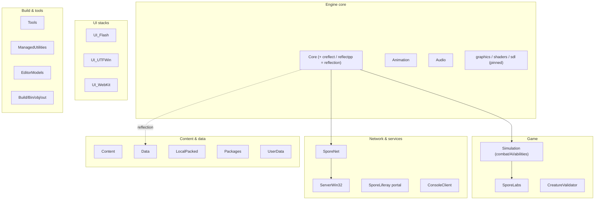

# Original Darkspore Source Tree — `D:\work\darkspore\ml`

Reconstructed from a screenshot shared by **foehammer (David Lee Swenson)**, an original Darkspore developer, on Discord. This is the **real internal source layout** of the game — the highest-fidelity reference we have for how the original codebase was organized.

> **Provenance:** File Explorer screenshot of `D:\work\darkspore\ml` on foehammer's machine. Solution files dated **2012-01-09** (last edited), `.ncb`/`.suo` **2014-10-06**, folders stamped **2015-03-22** (likely an archival copy). Toolchain: **Visual Studio 2008**.
>
> **Status:** transcription + annotation. Folder *contents* are not visible — purposes below are **inferred** (confidence marked) from the folder name, Darkspore/Spore engine knowledge, and cross-checks against the C++ reference server (`ReCapCpp/darkspore_server/source`) and our Ghidra findings. Treat unverified rows as leads to confirm via Ghidra / the C++ reference, not facts. (foehammer is unreachable — every "ask him" path is closed; verification is on us.)

---

## 🔑 Headline findings

1. **Codename = `SporeLabs`.** Darkspore's internal project name. This is *why* the wire/asset structs are named `labsPlayer`, `labsCharacter`, `labsCrystal`, `sporelabsObject` — they are **SporeLabs** Player/Character/Crystal/Object. Confirmed: those names appear throughout the C++ reference (`RakNet/`, `Game/`) and in our format list (`FORMAT_COVERAGE.md`).
2. **`creflect` + `reflectpp` exist and are pinned** to Quick Access. This is the **reflection system** = the AssetData runtime we reverse-engineered in Ghidra (`AssetType`/`AssetData` reflection stubs, `DeserializeObject`). `creflect` = C reflection, `reflectpp` = "reflect++" (C++ template reflection). foehammer pinning them suggests he worked on them directly. (He is now unreachable — resolved instead via Ghidra; see the cross-validation section.)
3. **`Simulation`** is its own top-level module — the combat/game engine that ReCap's `Game/` only covers ~25% of (per `PORTING_MATRIX.md`). This is the single biggest gameplay gap, and here it's a discrete codebase.
4. **`SporeNet`** matches the C++ reference server's `SporeNet/` — the networking/account layer.
5. **Two solutions:** `SporeLabs_Shared` (client+shared) and `SporeLabs_Server` — the client and the dedicated server were built from the same tree.
6. **`Spark` = an embedded HTTP server (`SP_App/HTTPServer`), NOT effects/particles.** Confirmed in `Darkspore.exe`: the client allocates a "Spark HTTP Server / 1.01.00" instance (Apache-style `httpd.conf`, `DirectoryIndex index.html`, `Port 8088`, `ServerAdmin awillmott@maxis.com`) and starts it. It serves a local web UI (pairs with `UI_WebKit`) and the screenshot/sharing feature (`My Creations/Spark`, captures `Spark_<date>.png`). Evidence surfaced by community member **Auntie Owl** (Discord, 2019-06-23) matched 1:1 to the binary. This is the original of ReCap's `Rest/` HTTP layer.

---

## Literal contents (root of `ml`)

### Solution / project files

| Name | Type | Modified | Size |
|---|---|---|---|
| `SporeLabs_Shared_2008.ncb` | VC++ IntelliSense DB | 2014-10-06 22:10 | 136,187 KB |
| `SporeLabs_Shared_2008.suo` | VS Solution User Options | 2014-10-06 22:10 | 71 KB |
| `SporeLabs_Shared_2008.sln` | VS Solution | 2012-01-09 13:20 | 56 KB |
| `SporeLabs_Server_2008.sln` | VS Solution | 2012-01-09 13:20 | 22 KB |

> The huge `.ncb` (136 MB IntelliSense cache) implies a very large C++ codebase. `.sln` size: Shared (56 KB) ≫ Server (22 KB) — the server solution is a subset.

### Folders (all `File folder`)

| Folder | Modified | Inferred purpose | Conf. | ReCap relevance |
|---|---|---|---|---|
| `Animation` | 03-22 00:34 | Skeletal/character animation runtime | high | `CharacterAnimation` asset format |
| `ARG` | 03-22 00:34 | Alternate-Reality-Game content/marketing | low | none |
| `Audio` | 03-22 00:34 | Audio engine (events, triggers) | high | `cAudioEventData`, `AudioTriggerDef` formats |
| `Bin` | 03-22 00:35 | Build output binaries | high | — |
| `Build` | 03-22 00:35 | Build scripts/config | med | — |
| `Config` | 03-22 00:35 | Engine/game config | med | `ServerConfig` parity |
| `ConsoleClient` | 03-22 00:35 | **Telnet client to the built-in `ConsoleServer`** (remote command console) | high | telnet-based cheat/automation; `ConsoleServer`+`TelnetTransport` present in retail client — see `CONSOLE_SYSTEM.md` |
| `Content` | 03-22 01:10 | Game content/assets (authored) | high | source XML before packing |
| `Core` | 03-22 01:31 | Engine foundation (memory, math, containers, **reflection?**) | high | C++ ref `Core/`; likely hosts `creflect` |
| `CreatureValidator` | 03-22 01:31 | Validates creature/editor part data | med | creature/deck rules |
| `Data` | 03-22 02:07 | Packed/runtime data (`.package`) | high | `AssetData_Binary.package` source |
| `Docs` | 03-22 02:14 | Internal documentation | med | ❓ contents never shared (foehammer unreachable) |
| `EditorModels` | 03-22 02:14 | Editor model data | low | asset editor |
| `Gears` | 03-22 02:14 | UI/widget framework or gameplay "gears" | low | ❓ confirm via Ghidra |
| `lib` | 03-22 02:14 | Third-party libraries | high | RakNet, Blaze, etc. |
| `LocalPacked` | 03-22 02:17 | Locally packed assets (dev cache) | med | DBPF packing |
| `ManagedUtilities` | 03-22 02:19 | .NET/C# managed tooling | med | C# tools precedent |
| `obj` / `out` | 03-22 02:20/02:23 | Intermediate/final build artifacts | high | — |
| `Packages` | 03-22 02:24 | Asset package build inputs/outputs | med | DBPF/catalog pipeline |
| `ServerWin32` | 03-22 02:25 | Win32 dedicated server build/project | high | **the server ReCap reimplements** |
| `Simulation` | 03-22 02:25 | **Game simulation: combat, objects, AI, abilities** | high | **biggest ReCap gameplay gap** |
| `Spark` | 03-22 02:25 | **Embedded HTTP server (`SP_App/HTTPServer`) — serves local web UI / sharing** | high | launcher/store/sharing web layer; original of ReCap `Rest/` |
| `SporeLabs` | 03-22 02:25 | Main game module (the SporeLabs game itself) | high | top-level game logic |
| `SporeLiferay` | 03-22 02:39 | Liferay (Java) web portal — account/store backend | med | web/account services |
| `SporeNet` | 03-22 02:41 | Networking + account/session layer | high | C++ ref `SporeNet/` (matches) |
| `Tools` | 03-22 02:43 | Build/asset/dev tools | high | asset pipeline tools |
| `UI_Flash` | 03-22 02:43 | Scaleform/Flash UI | high | HUD/menus |
| `UI_UTFWin` | 03-22 02:44 | UTFWin — Spore's native UI toolkit | high | in-game UI layer |
| `UI_WebKit` | 03-22 02:47 | Embedded WebKit (launcher/store/web views) | med | launcher/REST |
| `UserData` | 03-22 02:47 | Per-user save/profile data | med | account/profile |

### Pinned Quick Access (foehammer's most-used folders)

`reference`, `shaders`, **`creflect`**, `graphics`, **`reflectpp`**, `sdl`

> `creflect` and `reflectpp` pinned alongside `shaders`/`graphics`/`sdl` (rendering) suggests foehammer's focus spanned **the reflection/serialization system** and **graphics**. `sdl` likely = a schema/definition language for the reflection system (asset type definitions!) rather than the SDL media library — but this is **unconfirmed** (Ghidra shows no `sdl`/`SDL` strings either way, and foehammer is unreachable), so it stays open. An asset-type "SDL" would have been the authoritative source of the 143 format schemas we hand-transcribed.

---

## Module grouping (inferred)

---

## Cross-reference to what we already know

| Original module | ReCap C++ reference (`darkspore_server/source`) | Our findings |
|---|---|---|
| `SporeNet` | `SporeNet/` (User, Account, …) | matches name 1:1 |
| `Simulation` | `Game/` (Instance, Object, Locomotion, Noun…) | dalkon reimplemented a slice; ~25% ported |
| `Core` + `creflect`/`reflectpp` | — (client-side) | = the AssetData reflection runtime (`GHIDRA_GROUND_TRUTH.md`) |
| `ServerWin32` | the whole reimplemented server | ReCap's target |
| `labs*` / `sporelabsObject` formats | `RakNet/Types`, `Game/` | **explained: SporeLabs codename** |
| `Data` / `Packages` / `LocalPacked` | `AssetData_Binary.package` | DBPF pipeline (`AssetData.Parser`) |

---

## Cross-validation against Ghidra (`Darkspore.exe`)

The client binary's **namespaces** confirm most of foehammer's module folders as real code units. (Note: Ghidra has the **client** `Darkspore.exe` — so client+shared modules are confirmable; server-only modules like `SporeLiferay` and managed/Java/tool projects are not in this binary.)

| foehammer module | Confirmed Ghidra namespaces / classes | Status |
|---|---|---|
| `Core` + pinned `creflect`/`reflectpp` | the whole `Asset*` family (`AssetType`, `AssetData`, `AssetParser`, `AssetTypeRegistry`, `AssetCatalog`, `AssetCache`, `AssetObject`, `AssetLoader`, `AssetDestructor`), `MemoryAllocator`, `Math`, `Vector`, `Sort`; reflection runtime evidenced by "Tom Bui" asserts — `"…number of fields in the reflection table!"` @`0102fd58`, `"…does not have sentinel marker!"` @`0102fdb8`; `Core/` build path `SporeLabs_PROD\Core\UTFKernel\EASTL` @`00fd3408` | ✅ **reflection = the AssetData system we mapped** ⚠️ NOTE: literal `creflect`/`reflectpp` names are **folder-only** (0 string hits). There is **NO `ReflSystem` namespace** in the binary (0 hits, no `Refl*` symbol) — that earlier label was unverified; do not cite it. |
| `Simulation` | **`n*` namespace** — `nGameSimulator`, `nObjectManager`, `nGameDirector`, `nBehaviorTree`, `nAbility`, `nAffix`, `nAgent`, `nAttribute`, `nCondition`, `nEvent`, `nGameObject`, `nLevel`, `nLocomotion`, `nObjective`, `nPhysics`, `nPlayer`, `nScenarioManager`, `nTimeManager`, `nTuning` | ✅ **strong — this is the combat/AI engine** |
| `SporeNet` | **`nSporeNet::*`** — `cConnection`, `cConnectionRakNet`, `cMessage`, `cTransportRakNet`, `cSocketWin32`, `cClientSession`; + `cBlaze*`, `Tdf*`, `MessageDispatcher` | ✅ |
| `graphics` / `shaders` (pinned) | `cGameRenderer`, `ModelRenderer`, `ShadowRenderer`, `RenderDevice`, `MaterialManager`, `TextureManager`, `cModelAsset`, `cMaterialAsset`, `SP_Graphics`, `SP_RenderAsset(s)`, `SP_RenderModel` | ✅ |
| `UI_Flash` | **`GFx*`** (Scaleform): `GFxLoader`, `GImage`, `GColor`, `GMatrix2D/3D`, `GRefCount*`, `GSysAlloc*`, `GThread` | ✅ Scaleform GFx |
| `Animation` | `AnimationManager`, `SP_AnimLoader` | ✅ |
| `EditorModels` | `SP_Editor`, `SP_EditorModel` | ✅ |
| (scripting — module unclear) | `LuaManager`, `LuaScript`, `LuaSystem`, `LuaFunctions` | ✅ exists; maps to Simulation or `Spark`? |
| `lib` | `PHYSXLOADER.DLL`, RakNet (`cConnectionRakNet`), Blaze, EASTL (`eastl::*`) | ✅ |
| `Audio` | not surfaced as a top-level namespace in sampled list | ❓ confirm |
| `UI_UTFWin` / `UI_WebKit` | not surfaced (WebKit may be a separate launcher exe) | ❓ confirm |
| `Spark` | **`SP_App/HTTPServer`** — "Spark HTTP Server / 1.01.00" config string @`0100c2c8`, server setup `FUN_007eb780` (alloc tag `SP_App/HTTPServer`, port 8088, `httpd.conf`); app-name "Spark" in telemetry `FUN_0085c120`; capture path `My Creations/Spark` in `FUN_007ec840` | ✅ **embedded HTTP server, not effects** |
| `SporeLiferay` | Java — **not** in the client binary | n/a (server/web) |
| `ManagedUtilities` / `Tools` / `CreatureValidator` | managed/.NET — not in native client | n/a |

**Two big confirmations for ReCap:**
1. The `n*` Simulation namespace is the **authoritative class list for the combat engine** — `nGameSimulator` + `nObjectManager` + `nGameDirector` + `nBehaviorTree` are the spine of the ~75% of `Game/` ReCap hasn't ported. These names are reusable as the target design vocabulary.
2. The `Asset*` namespace family + the "Tom Bui" reflection-table/sentinel asserts confirm the pinned `creflect`/`reflectpp` folders compiled into the reflection runtime we mapped — the foehammer source and our Ghidra map describe **the same system**. (Caveat: the *names* `creflect`/`reflectpp`/`sdl` are folder-only, never symbols; no `ReflSystem` namespace exists; `sdl` is unconfirmed either way.)

> **The `n` prefix** appears to be the game-simulation namespace (likely "noun"-centric: `nGameObject`/`nObjectManager` operate on nouns). The `SP_` prefix = SporeLabs render/editor/asset glue. `c`-prefixed classes are the lower-level engine/platform layer (`cPlatformWin32`, `cSocketWin32`, `cObjectFactory`).

---

## Open questions (resolve via Ghidra / C++ ref / assets)

> foehammer is unreachable — these can no longer be answered by asking him. They stay open until reverse-engineered from `Darkspore.exe`, the C++ reference, or the asset packages.

1. ❓ **`sdl`** — was it the schema-definition language for asset types? No `sdl`/`SDL` strings in the binary so far; if real, it would be the ground truth behind our 143 hand-transcribed format stubs. → dig further in Ghidra / asset packages.
2. ❓ **`Docs/`** — internal design docs on asset format / netcode / simulation. Contents never shared; dead unless a copy surfaces elsewhere.
3. ❓ **`Simulation`** — combat/ability/AI architecture (biggest ReCap gap). Class layout + Lua integration → map via the `n*` namespace in Ghidra (see `SIMULATION_MAP.md`).
4. ❓ **`SporeNet` vs Blaze** — how the SporeNet layer sat on top of EA Blaze → trace `nSporeNet::*` + `cBlaze*` in Ghidra and the C++ reference.
5. ❓ **`ConsoleClient`** — could a headless client run against a private server (test harness)? → check binary remnants (`noServer`/`headless` switches noted in `DEV_TESTIMONY_FOEHAMMER.md`).

---

## Provenance & caution

- This is a **screenshot transcription**, not the source itself. Folder purposes are inferred; verify before relying on them for implementation.
- Do **not** assume access to or possession of the original source. This document records *organizational structure* shared publicly by an original dev for historical/interop understanding.
