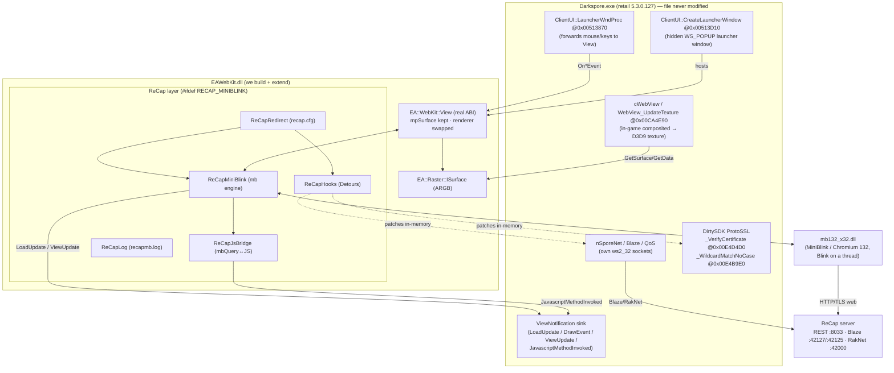
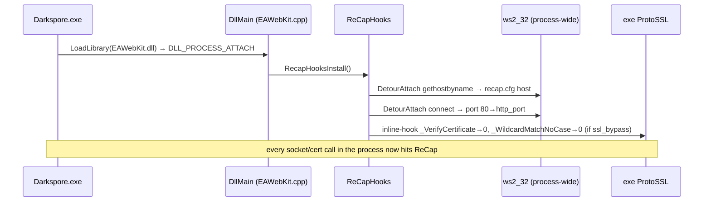
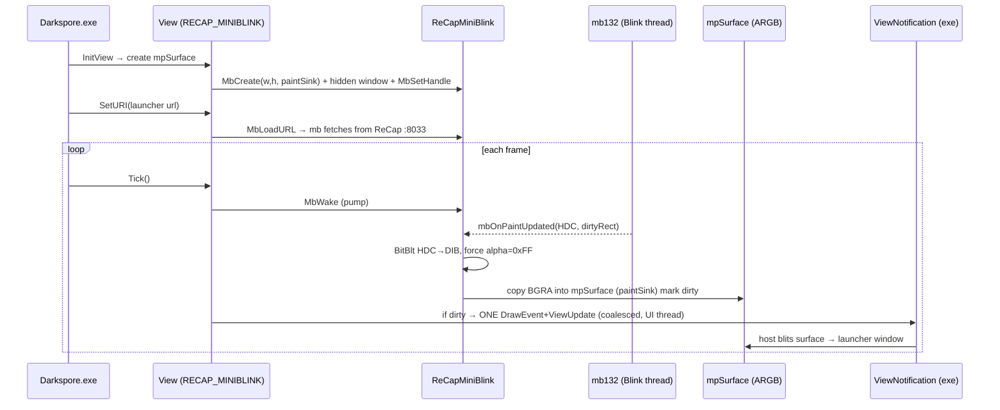
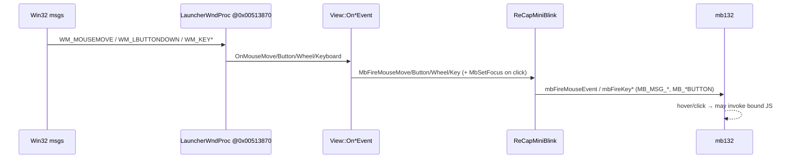
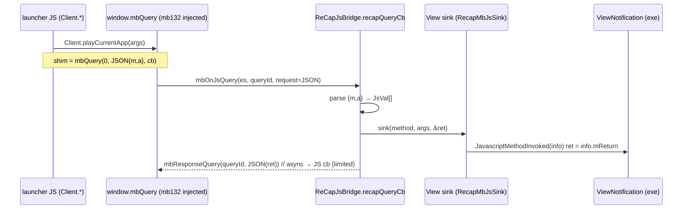
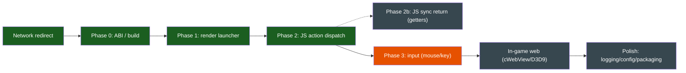

# ReCap WebView — modern-engine system map & scope

How ReCap makes Darkspore's retail client (a) talk to ReCap and (b) render its in-client web
UI with a **modern** engine (MiniBlink / Chromium 132) — all by **replacing one DLL**
(`EAWebKit.dll`), with **zero changes to `Darkspore.exe` on disk**.

> Status 2026-06-02: redirect ✅, launcher renders ✅ + **fully interactive ✅ — clicking
> Play dispatches `Client.playCurrentApp` and the game OPENS (reached in-game)**. Remaining:
> perf polish (laggy paint / slow on-demand hover-sprite loads / unreliable clicks under
> load), in-game composited web (cWebView/D3D9), synchronous JS getters (Phase 2b).
> History/decisions: `WEBVIEW_MODERNIZATION.md`, `WEBVIEW_SHIM_DESIGN.md`,
> `DEV_TESTIMONY_XACKERY.md`, specs `2026-06-02-eawebkit-{redirect-reimpl,modern-engine}-*`.

---

## TL;DR

We build `EAWebKit.dll` from source (VS2008) and add a small **ReCap layer** to it:

1. **Network redirect** (`ReCapHooks`, Microsoft Detours, runtime in-memory): points the whole
   process at ReCap (`recap.cfg`-driven) + bypasses the client's TLS cert check.
2. **Modern engine** (`ReCapMiniBlink` + `ReCapJsBridge`): swaps the View's *renderer* from
   EAWebKit's ~2008 WebCore to MiniBlink, keeping EA's real `View`/`ISurface` ABI — so the
   exe drives it unchanged. Modern CSS/HTML render into the same surface the exe already blits.

Everything is gated by `#ifdef RECAP_MINIBLINK`; without it (or without `mb132_x32.dll`) the
DLL falls back to stock WebCore.

---

## Component map

---

## Subsystem 1 — Network redirect (works today)

Runtime, in-memory **Detours** installed from `DllMain` (no exe-file patch, no launcher
process → AV-friendly). Replicates @Xackery's technique from rebuilt-from-source code.

- Config: `recap.cfg` next to the DLL (`host` / `http_port` / `ssl_bypass`). `ReCapRedirect`
  reads it once, lazily, never-fails.
- Cert addresses are base-relative (`GetModuleHandle(NULL)+offset`), located in Ghidra.

---

## Subsystem 2 — Modern engine (MiniBlink behind the real View)

`View` cleanly separates **`mpSurface`** (the ARGB buffer the exe reads) from its renderer.
We keep `mpSurface` and swap the renderer to MiniBlink. `mb.h` self-loads `mb132_x32.dll`.

### Render / pixel path

Key fixes that made it visible: alpha forced opaque (BitBlt leaves α=0 → transparent=black);
mb needs a **real HWND** (own hidden window) to dispatch paints; the host shows its window
only after a **load notification** (`LoadUpdate` kLETWillShow…), which WebCore fires and mb
doesn't — so `ReCapMiniBlink` fires it on `mbOnDocumentReady`; and the per-paint draw
notification is **coalesced to one per frame in `Tick`** (firing it per-paint starved the UI
thread → lag/frozen drag).

### Input path

### JS bridge (JS → native)

---

## Status & scope

| Area | State | Notes |
|---|---|---|
| Network redirect | ✅ done | client reaches ReCap; cert bypass; `recap.cfg` local/remote |
| Build / ABI | ✅ done | stock `EAWebKit.dll` builds; ReCap layer compiles `/W4 /WX` |
| Launcher render | ✅ done | modern CSS/HTML renders in the launcher window in-game |
| JS action dispatch | ✅ done | `Client.*` → `JavascriptMethodInvoked` (BARE name); **Play opens the game** |
| Input (mouse/keys) | ✅ works | On*Event → mb; captured-up forwarded from the hidden window; clicks complete |
| Perf / experience | 🔧 rough | laggy paint, on-demand hover-sprite loads leave the button empty briefly, clicks unreliable under load — polish, not a blocker |
| JS sync return (getters) | ⏳ todo | mb132 query channel is async; `var x=Client.getX()` returns undefined (Phase 2b) |
| In-game composited web | ❓ untested | login/store inside the game use cWebView→D3D9 (`WebView_UpdateTexture@0x00CA4E90`); reached only after Play works |
| Polish | ⏳ todo | trim debug logging, `recap.cfg` engine toggle, ship `mb132_x32.dll`, multi-view |

### What's left (detail)

- **Confirm input fix** — click fires `Client.playCurrentApp` → game advances past the launcher.
- **In-game web display** — the composited cWebView pulls `GetSurface()->GetData()` every frame
  via `WebView_UpdateTexture@0x00CA4E90`; likely "just works" with our surface, but the draw
  notification / second-View handling is unverified. Validate once Play works.
- **Synchronous getters** — mb132 has no sync native-call-with-return. Options (deferred):
  pre-inject static getter values on document-ready, adapt pages to async, or a V8
  FunctionTemplate via `mbJsToV8Value` (heavy). Only needed if a page stalls without them.
- **Keyboard / IME / text fields** — basic key forwarding wired; full text input/IME unverified.
- **Multi-view** — login/store are likely separate `View` instances; the engine swap is
  per-View so it should generalize, but untested.
- **Packaging** — ship `mb132_x32.dll` next to `Darkspore.exe`; document `recap.cfg`.
- **Cleanup** — gate/trim the verbose `recapmb.log` tracing; consider a runtime `engine=` toggle.

---

## ReCap layer — file map (in the `eawebkit` tree)

| File | Role |
|---|---|
| `source/ReCapHooks.{h,cpp}` | Detours network/cert redirect; installed from `DllMain` |
| `source/ReCapRedirect`* (`recapredirect.{c,h}` in DirtySDK pkg) | reads `recap.cfg` (host/port/ssl_bypass) |
| `source/ReCapMiniBlink.{h,cpp}` | mb engine: create/load/resize/paint(HDC→DIB→surface)/pump/input/focus/dirty/hidden-window |
| `source/ReCapJsBridge.{h,cpp}` | `window.<obj>.<method>` ↔ `mbQuery` ↔ `JavascriptMethodInvoked`; JSON marshalling |
| `source/ReCapLog.{h,cpp}` | crash-safe `recapmb.log` + BMP dump diag |
| `source/mb.h` (+ `stdint.h`/`stdbool.h` shims) | vendored MiniBlink header (self-loads the DLL) |
| `source/EAWebKit.cpp` (DllMain) | calls `RecapHooksInstall/Uninstall` |
| `source/EAWebKitView.cpp` (`#ifdef RECAP_MINIBLINK`) | View integration: InitView swap, SetURI/SetSize/Tick, JS bindings, On*Event input, load + coalesced ViewUpdate |
| `EAWebkit.vcproj` | compiles the ReCap `.cpp`s + defines `RECAP_MINIBLINK` |

## Ghidra anchors (retail 5.3.0.127, base 0x00400000)

| Symbol | Addr | Role |
|---|---|---|
| `ClientNet::ProtoSSL_VerifyCertificate` | 0x00E4D4D0 | cert verify → hooked to 0 |
| `ClientNet::ProtoSSL_WildcardMatchNoCase` | 0x00E4B9E0 | host match → hooked to 0 |
| `ClientUI::CreateLauncherWindow` | 0x00513D10 | hidden launcher OS window (hosts our View) |
| `ClientUI::LauncherWndProc` | 0x00513870 | forwards mouse/keyboard to the View |
| `ClientWeb::WebView_UpdateTexture` | 0x00CA4E90 | in-game cWebView → D3D9 texture (reads GetSurface) |

## Decisions / constraints
- Drop-in `EAWebKit.dll` only — never patch the exe file (AV-safe; vs ReCap.Launcher).
- Engine = MiniBlink mb132 (32-bit, Blink-on-thread, offscreen HDC paint). CEF/Ultralight rejected.
- mb132 JS bridge is **async** — synchronous getters are a known limitation (Phase 2b).
- Everything behind `RECAP_MINIBLINK` + graceful WebCore fallback if `mb132_x32.dll` is absent.
