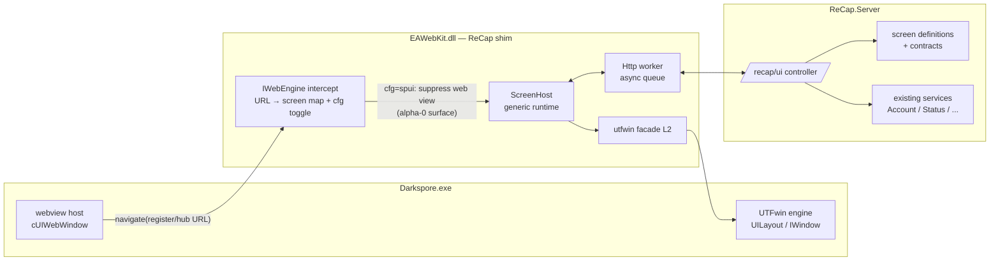
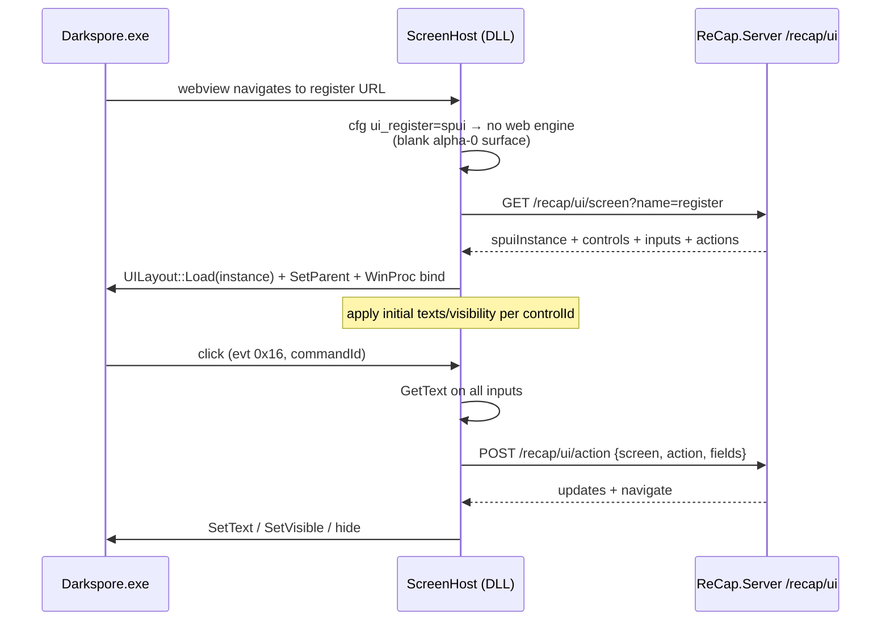
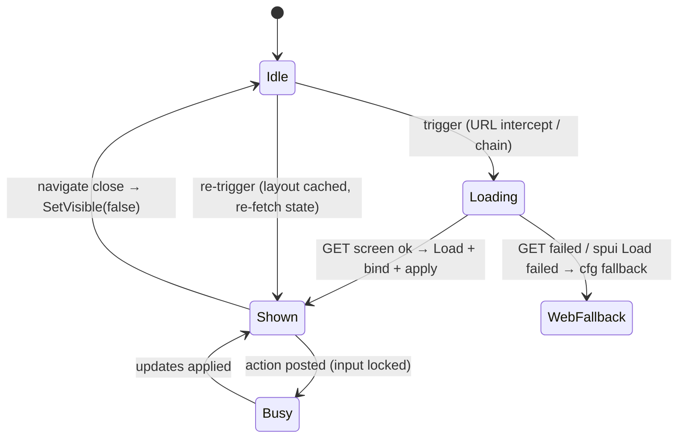
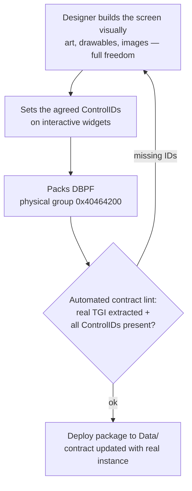

# SPUI Screen Framework — Server-Driven Native UI (Design)

**Date:** 2026-06-04
**Status:** Approved design (brainstorm w/ Jean)
**Predecessor:** `2026-06-03-utfwin-native-ui-poc-design.md` (PoC proven: native SPUI renders, reads fields, registers on server)

## Goal

Replace Darkspore's EAWebKit web screens with native UTFwin/SPUI screens through a **generic, server-driven runtime**: a new screen requires only a `.spui` asset (any editor) + a screen definition on ReCap.Server. **No DLL rebuild, no Ghidra, no per-screen C++.**

## Decisions (locked)

| Decision | Choice |
|---|---|
| Scope v1 | **Register/Login** + **Hub (mainwebview)** → SPUI |
| Out of scope | Launcher → future standalone C# app (`ReCap.Hub`); Announce banner stays web; Scaleform login untouched |
| Swap strategy | **Per-screen toggle in `recap.cfg`** (`ui_register=spui\|web`, `ui_hub=spui\|web`) — web is instant fallback |
| Data flow | **Server-driven UI**: new `/recap/ui` protocol; server owns content/logic, DLL is a dumb renderer |
| Hook seam | **Tier 1, DLL-only**: intercept inside our own IWebEngine layer (URL navigation). No new exe Detours |
| Authoring | Editor-agnostic. The contract is the `.spui` content (ControlIDs), not the tool |

## Architecture — layers

- **L1 (frozen):** exe entry points, Ghidra-verified once — `UILayout::Ctor/Load/SetParentWindow/FindWindowByID`, `IWindow` vtable slots (Cast/GetArea/SetArea/SetFlag), `ITextEdit` (GetText/SetText), `IWindow::AddWinProc`.
- **L2 (built, proven):** `ReCapUtfWin` facade — `Layout::Load/SetParent/Find`, `GetText/SetText`, `GetArea/SetArea/SetVisible`, `WinProc` base (verified events: click `0x16`, mouse `0x06/0x07/0x08`, textChanged `0x9B1552DA`).
- **L3 (new):** `ReCapScreenHost` — generic screen runtime (this design).
- **L4 (new):** ReCap.Server `/recap/ui` — screen definitions + actions, backed by existing services.



## `/recap/ui` protocol

Two endpoints. JSON. Stateless on the DLL side; the server may keep per-session state keyed by auth token.

**Screen fetch** — on trigger:

```json
GET /recap/ui/screen?name=register&locale=en-us
→ {
    "screen": "register",
    "spuiInstance": "0x3D7FD4F3",          // real TGI instance from the deployed package
    "controls": {                            // initial state, applied by controlId
      "0x10000010": { "text": "Criar conta", "visible": true }
    },
    "inputs":  [ "0x10000001", "0x10000002" ],   // TextEdits collected on every action
    "actions": { "0x10000003": "submit",          // commandId → action name
                 "0x10000005": "close" }
  }
```

**Action round-trip** — on widget click:

```json
POST /recap/ui/action
  { "screen": "register", "action": "submit",
    "fields": { "0x10000001": "jean", "0x10000002": "123" } }
→ {
    "updates":  { "0x10000010": { "text": "Conta criada!" } },   // applied via SetText/SetVisible
    "navigate": null | "close" | "show:<screen>"
  }
```

Rules:
- DLL knows **nothing** about what a screen means. It loads the layout, applies `controls`, attaches one generic WinProc, collects `inputs`, posts `actions`, applies `updates`.
- Server validates everything; errors come back as `updates` on a status label — no special error channel.
- `navigate: "show:<screen>"` chains screens (e.g. register → login) without DLL changes.



## Screen lifecycle



- Layouts are loaded once and cached (hide via `SetVisible(false)`); real teardown deferred until `UILayout` dtor is mapped (gap G4).
- A failed screen fetch or `Load ok=0` falls back to the web path for that screen — same behavior as `ui_x=web`.

## DLL components (new/changed)

| Component | Responsibility |
|---|---|
| `ReCapScreenHost.{h,cpp}` (new) | ScreenManager: trigger → fetch → load → bind → action loop. One generic `WinProc` (filters click events, maps commandId→action). Applies `controls`/`updates`. Owns the screen cache |
| `ReCapHttp` v2 | **Worker thread + request queue** — never block the game thread. Completion polled/drained on the main thread. Adds POST with body |
| JSON mini-parser | Reuse/extract the existing `ReCapJsBridge` JSON parsing into a shared helper |
| IWebEngine intercept | URL→screen-name map + `recap.cfg` toggles (`ui_register`, `ui_hub`). On `spui` mode: skip web engine creation, hand off to ScreenHost, keep surface transparent |

Hub specifics (Tier 1 safety): the exe still runs `OpenSetupWebView` and creates its host objects — untouched. Our view simply never instantiates the web engine, so the 42 JS callbacks are never invoked (they are page→game calls; no page, no calls). Game→page injections become no-ops in our view layer.

## Server components (new)

| Component | Responsibility |
|---|---|
| `UiRestController` (`/recap/ui/screen`, `/recap/ui/action`) | Protocol endpoints |
| Screen definitions | Per screen: contract binding + initial-state builder + action handlers, calling existing services (`AccountService`, `StatusService`, ...). Plain C# classes — no new persistence |
| Contracts (`contracts/<screen>.json`) | Single source of truth per screen: package, `spuiInstance`, controlId→role map (input/action/label). Consumed by the server; validated against the deployed package by an automated lint step |

## Authoring workflow (designer-facing)

Editor-agnostic — any tool that emits valid `.spui` works. The designer's only obligation is the **contract**: set the agreed ControlIDs (`0xEEC1B001` property) on the interactive widgets.



Hard-won packaging rules (encoded in the lint, not left to memory):
- The **physical** group in the package must be `0x40464200`; `Load` still uses logical `{type 0x0510A95B, group 0x40464100}`.
- Never trust FNV(filename) for the instance — editors may write their own. The lint extracts the **real TGI** from the package and writes it into the contract; the server serves that instance to the DLL.
- Missing image refs don't block `Load` (proven), but shipped screens should pack their PNGs (type `0x2F7D0004`) in the same DBPF.

## Gaps closed by this design (priority order)

1. **G1 — async HTTP** (today's blocking GET freezes the game thread) → Http worker
2. **G2 — `SetText` on static `Text`** (status/error labels; `Text` doesn't Cast to ITextEdit) → one vtable read in Ghidra, add to facade
3. **G3 — images in authored screens** → covered by the authoring workflow (format already supports them)
4. **G4 — real teardown** (`UILayout` dtor/Release unmapped) → deferred; `SetVisible(false)` until mapped
5. **G5 — focus/tab order, modal input lock** → phase 2, after v1 screens ship

## Risks

| Risk | Mitigation |
|---|---|
| Server down at screen trigger | Fallback to web path (same as cfg toggle); timeout on worker thread |
| Designer ships package with wrong/missing ControlIDs | Contract lint blocks deploy |
| Hub side-effects from never-running page JS | Tier 1 keeps exe path intact; verify in-game that hub absence of JS calls causes no stalls (test gate) |
| Screen needs a widget the facade can't drive yet (combobox/slider/list) | Per-widget vtable mapping is a small bounded Ghidra task; v1 screens use proven widgets only |

## Non-goals

- Launcher replacement (future `ReCap.Hub` C# app — separate design).
- Announce banner (stays web).
- Scaleform/GFx login replacement.
- Dynamic list/scroll widgets (hub v2).
