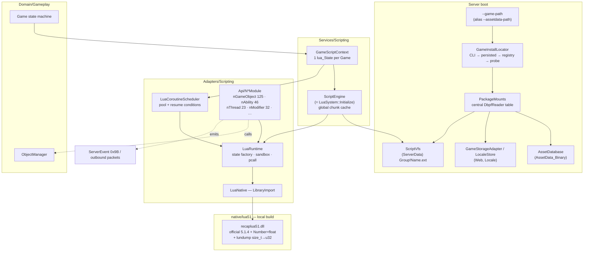
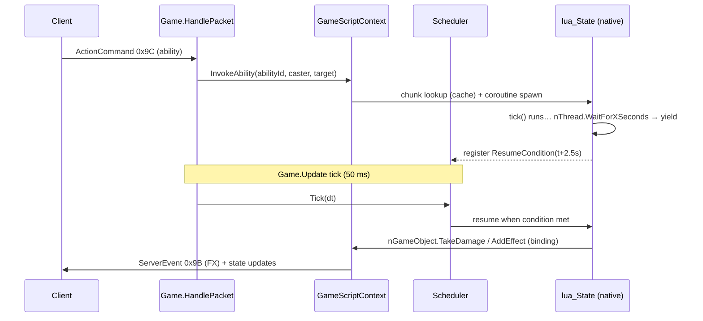

# Lua Scripting System — Design

**Date:** 2026-06-05
**Status:** DRAFT — awaiting user approval
**Scope:** Execute the game's original compiled Lua 5.1 scripts (ServerData.package) inside ReCap.Server, plus game-folder auto-detection replacing `--assetdata-path`.

---

## 1. Goal & deliberate divergence from C++

Run the **original compiled luac chunks** shipped in `ServerData.package` — no decompilation, no extracted script folder.

dalkon's C++ server embeds **LuaJIT 2.1 + sol2** (`ReCap.Cpp CMakeLists.txt:101-104,133`). LuaJIT cannot load PUC bytecode (own format only) — *that* is why his server runs decompiled sources (`res/data/serverdata/lua/`, 87 files, unluac `L0_1` artifacts). The decompilation was a runtime consequence, not a design choice. We remove the cause: use a VM that loads the original chunks directly.

Bonus paths this unlocks:
- Scripts always in sync with the user's game install (no stale extracted copies).
- Future modding: overlay directory where loose `.lua`/`.luac` files override package entries (mirrors the client's `Patches` mount).

## 2. Verified facts (the contract)

All client addresses = Darkspore.exe retail, image base 0x400000. Package facts = probe of `Data/ServerData.package` (1,114 entries).

| # | Fact | Evidence |
|---|------|----------|
| F1 | Lua **5.1.4** PUC vanilla, statically linked | version string `0x01018718` |
| F2 | **`lua_Number = float` (4 bytes)** — not double | header check `0x00909cb0` expects `1B 4C 75 61 51 00 01 04 04 04 04 00`; all 1,042 package chunks carry that exact header |
| F3 | 38 vanilla opcodes, standard encoding | VM dispatch `0x00903820`, cases 0x00–0x25 |
| F4 | Chunks have **debug info stripped** (empty chunk name) | probe: source-name length = 0 in all samples |
| F5 | ServerData.package: 1,042 luac entries (TypeId `0x3681D755` = FNV("lua")); groups: Abilities `0x7153BBB1`=487, Modifiers `0xFC0FF8F5`=403, Lua `0x3681D755`=89, behaviors `0xC130A42A`=31, +16 unresolved | probe via DbpfReader-equivalent parser |
| F6 | InstanceId = FNV(bare name, no ext) — 87/87 C++ script names matched | probe; consistent with [DBPF hash domains] |
| F7 | Script load: `LuaSystem::Initialize` `0x00a0c810` queries AssetCatalog for **10 hardcoded group hashes**, executes every script found | `0x3681d755, 0xda09176b, 0xfc0ff8f5, 0xd2fcb262, 0x7153bbb1, 0xd79fa88c, 0xc130a42a, 0xb2a79c5c, 0xee84d09a, 0x24f78aa1` |
| F8 | Custom `require` `0x008f5af0`, package-VFS-backed, name format **`"Group!Name.ext"`** (e.g. `"Lua!GlobalDefinitions.lua"`); no loadfile/dofile anywhere | client decompile + require strings inside chunk constants |
| F9 | Sandbox (state factory `0x008f5ba0`): open = base, string, table, math, coroutine; **nil** = debug, package, loadstring, dofile, loadfile, loadlib, module; `print` = stub; `math.random` overridden native | client decompile |
| F10 | Concurrency = cLuaThread pool (`0x008f5d70`): function xmoved to a thread state + resumed; SimulatorControl `0x008f6e40` = scheduler. Yield API: `nThread.Sleep/WaitForXSeconds/WaitForProjectile/...` | client decompile |
| F11 | API surface (registrar `0x00a0c600`, namespace helper `0x008f3620`): **nGameObject=125 fns, nAbility=46, nModifier=32, nThread=23**, + nCondition, nPhysics, nUtil, nBit, nAttribute, nLocomotion, nObjectManager, nPlayer, nEvent, nAgent, nMathUtil, nGameDirector, nGameSimulator, nLevel, nObjective, nAffix, nJuggernaut(stubs), nTuning, nTimeManager, nBehaviorTree, nScenarioManager, nDebug, nClient(stubs) | client decompile |
| F12 | Client mounts ServerData.package itself in dev mode (`0x009e19d0`) — proves chunk set + load sequence is the full server-side script system | string xref `0x009e1bc7` |

**Consequence of F2+F4:** stock `lua51.dll` (double, x64 `size_t=8`) rejects every chunk. unluac works on stripped chunks but emits synthetic names (= exactly what dalkon's files look like). Direct execution requires a 5.1 VM built with `Number=float` that reads 4-byte size fields.

## 3. Decisions

| # | Decision | Rationale |
|---|----------|-----------|
| D1 | **Runtime = custom native build of official Lua 5.1.4** (x64): `LUA_NUMBER=float` via luaconf.h + lundump/ldump `size_t→uint32` patch. P/Invoke via `[LibraryImport]` + `[UnmanagedCallersOnly]`. | Only option executing original bytes with exact float semantics. Patch ≈50 lines, serialization-only (VM/GC/coroutines untouched), known technique ([lua-5.1-32bit](https://github.com/IzumiRaine/lua-5.1-32bit), lua-l 2016-02). Alternatives rejected: KopiLua (double→float = invasive fork of an archived codebase, 10-30× slower), unluac pipeline (= dalkon's path; semantic drift; kept only as documented fallback). |
| D2 | **Native artifact: vendored source + build script in the main repo, no committed binary, no submodule.** `native/lua51/` holds the official 5.1.4 source, our patches, `build.ps1`. The build is plain C via MSVC `cl.exe` (located through `vswhere`/vcvars) — dotnet never compiles C, it only copies the DLL. `build.ps1` emits `recaplua51.dll` + `luac.exe` (test fixtures) into a gitignored `out/`. `ReCap.Server.csproj` pre-build guard fails with "run native/lua51/build.ps1" when the DLL is missing. | User choice (discussed: a separate repo + `lib/` submodule was considered and rejected — `lib/` stays submodules-only and a frozen one-shot C build doesn't justify another repo). Reproducible; repo stays binary-free; one build per machine, same toolchain already used for the EAWebKit hooks DLL. |
| D3 | **Game folder detection: full chain + persistence.** `--game-path` (CLI) → persisted last-known-good (`game-path.json` beside server.db) → registry (EA/Origin/Steam uninstall keys) → common-path probe → clear error. `--assetdata-path` stays as deprecated alias (derives root from the file's folder). | User choice. Registry was empty on a real manual install — chain ends in persistence so any install is pointed at most once. |
| D4 | **One `lua_State` per Game instance** + global immutable chunk-byte cache. All Lua execution on the game-loop thread (no locks). | Match isolation (GC, globals, private tables per game); mirrors C++ per-Instance state; client uses pooled thread-states — semantically equivalent via `lua_newthread` coroutines inside the per-game state. |
| D5 | **Stub-first API registration.** All ~300 n* names registered from day 1; unimplemented ones log `unimplemented nGameObject.X (chunk Y)` once per name. | Boot never nil-errors; real script demand drives implementation order instead of guesswork. |
| D6 | **PackageMounts** central adapter replaces scattered `DbpfReader` opens (AssetDatabase, GameStorageAdapter, LocaleStore, ScriptVfs all consume it). | Single mount table mirrors client `Core::MountDataDirectories`; one place to add Patches-style overlays later. |

## 4. Architecture



### Ability cast at runtime



### Boot sequence (per server start / per game)

```mermaid
flowchart LR
    A[GameInstallLocator.Resolve] --> B[PackageMounts.Open]
    B --> C[ScriptVfs.IndexChunks<br/>1042 entries → bytes cache lazy]
    C --> D[Game created]
    D --> E[GameScriptContext:<br/>new sandboxed state]
    E --> F[Register all N*Modules<br/>stub-first]
    F --> G[Execute 10 group sets<br/>in client order F7]
    G --> H[Scripts self-register<br/>abilities/affixes/objectives<br/>into Lua tables]
    H --> I[Game.Update loop<br/>Scheduler.Tick 50ms]
```



## 5. Folder structure

```
ReCap.Server/
├── Adapters/
│   ├── Scripting/
│   │   ├── Native/
│   │   │   ├── LuaNative.cs          # [LibraryImport] bindings (~40 C API fns)
│   │   │   └── LuaStateHandle.cs     # SafeHandle ownership
│   │   ├── LuaRuntime.cs             # state factory + sandbox (F9) + pcall/traceback
│   │   ├── ScriptVfs.cs              # "Group!Name.ext" → chunk bytes (F8); overlay hook
│   │   ├── LuaCoroutineScheduler.cs  # pool + resume conditions (F10)
│   │   └── Api/
│   │       ├── LuaApiModule.cs       # base: replica of RegisterLuaNamespace 0x008f3620
│   │       ├── NGameObjectModule.cs
│   │       ├── NAbilityModule.cs
│   │       ├── NThreadModule.cs
│   │       ├── NUtilModule.cs
│   │       ├── NMathUtilModule.cs
│   │       └── …remaining namespaces (stub-first, one file each as they gain real fns)
│   └── Persistence/
│       └── PackageMounts.cs          # central DbpfReader table (D6)
├── Services/
│   ├── Scripting/
│   │   ├── ScriptEngine.cs           # boot, group load order (F7), chunk cache
│   │   └── GameScriptContext.cs      # per-Game state + ability dispatch
│   └── GameInstallLocator.cs         # detection chain + persistence (D3)
native/
└── lua51/
    ├── lua-5.1.4/                    # vendored official source (patches applied)
    ├── patches/                      # 0001-number-float.patch, 0002-lundump-u32.patch (reproducibility)
    ├── build.ps1                     # vswhere → cl.exe → out/recaplua51.dll + out/luac.exe
    ├── out/                          # gitignored build output
    └── README.md                     # why float, why u32, header bytes, rebuild steps
```

## 6. Components

**LuaNative / LuaStateHandle** — raw `[LibraryImport]` surface: `luaL_newstate, lua_close, luaL_loadbuffer, lua_pcall, lua_newthread, lua_resume, lua_status, lua_xmove, stack ops, table ops, lua_pushcclosure, lua_sethook, lua_atpanic, lua_gc`. Callbacks = static methods with `[UnmanagedCallersOnly(CallConvs=[typeof(CallConvCdecl)])]`. No allocation on hot paths. Depends on: recaplua51.dll only.

**LuaRuntime** — safe wrapper. `CreateSandboxedState()` applies F9 exactly (open base/string/table/math/coroutine, nil the banned globals, stub `print` → `Log.Lua.Debug`, native `math.random`, install custom `require`). `LoadChunk(bytes, chunkName)` → `luaL_loadbuffer`; errors surface as C# exceptions carrying Lua traceback. Depends on: LuaNative.

**ScriptVfs** — resolves `"Group!Name.ext"` and bare names: GroupId=FNV(group), InstanceId=FNV(name), TypeId=FNV(ext) against ServerData.package via PackageMounts. Current `DbpfReader.GetAsset` ignores GroupId — VFS keeps its own `(group,instance)→entry` index built from the entry table. Overlay hook: ordered providers list, loose-file provider added later. Depends on: PackageMounts, WireHash.

**LuaCoroutineScheduler** — per-GameScriptContext. `Spawn(fnRef)` → `lua_newthread` + first `lua_resume`. Yield bindings register a `ResumeCondition` (time reached, predicate, projectile event). `Tick(dt)` from `Game.Update` resumes satisfied threads; finished/errored threads return to pool. Mirrors F10 without copying the C++ 1 ms loop — 50 ms tick is the server's simulation cadence.

**Api/N\*Modules** — one static class per namespace; declares `(name, fnPtr)` tables; `LuaApiModule.RegisterNamespace` replicates `0x008f3620` (get-or-create global table, rawset entries). Implemented fns call Domain (`ObjectManager`, `Game`, `Player`) and outbound senders; stubs log once. Marshalling kept primitive: numbers (float!), strings, object IDs as uint32 — no userdata in v1 (scripts address objects by ID; bindings resolve via ObjectManager).

**ScriptEngine** — singleton service. Owns chunk cache (`(group,instance) → byte[]`), group load order (F7 array, extracted verbatim from `0x00a0c810`), and `CreateContext(game)`. Boot validation mode: create a throwaway context at startup, execute all groups, report unimplemented-stub hits + errors (smoke gate).

**GameScriptContext** — per-Game façade: holds the state, scheduler, ability registry table refs (populated by scripts' `RegisterAbility`-style calls), `InvokeAbility/InvokeCondition/...` entry points used by `Game.HandlePacket`.

**GameInstallLocator** — D3 chain. Output record: `GameInstall { Root, DataDir, Packages... }`. Validates by `Data/AssetData_Binary.package` + `Data/ServerData.package` existence. Persists resolved root after first success.

**PackageMounts** — opens/owns `DbpfReader`s for AssetData_Binary, ServerData, Web, Locale/* on demand; exposes `Get(PackageId)`. Existing consumers (AssetDatabase `AssetDatabase.cs:127`, GameStorageAdapter `GameStorageAdapter.cs:41`, LocaleStore `LocaleStore.cs:58`) migrate to it.

## 7. Lifecycle & threading

- **Server start:** Locator → Mounts → AssetDatabase warmup (existing, background) ∥ ScriptEngine index + optional smoke boot. DLL missing → fatal with build instructions.
- **Game create:** new GameScriptContext → sandbox → register modules → execute the 10 group sets in client order. Cost: 1,042 small chunks, bytes pre-cached; measured in P1 (estimate < 200 ms). If it ever matters: template-state snapshot optimization (documented, not built).
- **Game loop:** all Lua calls happen inside `Game.Update`/`Game.HandlePacket` on the RakNet loop thread. One game = one state = zero cross-thread Lua. 
- **Game end:** `lua_close` via SafeHandle dispose; scheduler cleared.

## 8. Error handling & robustness

- Every entry into Lua = `lua_pcall`/protected `lua_resume` with traceback handler. Script error → `Log.Lua.Error` (new Serilog category `Log.Lua`), coroutine killed, game keeps running. Server never crashes from script content.
- **Watchdog:** `lua_sethook(LUA_MASKCOUNT, N≈5M)` per resume — runaway loop aborts that thread with a logged traceback.
- **Memory:** start with default allocator + `lua_gc` step per tick; custom `lua_Alloc` cap is a documented follow-up, not v1.
- Chunk load failure (bad entry, refpack error): logged with group/instance hash + skipped; boot continues.
- Stub telemetry: one-shot warn per unimplemented fn name, with calling chunk name — this list is the prioritized backlog.

## 9. Testing (ReCap.Tests/Scripting/)

Our native build also produces `luac.exe` (float) → tests compile tiny fixture sources at build time. **No EA-copyrighted chunks committed.**

- **Interop/golden:** load a fixture chunk (header `1B 4C 75 61 51 00 01 04 04 04 04 00`), execute, assert result. Asserts float semantics (e.g. `0.1+0.2` float rounding) to lock `Number=float`.
- **Sandbox contract:** `debug==nil`, `loadstring==nil`, … per F9; `print` routed to log.
- **VFS:** `"Group!Name.ext"` resolution math vs known FNV vectors (F6/F8); overlay precedence.
- **Scheduler:** WaitForXSeconds resume timing across ticks; error-in-coroutine isolation; watchdog abort.
- **Locator:** chain order with mocked registry/fs; persistence round-trip; alias `--assetdata-path`.
- **Integration (skippable when game absent):** open real ServerData.package, execute boot groups, assert zero hard errors — same skip pattern AssetDatabase tests use.

## 10. Implementation phases (one plan doc later, ledger-style gates)

| Phase | Content | Gate |
|-------|---------|------|
| P0 | native/lua51 vendor + patches + build.ps1; LuaNative/LuaRuntime; sandbox | fixture chunk executes; sandbox tests green |
| P1 | PackageMounts + ScriptVfs + require; ScriptEngine boot, 10-group order; stub-first all namespaces | full boot of real ServerData scripts, zero nil-errors, stub report printed |
| P2 | GameInstallLocator chain + persistence; `--game-path`; alias back-compat; consumers migrated | server starts with no path flag on this machine |
| P3 | Scheduler + nThread core; nUtil/nMathUtil/nBit; nGameObject read-subset | a real ability chunk runs its tick to completion in a test game |
| P4 | Ability cast wiring: 0x9C → GameScriptContext.InvokeAbility → bindings → 0x9B FX out | client-visible scripted ability effect |
| P5+ | Stub-telemetry-driven expansion: nModifier, conditions/AI, objectives, affixes | per-feature ledger entries |

## 11. Open questions (tracked, non-blocking)

- Exact order of the 10 group hashes in `0x00a0c810` array (extract verbatim in P1; ordering may matter for require-less cross-references).
- 16 unresolved group-name hashes (FNV brute with candidate wordlist in P1; cosmetic).
- TypeId `0x00B1B104` (67 binary entries — likely phase/behavior-tree data): out of Lua scope, separate research note.
- Per-game boot cost measurement (P1) → decide if template-state snapshot is ever needed.
- Linux native build (`liblua51.so`): deferred until a Linux server target exists.
- **ReCap.Luptos** (reserved name, user-chosen): future pure-C# port of the Lua 5.1 float VM — separate repo as `lib/` submodule → NuGet, same trajectory as RakNexus/AssetData.Parser. Deferred until the native runtime exists as its differential-testing oracle (same chunks run on both VMs, outputs compared). Everything above `LuaRuntime` is runtime-agnostic, so it lands as a drop-in for `Adapters/Scripting/Native/`.

## 12. References

- Ghidra audit (this session): addresses cited inline (F1–F12).
- Package probe (this session): ServerData.package stats, header dumps, FNV matches.
- C++ reference: `ReCap.Cpp` — LuaJIT+sol2 integration, API surface tables, known stubs (~40% missing vs F11).
- Runtime research: [IzumiRaine/lua-5.1-32bit](https://github.com/IzumiRaine/lua-5.1-32bit), [tilkinsc/Lua.NET](https://github.com/tilkinsc/Lua.NET), [lua-l 2016-02 size_t patch thread](http://lua-users.org/lists/lua-l/2016-02/msg00176.html), [unluac](https://sourceforge.net/projects/unluac/) (fallback only).
- Memory: `lua-system-contract.md`; related `dbpf-hash-domains.md`, `simulation-ghidra-mapping.md`, `client-vfs-and-cmdline-flags.md`.
